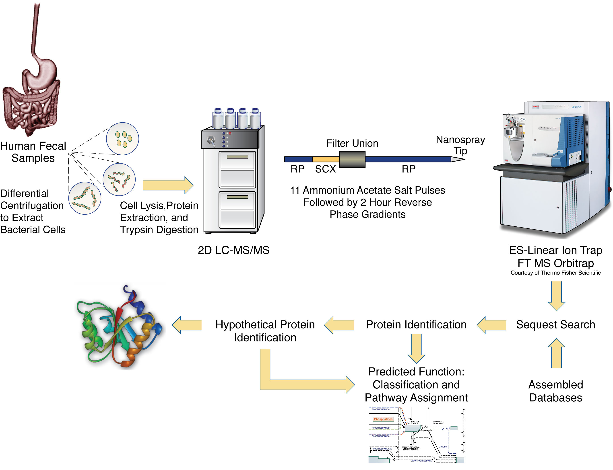

# Proteomics for computer scientists {.chapter .content-start  data-running-title='Proteomics for computer scientists'}

Biology can be a daunting subject for computer scientists. As people who are used to everything being deterministic and logical, the real world can be disappointingly unpredictable. Biological lingo and jargon can also be a real barrier in the communication between computer scientists and biologists. This chapters aims to be a gentle introduction in the (micro)biology and biochemistry that is needed to understand this thesis.

## Life {data-running-title='Life'}

### The origin of life
A good starting point to explain what life is, would be to start with its origin. Unfortunately, this origin of life is not something we know for sure. The origin of life of an active research area that tries to form hypothesis that take into account the biological, chemical as well as geophysical aspects.

##### Spontaneous generation
Before the nineteenth century, it was generally believed that life could generate spontaneously out of non-living matter [@Balme1962].This theory is known as *spontaneous generation*. Maggots, for example, could arise from dead flesh and crocodiles could form  from logs rotting at the bottom of a pond according to the Greek philosopher Aristotle. During the seventeenth century, it gradually became clear that this belief was false and the theory that each living organism comes from a pre-existing living organism was adopted for visible organisms.

At the time, there was a strong suspicion of the existence of organisms that aren't visible to the naked eye. In 1676, Antoni van Leeuwenhoek was the first to observe these microorganisms using a self-made microscope [@Gest2004]. The origin of these organisms was not clear and it wasn't until 1859, when Louis Pasteur did a series of famous experiments that proved that microbial life couldn't spontaneously originate from a sterile nutrient broth, that the theory of spontaneous generation was refuted [@Schwartz2001].

With spontaneous generation off the table, it took several years before a new theory was formulated. In 1924, Alexander Oparin speculated that the presence of oxygen in the atmosphere prevents the formation of the organic molecules that serve as building blocks for the evolution of life. This led Oparin to conclude that although spontaneous generation is not possible under the current circumstances, it did occur at least once a very long time ago when atmospheric oxygen was sparse. He argued that in an oxygenless environment, a mix of organic compounds could indeed form by means of sunlight. These molecules could then cluster into more complex droplets and by merging and splitting, a sort of basic evolutionary pressure that favors integrity emerges [@Oparin1953]. Even today, Oparin's theory is still used as a starting point for many origin of life theories.

##### RNA world hypothesis
To better understand its origin, it is worth taking a look at the oldest known life forms. One of the earliest evidences of life is found in the form of stromatolites [@Garwood2012].Stromatolite literally means *layered rock*. Stromatolites are solid, rock-like structures that are formed by cyanobacteria, a type of aquatic bacteria that obtains energy through photosynthesis. Cyanobacteria can form colonies and capture sediments using a sticky, mucus-like surface layer. These sediments can react with water to form a thin layer of limestone. Over time, the limestone accumulates and forms a stromatolite [@Riding1999]. The earliest of these geological formations that contain fossilized cyanobacteria date to over 3.5 billion years ago [@Schopf2002]. At that time, there was almost no fee oxygen in earth's atmosphere. By producing oxygen as a byproduct of converting carbon dioxide and water into sugar during photosynthesis, Cyanobacteria contributed significantly to the oxygenation of the atmosphere.

* RNA world hypothesis vs. Protein world hypothesis:
  * RNA world
    * RNA works both as enzyme and container of genes (DNA took over the latter)
    * it may have supported pre-cellular life and major step towards cellular life
    * evidence: there are RNA enzymes, some virusses use RNA for heredity, many fundamental parts of the cell require RNA
  * protein world
    * proteins worked as enzymes first, producing metabolism.
    * evidence: protein as enzyme is essential for today's lives, some AAs are formed from more basic chemicals.
  * generally accepted that current life descended from an RNA world.

* cell development?
* chemical evolution before biological evolution?
* cell membrane
* stromatolites: fossilized cyanobacteria: one of oldest known lifeform on Earth. There was almost no fee oxygen in earth's atmosphere and the CB created this by photosynthesis.
* between 3.8 and 4.1 billion years ago

* hyperthermophiles: last universal lowest common ancestor

##### What is life

##### DNA/RNA/proteins

##### Taxonomy

## Proteomics {data-running-title='Proteomics'}
This section should cover:

* Basics on Proteomics including peptide identification
* Basics on metaproteomics

Inspiration from:

* TPA case study: basic proteomics and trypsin
* MPA case study: basic metaproteomics

Because most proteins are simply to large to be analyzed using a mass spectrometer, they are usually cleaved into smaller peptides before the actual MS analysis takes place. In practice, most proteomics studies achieve such a cleavage by adding trypsin to a protein sample. Trypsin is a serine protease found in the digestive system of humans and many other vertebrates, where it helps to digest food proteins. The enzyme has a very specific function — it only cleaves peptide chains at the carboxyl side of the amino acids lysine (represented by the letter `K`) or arginine (represented by the letter `R`). As a result, it is commonly used in biological research during proteomics experiments to digest proteins into peptides for mass spectrometry analysis, e.g., in-gel digestion.

High-performance liquid chromatography (HPLC) is a chromatographic technique used to separate the components in a mixture, to identify each component, and to quantify each component. When combined with shotgun tandem mass spectrometric methods, the active proteins within a biological sample may be determined. A trypsin digest is used to cleave the proteins in a sample downstream to every `K` (lysine) or `R` (arginine), except when followed by `P` (proline). The individual components that result after the cleavage step are called tryptic peptides. The amino acid sequence of these tryptic peptides may then be determined by means of mass spectrometry. However, most devices have a detection limit that only allows to determine the amino acid sequence of peptides having a length between 5 and 50 amino acids ([@Fig:ch1fig1]).

{#fig:ch1fig1}

By searching for all proteins that contain a particular tryptic peptide that was sequenced from an environmental sample, we can get insight into the biodiversity and functionality of the biological sample. The Unipept web application supports biodiversity analysis of large and complex metaproteome samples using tryptic peptide information obtained from shotgun MS/MS experiments. Its underlying index structure is designed to quickly retrieve all occurrences of a tryptic peptide in UniProt entries.

![General outline of the Unipept workflow for taxonomic identification of tryptic peptides. For a given tryptic peptide, all UniProt entries having an exact match of the peptide in the protein sequence are found. Unipept then computes the lowest common ancestor (LCA) of the taxonomic annotations extracted from the matched UniProt entries, based on a cleaned up version of the NCBI Taxonomy. All intermediate results are shown for the sample tryptic peptide enfvy[il]ak (isoleucine and leucine equated), leading to an LCA in the phylum Streptophyta. Arrows at the bottom show which processing steps are available as functions in the Unipept API and the Unipept CLI.](images/ch1fig2.png){#fig:ch1fig2}

Over the period of evolution, we human beings have co-evolved an intricate symbiosis with microorganisms that inhabit our gastrointestinal tract. These microorganisms are responsible for maintaining a healthy gut environment, they aid in digestion of our food and our immune system and they guard us against invading pathogens. In addition, some diseases, such as Crohn's disease, are somehow correlated to the composition of the gut microbiota. Although we are dependent on microorganisms for normal gut functioning, much remains to be learned about microbial processes in the gut that are carried out by this huge community of largely unexplored microbial cells that can amount to numbers as great as 1011 per gram of faeces.

Recently, we have been aided by the development of molecular tools that enable us to determine the composition of microorganisms inhabiting the intestine without having to cultivate them. In addition to the increasing amounts of information about the identities of microorganisms in the gut from our own studies and others, there have been a limited number of studies of the functional genes in the entire gut microbial metagenome, using sequencing based metagenomics approaches.

A next step is to determine what genes are actually expressed and the function of the gut microbiota in different states of health and disease. Shotgun proteomics (@Fig:ch1fig3) is one approach that can be used to determine what proteins were expressed in an environmental sample. As of today, this technique is still in its infancy, but given the rapid technological developments and based on the results of the first analyses, we can nevertheless consider this to be a very promising technique.

{#fig:ch1fig3}

## Unipept {data-running-title='Unipept'}
This section should cover:

* What we did and why we did it
* Overview of the chapters

Inspiration from:

* layman’s summary FWO

Microorganisms drive most of the chemical transformations crucial to sustaining life on Earth. Their ability to inhabit almost every environmental niche proves they possess an incredible diversity of physiological capabilities. However, little is known about the majority of the millions of microbial species that are predicted to exists, given that we are able to grow only an estimated 1% of these organisms under lab conditions. The emerging disciplines of metagenomics and metaproteomics take advantage of the current generation of sequencing technologies to recover genetic material and active proteins directly from environmental samples. These new approaches provide us with a “new kind of microscope” that is revolutionizing our understanding of the diversity and ecology of environmental communities. However, the computational and statistical tools to analyze metagenomics and metaproteomics data are clearly lagging behind the developments in sequencing technology. To counter this, researchers at Ghent University are developing an online web portal called Unipept that combines advanced algorithms, novel statistical methods and interactive visualizations for the analysis of metagenomics and metaproteomics data sets. It will equip the new microscope with more powerful lenses, enabling researchers to better zoom in on who is living in complex environmental communities, what they are doing there and how they are doing it. To validate that Unipept has important applications across the fields of environmental, clinical and evolutionary microbiology, it is used to study shifts in the gut microbiota of patients suffering from cystic fibrosis (also known as mucovisidosis), the most common genetic disease in people from Caucasian origin that mostly affects the lungs and for which no cure exists today.

something about:

* CF?
* metagenomics?

