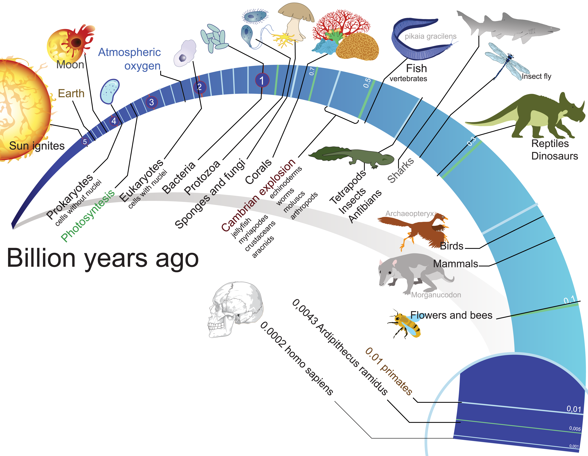
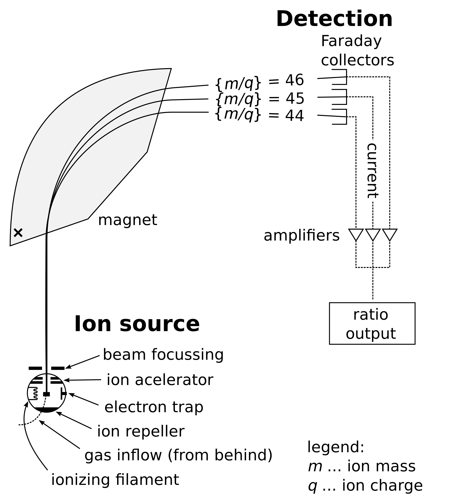
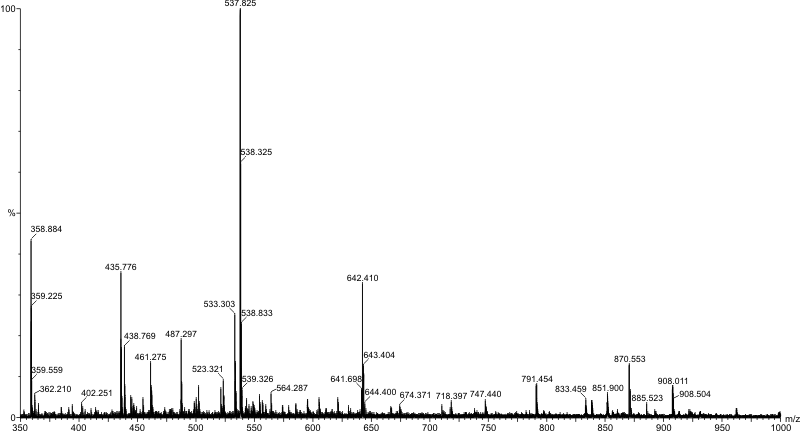
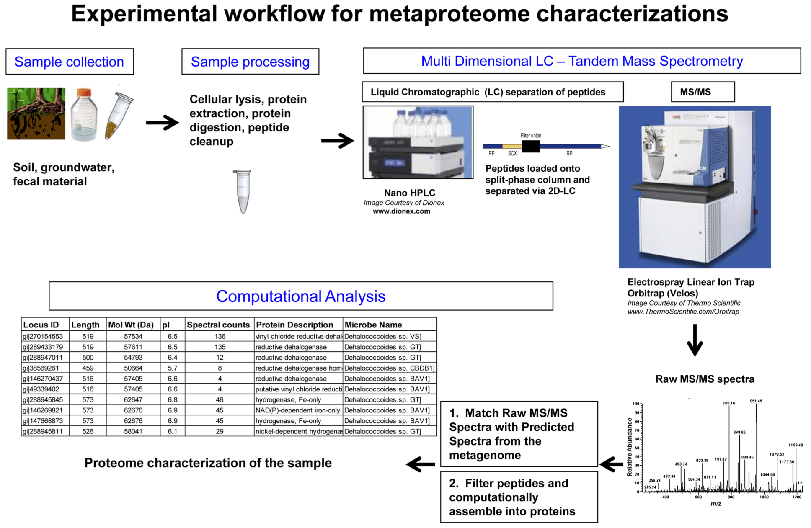
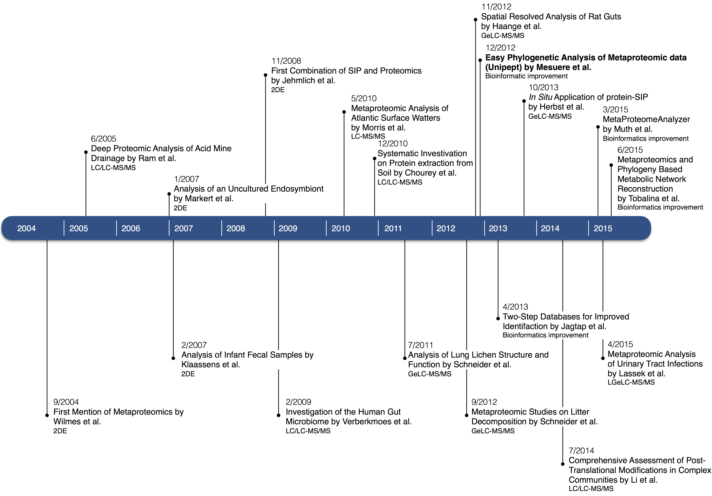

# Proteomics for computer scientists {.chapter .content-start  data-running-title='1. Proteomics for computer scientists'}

Biology can be a daunting subject for computer scientists. As people who are used to everything being deterministic and logical, the real world can be disappointingly unpredictable. Biological lingo and jargon can also be a real barrier in the communication between computer scientists and biologists. This chapters aims to be a gentle introduction in the (micro)biology and biochemistry that is needed to understand this thesis.

## Life on Earth{data-running-title='Life on Earth'}

A good starting point to explain what life is, would be to start with its origin. Unfortunately, this origin of life is not something we know for sure. The origin of life is an active research area that tries to form hypothesis that take into account the biological, chemical as well as geophysical aspects.

##### Spontaneous generation
Before the nineteenth century, it was generally believed that life could generate spontaneously out of non-living matter [@Balme1962].This theory is known as *spontaneous generation*. Maggots, for example, could arise from dead flesh and crocodiles could form from logs rotting at the bottom of a pond according to the Greek philosopher Aristotle. During the seventeenth century, it gradually became clear that this belief was false and the theory that each living organism comes from a pre-existing living organism was adopted for visible organisms.

At the time, there was a strong suspicion of the existence of organisms that aren't visible to the naked eye. In 1676, Antoni van Leeuwenhoek was the first to observe these microorganisms using a self-made microscope (@Fig:ch1fig5; @Gest2004). The origin of these organisms was not clear and it wasn't until 1859, when Louis Pasteur did a series of famous experiments (@Fig:ch1fig6) that proved that microbial life couldn't spontaneously originate from a sterile nutrient broth, that the theory of spontaneous generation was refuted [@Schwartz2001].

{#fig:ch1fig5}

With spontaneous generation off the table, it took several years before a new theory was formulated. In 1924, Alexander Oparin speculated that the presence of oxygen in the atmosphere prevents the formation of the organic molecules that serve as building blocks for the evolution of life. This led Oparin to conclude that although spontaneous generation is not possible under the current circumstances, it did occur at least once a very long time ago when atmospheric oxygen was sparse. He argued that in an oxygenless environment, a mix of organic compounds could indeed form by means of sunlight. These molecules could then cluster into more complex droplets by merging and splitting. This led to a sort of basic chemical evolutionary pressure that favors integrity [@Oparin1953]. Even today, Oparin's theory is still used as a starting point for many origin of life theories.

![Schematic of the experimental setup used by Louis Pasteur in his experiments on alleged spontaneous generation as published in *Mémoire sur les corpuscules organisés qui existent dans l'atmosphère: examen de la doctrine des générations spontanées* [@Pasteur1862].](images/ch1fig6.jpg){#fig:ch1fig6}

##### Evolutionary timeline
To better understand its origin, it is worth taking a look at the oldest known life forms. One of the earliest evidences of life is found in the form of stromatolites [@Garwood2012].Stromatolite literally means *layered rock*. Stromatolites are solid, rock-like structures that are formed by cyanobacteria, a type of aquatic bacteria that obtains energy through photosynthesis. Cyanobacteria can form colonies and capture sediments using a sticky, mucus-like surface layer. These sediments can react with water to form a thin layer of limestone. Over time, the limestone accumulates and forms a stromatolite [@Riding1999]. The earliest of these geological formations that contain fossilized cyanobacteria date to over 3.5 billion years ago [@Schopf2002]. At that time, there was almost no free oxygen in Earth's atmosphere. By producing oxygen as a byproduct of converting carbon dioxide and water into sugar during photosynthesis, Cyanobacteria contributed significantly to the oxygenation of the atmosphere. This led to the Great Oxygenation Event some 2.5 billion years ago [@Flannery2012].

1.8 billion years ago, the first eukaryotic cells start to appear [@Knoll2006]. These are still unicellular organisms, but unlike prokaryotes, they contain cell organelles (such as a nucleus and mitochondria) enclosed by membranes. These organisms probably originated from several prokaryotic cells engulfing each other. Until now, the reproduction of eukaryotic organisms happened asexually through mitosis in which a cell divides into two genetically identical cells. Around 1.2 billion years ago, eukaryotic cells started to also reproduce sexually through meiosis [@Bernstein2012]. In meiosis, cell division produces daughter cells each containing half the genetic material of the parent cell. Two of these haploid cells can then fuse to create a new cell that contains the combined genetic material (@Fig:ch1fig8).

According to @Butterfield2000, sexual reproduction was critical for the success of the eukaryotes because it allowed for complex multicellularity. The first multicellular organism is believed to have originated more then 800 million years ago. 50 million years later, the first protozoa emerged, a group of unicellular eukaryotic organisms that exhibit advanced behavior such as motility and predation.

{#fig:ch1fig8}

An interesting side effect of the rising atmospheric oxygen levels, is that high in the atmosphere, the oxygen molecules started interacting with each other under influence of the sun's ultraviolet (UV) radiation to form ozone molecules.  Around 600 million years ago, a thin layer of ozone had built up around the Earth, protecting it from irradiation by the sun's UV light. Until now, life was limited to water, but this reduced radiation allowed for the colonization of the land [@Battistuzzi2004].

The combination of these events led to a period of increased evolutionary speed known as the Cambrian explosion. Starting around 580 million years ago for a period of 70 to 80 million years, the rate of diversification accelerated significantly [@Marshall2006]. Most of the major animal phyla appeared during that period such as jellyfish, crustaceans, arachnids, worms, etc. This period of rapid evolution was followed by the nascence of the first vertebrates (485 million years ago), the first primitive plants (434 million years ago), the first spiders and scorpions (420 million years ago), the first tetrapod on land (395 million years ago) and the first dinosaurs (225 million years ago; @Lowe2013).

AThis event is known as the *Cretaceous-Paleogene extinction event*. massive comet impact some 66 million years ago had catastrophic effects on life on Earth: over 75 percent of all existing animal species was wiped out including all non-avian dinosaurs [@Renne2013;@Jablonski1994]. The change in the environment and the eradication of many dominant groups let other organisms take their place. An example of this is the elimination of dinosaurs in favor of the mammals. One of these new type of mammals were the primates (60 million years ago) out of which the great apes (hominids; 18 million years ago) and eventually the humans (*Homo*; 2.5 million years ago) and modern humans (*Homo sapiens*; 250&thinsp;000 years ago) formed [@Goodman1998].

{#fig:ch1fig7}

## Taxonomy {data-running-title='Taxonomy'}
Life on Earth is extremely varied, even more so than one would initially think. The group of beetles, for example, is incredibly diverse with over 400&thinsp;000 species and gigantic compared to the number of mammals of which only 5&thinsp;500 are known [@Hammond1992]. The number of described species easily exceeds 1 million and it is estimated that we have only managed to document a small fraction. Estimates for the total number of species range from 5 million to over 100 million. A recent statistical analysis estimates that the total number of non-bacterial species is 8.7 million [@Mora2011] with thousands of additional bacterial species.

Aristotle (384&ndash;322 BC) was one of the first to start naming and organizing living organisms [@Mayr1982]. He used a simple system with two groups: plants and animals. Organisms were put into classes based on their physical appearance and shape. This branch of science of naming and classifying organisms is called taxonomy and was relatively uneventful for the next 2000 years.

##### Linnaean taxonomy
It wasn't until Carl Linnaeus (1707&ndash;1778), that taxonomy broke new ground. With the publication of the *Systema Naturæ* [@Linnaeus1758], he introduced a standardized naming system for organisms. Next to a new naming system, he also introduced a new hierarchical classification system. In his taxonomy, there are three kingdoms (plants, animals and minerals) that are each divided into several classes [@Fig:ch1fig4]. These classes are then subdivided further in orders, families, genera and species, each having their own name. The name of a species consists of two parts of which the first part refers to the parent genus. Although his system had numerous flaws, *minerals* can hardly be called living organisms and his class of *vermes* was a grab bag of organisms fitting nowhere else, the basic ideas of the Linnaean system are still used in today's systems.

![The classification of animals in the classes of quadrupedia (mammals), aves (birds), amphibia (amphibians), pesces (fish), insecta (insects) and vermes ("animals of slow motion, soft substance, able to increase their bulk and restore parts which have been destroyed, extremely tenacious of life, and the inhabitants of moist places.") as described in the *Systema Naturæ* [@Linnaeus1758].](images/ch1fig4.png){#fig:ch1fig4}

##### Evolutionary taxonomy
Towards the end of the eighteenth century, the idea formed to translate the Linnaean taxonomy, a system that produced systematic lists, into a tree-like organization of plants and animals.When we talk about ancestors in the rest of this thesis, such as in *Lowest Common Ancestor*, we mean a higher node in the taxonomy tree and not an evolutionary ancestor. After the publication of Charles Darwin's theory of evolution in *On the Origin of Species* [@Darwin1859], it gradually became accepted that the classification should reflect Darwin's principle of common descent. The ensuing evolutionary taxonomy resulted in the generation of a tree of life that also included known fossil groups. The recent advent of DNA sequencing and analysis completed the transition from a taxonomy based entirely on morphology to one based on evolutionary history (phylogeny).

These recent advances don't mean that there is a single, official taxonomy containing all species. On the contrary, each domain has its own classification system. The Angiosperm Phylogeny Group III system [@Bremer2009], for example, is used for flowering plants and the List of Prokaryotic names with Standing in Nomenclature (LPSN) by Euzéby [@Euzeby1997] is the authority for prokaryotes. In our application, we don't wish to limit us to a single domain, which is why we use the NCBI Taxonomy database [@Federhen2012]. The NCBI Taxonomy is a nomenclature and classification repository that contains organism names and taxonomic lineages for all sequences in the databases of the International Nucleotide Sequence Database Collaboration (INSDC). Since the data used in our application also originates from INSDC databases, cross-references are ubiquitous.

## Molecular building blocks {data-running-title='Molecular building blocks'}
Although life on Earth is incredibly diverse, all organisms share fundamental molecular mechanisms. In almost all organisms, the basic unit of energy is adenosine triphosphate (ATP), structural and functional roles are fulfilled by proteins and DNA (and RNA) carries the genetic information. In this section, we will take a closer look at the latter two.

##### DNA
Deoxyribonucleic acid, or DNA, is a molecule that contains most of the genetic information that is needed for the development and functioning of all living organisms. The molecule is contained of a long chain of many nucleotides.Each of our chromosomes is a single DNA molecule. As can be seen in @Fig:ch1fig9, each nucleotide is composed of three main parts: a phosphate group, a 5-carbon sugar (deoxyribose) and one of four nitrogen-containing bases: adenine (A), thymine (T), cytosine (C) or guanine (G). Since the phosphate group and sugar are the same for every nucleotide, a DNA molecule can be described by the sequence of its bases.

{#fig:ch1fig9}

In 1962, James Watson and Francis Crick (@Fig:ch1fig10) together with Maurice Wilkins won the Nobel Prize in Physiology or Medicine for their discovery of the molecular structure of DNA. Nine years before, they, together with Rosalind Franklin (@Fig:ch1fig11), determined that DNA is made of two strands of nucleotides that form a double helix [@Watson1953]. The nucleotides in the two-stranded spiral have their sugar and phosphate groups on the outside and their bases connecting on the inside. Not all bases can connect with each other: adenine always binds with thymine and cytosine always binds with guanine. This means that if one of the two strands is known, the complementary strand can be determined. For example, if the sequence of a strand contains acctgtc, the complementary section will be tggacag.

 
 {#fig:ch1fig11}

{#fig:ch1fig10}

In eukaryotes, such as humans, DNA occurs in linear chromosomes while in most prokaryotes, such as bacteria, DNA occurs in circular chromosomes. All the chromosomes in the cell of an organism make up its genome. The size of the genome varies enormously across the tree of life. Viruses, for example, typically have a genome size of a few thousand base pairs [@Fiers1976], the human genome has 3.2 billion base pairs spread across 46 chromosomes [@Venter2001] and some plants have a genome of over 150 billion base pairs [@Pellicer2010].

The genetic information itself is contained within genes. A gene is a part of the chromosome that encodes for a protein or a functional RNA. Not all of the DNA of an organism is part of a gene. In prokaryotes, 80-90% of the genome consists of coding DNA [@Koonin2010], but in eukaryotes this is many times lower. In humans, for example, over 98% of the genome is non-coding [@Elgar2008]. This non-coding DNA used to be called *junk DNA*, but recent research has shown that at least part of the non-coding DNA is biochemically active and performs regulatory functions [@Pennisi2012].

##### Gene expression
When a protein is made based on the information from a gene, we say that the gene is expressed. During the transcription phase of gene expression, a copy of the DNA sequence is made by RNA polymerase, creating messenger RNA. The protein-coding region of the messenger RNA is then translated into a protein (@Fig:ch1fig13).

Ribonucleic acid (RNA) and DNA are both nucleic acids and share a lot of properties. Both are assembled as a chain of nucleotides, but unlike DNA, RNA mostly occurs as a single-strand. They both have the same phosphate group, but differ in sugar componentAs the name suggests, DNA uses deoxyribose, RNA uses ribose. and possible bases. In DNA, the complementing base of adenine is thymine, whereas in RNA, it is uracil (U).

Many types of RNA existOther types include small nuclear RNA and small interfering RNA. with the messenger RNA (mRNA), ribosomal RNA (rRNA) and transport RNA (tRNA) playing an important role in gene expression. The transcription phase starts by an RNA polymerase enzyme binding to the DNA molecule and opening up the double helix. The RNA polymerase then begins mRNA synthesis by matching bases that complement the DNA strand. If the DNA sequence is atccga, for example, the resulting mRNA sequence will be uaggcu. Once transcription is finished, the constructed mRNA is released in the cell.

{#fig:ch1fig13}

In the next phase, the mRNA binds to one of the ribosomes in the cell. A ribosome is a cell organelle that is responsible for translating the mRNA into a protein and consists of two subunits that are made from rRNA and proteins. The small subunit binds to the mRNA and reads the sequence. Each nucleotide triplet of the mRNA sequence is called a codon and can bind to a single type of transport RNA holding an amino acid. The large ribosomal subunit binds to the tRNA and connects the attached amino acid to the growing protein chain. The type of amino acid that is attached to the tRNA depends on the sequence of the codon binding site and is uniquely defined (@Fig:ch1fig12). This way, once the mRNA is bound to the ribosome, there is only a single protein translation possible.

##### Proteins
Proteins are large molecules that perform many different functions in living organisms. They can serve as enzyme, have a structural function or even transport other molecules. As mentioned in the previous section, the building blocks of proteins are amino acids. There are 20 naturally occurring amino acids, each having a three-letter and a one-letter abbreviation (@Tbl:ch1tbl1). The one-letter abbreviations are also sometimes called the protein alphabet and are generally used to describe the sequence of the amino acids of a protein. Since proteins are formed by chains of amino acids, the order of them uniquely describes the protein. Shorter chains of amino acids are called peptides. The proteome is the set of all proteins that are expressed by an organism.

{#fig:ch1fig12}

&nbsp;&nbsp;&nbsp;&nbsp;&nbsp;&nbsp;&nbsp;&nbsp;&nbsp;&nbsp;&nbsp;&nbsp;&nbsp;&nbsp;&nbsp;&nbsp;&nbsp;&nbsp;&nbsp;&nbsp;&nbsp;&nbsp;&nbsp;&nbsp;&nbsp;&nbsp;&nbsp;&nbsp;&nbsp; | amino acid&nbsp;&nbsp;&nbsp; | long abbreviation | short abbreviation | average molecular mass
:----- | :--------- | :------- | :------- | ---------------:
&nbsp; | Alanine | Ala | A | 89.09 Da
&nbsp; | Arginine | Arg | R | 174.20 Da
&nbsp; | Asparagine | Asn | N | 132.12 Da
&nbsp; | Aspartic acid | Asp | D | 133.10 Da
&nbsp; | Cysteine | Cys | C | 121.15 Da
&nbsp; | Glutamic acid | Glu | E | 147.13 Da
&nbsp; | Glutamine | Gln | Q | 146.15 Da
&nbsp; | Glycine | Gly | G | 75.07 Da
&nbsp; | Histidine | His | H | 155.16 Da
&nbsp; | Isoleucine | Ile | I | 131.17 Da
&nbsp; | Leucine | Leu | L | 131.17 Da
&nbsp; | Lysine | Lys | K | 146.19 Da
&nbsp; | Methionine | Met | M | 149.21 Da
&nbsp; | Phenylalanine | Phe | F | 165.19 Da
&nbsp; | Proline | Pro | P | 115.13 Da
&nbsp; | Serine | Ser | S | 105.09 Da
&nbsp; | Threonine | Thr | T | 119.12 Da
&nbsp; | Tryptophan | Trp | W | 204.23 Da
&nbsp; | Tyrosine | Tyr | Y | 181.19 Da
&nbsp; | Valine | Val | V | 117.15 Da

: Overview of all naturally occurring amino acids with long abbreviation, short abbreviation and molecular weight. Notice that leucine and isoleucine have the same weight. {#tbl:ch1tbl1}

## Metaproteomics {data-running-title='Metaproteomics'}

Proteomics is the large-scale study and analysis of proteins. The detection of specific proteins typically happens in two ways: using immunoassays and using mass spectrometry.Examples of immunoassay techniques are ELISA and Western blot. The techniques using immunoassays use specific antibodies that bind to the target protein to detect and quantify that protein. Mass spectrometry on the other hand, is a more general technique that uses the mass of fragmentized ions to determine the chemical composition of a sample.

##### Mass spectrometry
Mass spectrometry consists of three main parts: ionization, mass analysis and ion detection (@Fig:ch1fig14). During the ionization phase, a part of the sample is converted to ions. This means that the incoming molecules are charged and fragmented by an ion source. Many different types of ion sources can be used depending on the type of sample that is subject to analysis. Two commonly used techniques for biological samples are electrospray ionization (ESI; @Fenn1989) and matrix-assisted laser desorption/ionization (MALDI; @Tanaka1988).

Next, the ions are selected from the sample and directed through the mass analyzer. This component uses electrical and/or magnetic fields to separate the ions based on their molecular mass and charge, or more specific, their mass-to-charge ratio. Again, many types of mass analyzers exist with time-of-flight (TOF) and Orbitrap [@Hu2005] being common techniques. The combination of the used ion source and mass analyzer determines the configuration of a mass spectrometer. Common configurations often get their own name, for example, MALDI-TOF indicates that a MALDI ion source was used in combination with a TOF analyzer.

 
 {#fig:ch1fig14}

The separation of the ions makes it possible to detect how many ions of each mass-to-charge ratio are present. This is what happens in the last phase by a detector producing a mass spectrum (@Fig:ch1fig15). This spectrum shows the number of detections and thus the relative abundance of ions for each mass-to-charge ratio.

{#fig:ch1fig15}

##### Proteomics
When using mass spectrometry for proteomics, several experimental techniques (for example, top-down proteomics, bottom-up proteomics, targeted proteomics) can be used depending on the goal of the experiment. In this introduction we will focus on the bottom-up approach, where proteins are first split into smaller peptides before administering them to the mass spectrometer. Cleaving a protein in smallerA proteolytic enzyme is also called a protease. peptides is done by adding a special, proteolytic, enzyme to the protein sample.

One of the most used proteases is trypsin [@Vandermarliere2013], an enzyme that is found in the digestive system of humans and many other vertebrates where it helps to digest proteins in food. Trypsin cleaves peptide chains atAlthough generally accepted, the proline exception is increasingly being questioned. very specific places namely when encountering the amino acids lysine (K) or arginine (R), except when they are bound to proline (P). The resulting peptides are called tryptic peptides. The effect of trypsin on a protein can easily be simulated *in silico*. It comes down to splitting the protein sequence after every `K` or `R` except when followed by a `P`, for example using a regular expression like `s/([KR])([^P])/\1\n\2/g`.

Next, one or more mass spectrometry (MS) steps are used to analyze the peptide mixture. When two MS steps are used, this is called tandem mass spectrometry (MS/MS; @Fig:ch1fig16). In the first MS phase, the incoming peptides are ionized using an ionization technique that causes little fragmentation, for example ESI or MALDI. Next, the ions are separated and ions of a particular mass-to-charge ratio are selected. In the second phase, the selected ions are fragmented, for example using collision-induced dissociation (CID). The resulting fragments are then again separated by mass-to-charge ratio and detected resulting in a mass spectrum.

{#fig:ch1fig16}

The next challenge is converting the many measured spectra to usable information such as peptide sequences. Two approaches can be used for this conversion: database searching and de novo sequencing. De novo sequencing uses advanced algorithms to determine the sequence directly from the spectrum. This allows the discovery of peptides that were never seen before, but the technique is time consuming and has a low accuracy [@Pevtsov2006]. Database searching is a simpler technique that is more commonly used. As the name implies, database searching starts from a protein database, for example UniProt, and performs an *in silico* trypsin digest on the proteins. For each of the resulting tryptic peptides, a theoretical mass spectrum is calculated. These predicted spectra are then compared to the recorded spectrum and the sequence of the best matching spectrum is returned as the result. Many tools implement database searching, for example Mascot [@Hirosawa1993], Sequest [@Eng1994], X!Tandem [@Craig2003] or OMSSA [@Geer2004].

##### Metaproteomics
When the protein contents of an environmental sampleBecause an entire community is examined instead of an individual, metaproteomics is also sometimes called community proteomics. is analyzed, this is called metaproteomics. The origin of such samples ranges from waste water treatment plants to clinical samples. While the procedure looks similar to the one described in the previous section, shotgun metaproteomics is a relatively new technique that developed in the last decade [@Wilmes2004;@Herbst2015]. Because the origin of the proteins is not limited to a single species or well defined set of organisms, metaproteomics is a lot more challenging.

{#fig:ch1fig17}

In classic proteomics, proteins are first separated and selected using two-dimensional gel electrophoresis (2DE) before trypsin is added to digest the proteins into tryptic peptides. In metaproteomics, we want to get a complete picture of the sample and analyze as many proteins as possible. Because of this, the 2DE step is usually skipped and trypsin is added in the sample preparation step (@Fig:ch1fig17). During sample preparation, the proteins are extracted from the cells in the sample. Protein extraction in complex samples is very challenging and the method used is dependent on the origin of the sample. Next, the tryptic peptides are separated using liquid chromatographic methods, for example high-performance liquid chromatography (HPLC), before starting the MS/MS phase.

Converting the obtained spectra to peptide sequences and ultimately proteins is also a lot more challenging in metaproteomics. Because the number of possible organisms and thus proteins is a lot bigger, the database on which a search is performed is very important and must be carefully selected [@Tanca2013a]. Other issues that impede the correct identification of proteins is the fact that distinct peptides can generate the same spectrum (leucine and isoleucine have the same mass, for example) and that some peptides are shared by many proteins.

Nevertheless, the field of metaproteomics has seen enormous progress in the last ten years (@Fig:ch1fig18). Where the technique initially worked for relatively simple acid mine drainage samples, it is now routinely applied to more complex environments such as the human gut.

{#fig:ch1fig18}

## Unipept {data-running-title='Unipept'}

Unipept, the subject of this thesis, is a tool to help analyze the outcome of metaproteomics experiments. More specifically,Although identified proteins are usually the desired result of an MS experiment, we take a step back and start from the peptides. it takes the identified peptides as input and gives an overview of the biodiversity as output. This happens by exactly matching the peptides to the protein sequences in the UniProt database and aggregating the resulting associated organisms to a consensus taxon. Since UniProt contains over 60 million protein entries and a typical metaproteomics experiment yields thousands of identified peptides, significant time was spent to optimize the database and algorithms. This resulted in a web application that can analyze a sample containing thousands of identified peptides in mere seconds while presenting the results using rich and interactive visualizations.

In the next chapter, we present the Unipept web application as a tool for the diversity analysis of complex metaproteome samples. Chapter 3 builds on that by introducing two new ways to access the analysis tools offered by Unipept: a web-based API and a set of command line tools.

The next two chapters cover the peptidome analysis part of the Unipept ecosystem. The Unique Peptide Finder is introduced in chapter 4 as a new way to discover unique peptides that can be used as biomarkers in targeted metaproteomics, while chapter 5 features Peptidome Clustering to investigate the relatedness of organisms. These two tools are built on the same foundations using advanced JavaScript features to offer interactive visualizations and high-performance client-side calculations.

Chapter 6 tells the story of Unipept from a computer scientist's point of view. The chapter reconstructs the development timeline of Unipept including the technical design choices and failed experiments.

The last chapter explores ongoing and potential future extensions to Unipept, including a new metagenomics pipeline, the addition of functional analysis features, and additions to the Unique Peptide Finder.
