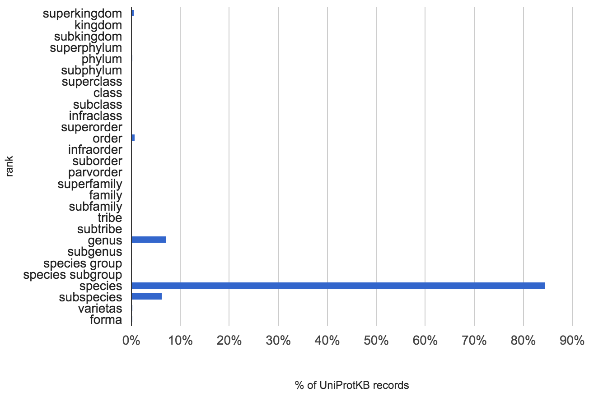
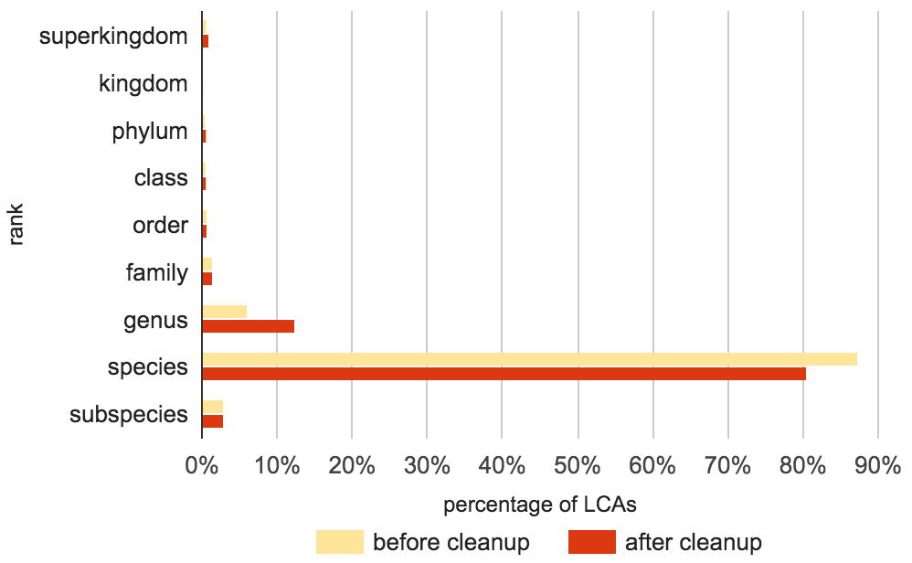
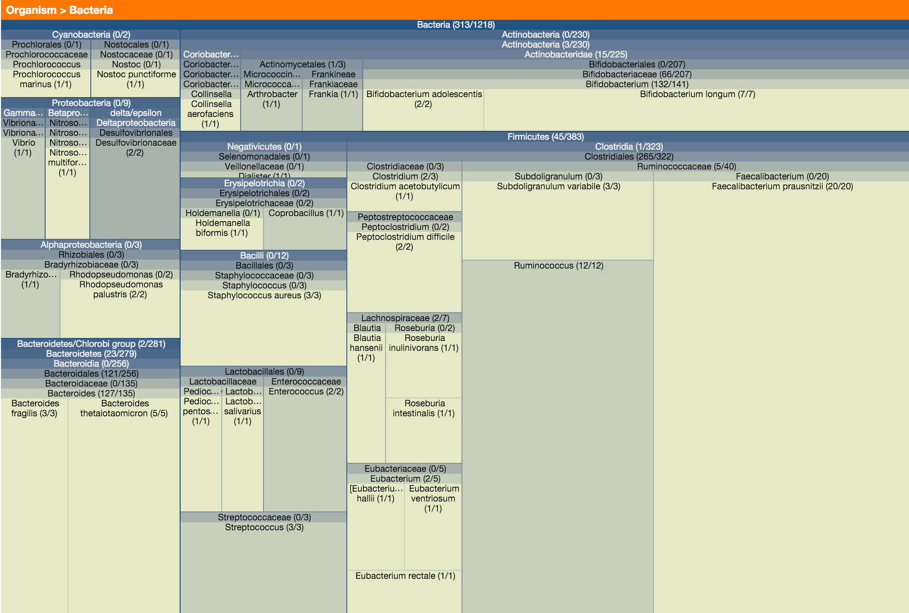
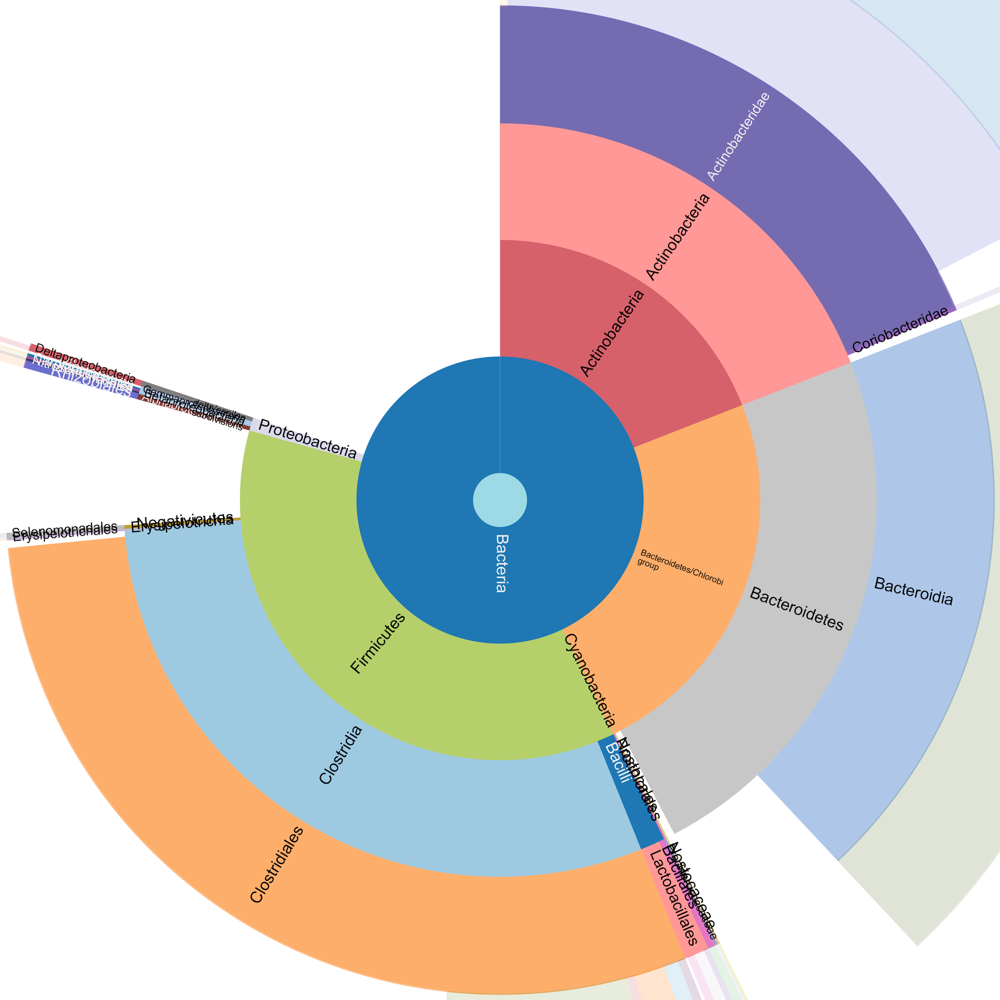

# Metaproteomics biodiversity analysis {.chapter data-running-title='2. Metaproteomics biodiversity analysis'}

The initial objective of Unipept was to improve the biodiversity analysis of metaproteomics experiments. This was achieved not only by providing more accurate and faster results, but also by presenting the results with interactive visualizations in a user-friendly approach focused on non-technical users.

This chapter contains the initial Unipept article published in the Journal of Proteome Research in 2012, an update article published in Proteomics in 2015 and a short overview of the new features that were added since the last publication.

## Unipept: Tryptic peptide-based biodiversity analysis of metaproteome samples {data-running-title='Tryptic peptide-based biodiversity analysis'}

This section contains a verbatim copy of the research article by @Mesuere2012 as published in the Journal of Proteome Research.

**Abstract** &mdash; The Unipept web application ([http://&#8203;unipept&#8203;.ugent&#8203;.be](http://unipept.ugent.be)) supports biodiversity analysis of large and complex metaproteome samples using tryptic peptide information obtained from shotgun MS/MS experiments. Its underlying index structure is designed to quickly retrieve all occurrences of a tryptic peptide in UniProt entries. Taxon-specificity of the tryptic peptide is successively derived from these occurrences using a novel lowest common ancestor approach that is robust against taxonomic misarrangements, misidentifications, and inaccuracies. Not taking into account this identification noise would otherwise result in drastic loss of information. Dynamic treemaps visualize the biodiversity of metaproteome samples, which eases the exploration of samples with highly complex compositions. The potential of Unipept to gain novel insights into the biodiversity of a sample is evaluated by reanalyzing publicly available metaproteome data sets taken from the bacterial phyllosphere and the human gut.

### Introduction
The introduction of high throughput sequencing methods allowed to determine the diversity, phylogeny, and genomic repertoire of complex microbial communities such as the human gut microbiome. Recently, the Metahit consortium released metagenomic sequence information showing approximately 1&thinsp;000 different species commonly found in fecal samples, on average accounting for half a million genes in addition to the human genome [@Qin2010]. While metagenomics provides a wealth of information on the global gene content, understanding the actual functional contribution to nutrient conversion or immune system development of individual genes or organisms requires functional genomics tools.

High quality multidimensional liquid chromatography in combination with shotgun tandem mass spectrometric methods are currently implemented to reveal the protein complement of the metagenome, providing information of the core functional components [@Verberkmoes2009; @Kolmeder2012]. In a typical single species proteomic experiment, protein identification from shotgun MS/MS data of tryptic peptides relies on matching the spectra to *in silico* calculated spectral information from proteins predicted from isolate or metagenomic databases. Therefore, tryptic digests and fragmentation ions on all protein sequences available for this organism are simulated. In the worst case, protein identification can be based on cross-species identification, typically using a close homologue.

In metaproteomics approaches, MS/MS based identification is hampered by several aspects. A first problem is the limited coverage of the curated protein databases, e.g., UniProtKB/Swiss-Prot [@Boeckmann2003]. Ideally, a protein complement of a synthetic metagenomic database containing sequences from different metagenomics experiments covering a wide range of organisms expected in the environment of interest could be created. Metagenomic databases however are exponentially increasing, and naive six-frame translation and protein prediction would lead to a high false discovery rate or low protein identification efficiency. @Rooijers2011 countered this problem by implementing an iterative workflow combining the use of a defined synthetic metagenome and a non-annotated metagenome repository.

The taxon-specificity of peptides is discussed in more detail in Chapter 4.

A more specific problem towards functional analysis of the metaproteome is the lack of connectivity of the tryptic peptides and the organism of origin. Many tryptic peptide sequences are conserved over different bacterial taxa and are therefore not-informative to describe the taxonomic diversity or functional properties of the sample. @Askenazi2010 developed the Pep2Pro web service to identify taxon-specific peptides. However, they used a restricted definition of taxon-specificity by only retaining peptides unique to a single taxon as defined in the NCBI taxonomy. In this paper, we present Unipept ([http://&#8203;unipept&#8203;.ugent&#8203;.be](http://unipept.ugent.be)), a web application that supports biodiversity analysis of large and complex metaproteome samples using tryptic peptide information obtained from shotgun MS/MS experiments. Its underlying index structure is designed to quickly retrieve all occurrences of a tryptic peptide in UniProt entries. Taxon-specificity of the tryptic peptide is successively derived from these occurrences using a novel lowest common ancestor approach that is robust against taxonomic misarrangements, misidentifications, and inaccuracies. Not taking into account this identification noise would otherwise result in drastic loss of information. Dynamic treemaps visualize the biodiversity of metaproteome samples, which eases the exploration of samples with highly complex compositions. The potential of Unipept to gain novel insights into the biodiversity of a sample is evaluated by reanalyzing publicly available environmental metaproteome data sets from phyllosphere bacteria [@Delmotte2009] and the human gut [@Verberkmoes2009].

### Materials and methods
#### Database construction

Unipept uses a MySQL database as its storage backbone. The database is populated using a custom data processing pipeline written in the Java programming language. This pipeline integrates the NCBI Taxonomy Database [@Wheeler2004] with the UniProt Knowledgebase (UniProtKB; @Wu2006). The complete NCBI Taxonomy Database is fetched from the NCBI FTP server. While processing the downloaded database, only those records with a name class containing "scientific name" are retained, accounting for about 882&thinsp;000 records. Unipept mainly relies on the hierarchical structure of the NCBI taxonomy and the rank information it assigns to the different nodes. Careful use of indexes provides fast access to the necessary taxonomic information. As a second data source, Unipept uses the XML version of the UniProt Knowledgebase. UniProtKB consists of two parts, Swiss-Prot and TrEMBL, containing more than 17 million The size of the UniProt database is discussed in more detail in @Sec:ch5-uniprot-reduction. protein entries, including proteins from complete and reference proteomes. The Java pipeline iterates over all protein entries and performs an *in silico* trypsin digest on every protein. The individual peptides are added to the Unipept database, together with additional metadata from the UniProt entry such as organism information and various cross references. Using UniProt release 2012_07, this establishes a comprehensive catalogue of over 250 million tryptic peptides.

Because Unipept was developed to work with mass spectrometry data as input, two additional extensions to the data integration pipeline were made. First, peptides with a length smaller than five or greater than fifty amino acids are discarded. This is done because most mass spectrometers have a limited mass range and small peptides are difficult to distinguish by mass alone [@Eidhammer2007]. In addition, a lower limit of five amino acids has no real impact on biodiversity analysis, since shorter peptides are generally found in the genome of organisms across all kingdoms of life. The second extension takes into account the difficulties to discern the isobaric amino acids isoleucine (I) and leucine (L). Therefore, a duplicate version of every tryptic peptide is stored in which the difference between I and L is ignored. When running queries on Unipept, users can decide whether differentiating between I and L is relevant or not.

#### Web application
To allow ubiquitous access to the Unipept database, a web based front-end was developed using Ruby on Rails (RoR), which is accessible at [http://&#8203;unipept&#8203;.ugent&#8203;.be](http://unipept.ugent.be). RoR is a web application framework for the Ruby programming language, which allows rapid prototyping and has built-in support for the creation of RESTful web services. The application consists of two basic functionalities: a peptide-based taxonomic identification and a multi-peptide dynamic diversity treemap analysis.

#### Single peptide analysis {#sec:ch2-SPA}

Single peptide analysis was since renamed to tryptic peptide analysis.

With single peptide analysis, users submit a single tryptic peptide with potential missed cleavages. Individual tryptic peptides can be 5 to 50 residues long. The application responds with a list of all UniProt entries wherein the peptide was found. For every UniProt entry in this result set, the complete taxonomic lineage is derived from the NCBI taxonomy. These lineages are successively used to compute the common lineage of the peptide as the lowest common ancestor (LCA) of the organisms. The resulting information is presented as a comprehensible table that contains all matched UniProt entries and visualized using an interactive JavaScript tree view that bundles all taxonomic lineages. The peptide analysis page displayed by Unipept also contains a hyperlink that allows to directly BLAST the peptide against a series of NCBI hosted databases.

![Tree view bundling the complete taxonomic lineages of all UniProt entries whose protein sequence contains the tryptic peptide eltslvdgplsgevk. Figure shows taxonomic lineages before cleanup procedures are in effect, resulting in invalid species nodes (marked with thick border) *Clostridiales bacterium 1_7_47FAA* (NCBI taxon ID 457421) and *Ruminococcus* sp. *5_1_39BFAA* (NCBI taxon ID 457412) showing up in the tree. The phylum Firmicutes is the lowest common ancestor (LCA) of all taxonomic lineages taken from the UniProt entries in which the peptide was found. A dynamic version of this tree view is included in the web application, as the number of levels and nodes bundled in a tree might grow large for peptides that are universally found over multiple different lineages. Take into account that due to gaps in the hierarchical structure of the NCBI taxonomy, taxonomic levels are not always properly aligned in the tree view.](images/ch2fig1.png){#fig:ch2fig1}

![Table showing complete taxonomic lineages of all UniProt entries whose protein sequence contains the tryptic peptide eltslvdgplsgevk. Each row represents the complete taxonomic lineage of a single UniProt entry. First column contains the name extracted from the UniProt entry, followed by columns representing valid taxonomic ranks ordered from superkingdom on the left to forma on the right. Only ranks used in the complete lineages of the entries in which the peptide was found are displayed as columns in the table. To ease the interpretation of the table, rows are ordered according to the taxonomic names in the taxonomic rank columns (evaluated from left to right) and cells containing the same taxonomic name are marked with the same color code per column. The table shows taxonomic lineages before cleanup procedures are in effect, resulting in invalid species nodes (marked with thick border) *Clostridium bacterium 1_7_47FAA* (NCBI taxon ID 457421) and *Ruminococcus* sp. *5_1_39BFAA* (NCBI taxon ID 457412) showing up in the table.](images/ch2fig2.png){#fig:ch2fig2}

When single peptide analysis is applied, for example, to the tryptic peptide eltslvdgplsgevk ([http://&#8203;unipept&#8203;.ugent&#8203;.be&#8203;/sequences&#8203;/eltslvdgplsgevk&#8203;/equateIL](http://unipept.ugent.be/sequences/ELTSLVDGPLSGEVK/equateIL)), it results in the lineage tree depicted in @Fig:ch2fig1 and the lineage table shown in @Fig:ch2fig2. These results show that the peptide was found in 17 UniProt entries, covering 12 different species (10 after taxonomic cleanup; see below) and 8 different genera. In particular, the peptide was found twice in the *Clostridium saccharolyticum WM1* genome, in both copies of the duplicated tal2 gene (UniProt entries D9R9N2 and D9R6P3). Note that not all UniProt entries from the result set were identified up to the species level. All UniProt entries in which the peptide was found have a common phylum (Firmicutes), which was computed as the LCA of taxonomic identifications mentioned in the UniProt entries.

name&nbsp;&nbsp;&nbsp;&nbsp;&nbsp;&nbsp;&nbsp;&nbsp;&nbsp;&nbsp;&nbsp;&nbsp;&nbsp;&nbsp;&nbsp;| sampled\
environment | #&nbsp;peptides | # peptides after\
deduplication | #&nbsp;peptides&nbsp;after\
deduplication and i=l | &nbsp;&nbsp;&nbsp;&nbsp;&nbsp;&nbsp;&nbsp;&nbsp;&nbsp;&nbsp;&nbsp;&nbsp;&nbsp;&nbsp;&nbsp;#&nbsp;unipept matches
:---------- | ------------------- | ---------: | -----------------------------: | -------------------------------------: | ----------------:
sample 7    | human gut           |       3&thinsp;895 |                           1&thinsp;854 |                                   1&thinsp;809 |              1&thinsp;771
sample 8    | human gut           |       5&thinsp;447 |                           2&thinsp;704 |                                   2&thinsp;644 |              2&thinsp;555 |
A.&nbsp;thaliana | phyllosphere        |      10&thinsp;019 |                           2&thinsp;930 |                                   2&thinsp;914 |              2&thinsp;397 |
Clover 1a   | phyllosphere        |       8&thinsp;418 |                           2&thinsp;913 |                                   2&thinsp;901 |              2&thinsp;264 |
Clover 1b   | phyllosphere        |       9&thinsp;636 |                           2&thinsp;591 |                                   2&thinsp;581 |              1&thinsp;935 |
Clover 2    | phyllosphere        |       1&thinsp;862 |                            645 |                                    643 |               600 |
Soybean 1   | phyllosphere        |      15&thinsp;140 |                           5&thinsp;151 |                                   5&thinsp;134 |              4&thinsp;758 |
Soybean 2   | phyllosphere        |      19&thinsp;493 |                           3&thinsp;583 |                                   3&thinsp;572 |              2&thinsp;740 |

: Overview of the benchmark datasets used. The first dataset consists of two samples of the human gut microbiota of twins from a study by @Verberkmoes2009. The second dataset includes six samples of aerial plant surfaces of soybean (*Glycine max*), clover (*Trifolium repens*) and *Arabidopsis thaliana* from a study by @Delmotte2009. The first two columns contain the name of the dataset and their origin followed by columns containing the number of peptides included in the dataset, the number of peptides after filtering, the number of peptides after filtering duplicates when equating isoleucine and leucine and the number of peptides found by Unipept while filtering duplicates and equating isoleucine and leucine. {#tbl:ch2tbl1}

The LCA of a set of taxonomic identifications is computed by constructing a lineage table in which the rows represent the complete taxonomic lineage of a single UniProt entry. The columns represent valid taxonomic ranks, ordered from superkingdom on the left to forma on the right. Subsequently, the columns are scanned from left to right and the rightmost column where every row has the same value is called the LCA. @Fig:ch2fig2 shows the lineage table for the example tryptic peptide, in which the phylum column clearly is the rightmost column containing equal values. This naive approach of scanning the lineage table suffers from two major problems, both of which have been addressed in the application.

A first confounding factor is that some intermediate taxonomic levels might be missing in the complete lineage of a taxon in the NCBI taxonomic hierarchy, resulting in gaps within some of the columns of the lineage table. This is exemplified by the complete lineage of the species *Gemella haemolysans* ([@Fig:ch2fig2]), which was not assigned to a valid family. If a gap would be treated as a separate value in the LCA scan, poor identification results would be obtained for LCAs with the rank of species and genus where a better classification is often possible. If instead gaps would be completely ignored, problems would arise at higher taxonomic levels in cases where only some of the lineages have values for a certain level. A hybrid solution was chosen in which gaps are treated as separate values, except at the species and the genus levels. The outcome of this heuristic approach is in line with what could be intuitively expected from an LCA algorithm. In effect, taxonomic lineages of UniProt entries that have not been identified up to the species or genus levels are discarded if the peptide occurs in another UniProt entry that has an identification that is more specific. This avoids that very specific identifications (e.g., at the species level) in UniProt would be masked by less specific identifications (e.g., at the family level) in determining the common lineage for a given peptide.

A second and more substantial problem impeding accurate identification of the common lineage of a given peptide is the quality of the NCBI taxonomy on the one hand, and inaccurate or incorrect taxonomic identifications in UniProt entries on the other hand. This combination of taxonomic misarrangements, misidentifications, and inaccuracies can result in drastic loss of information. If a single peptide occurs in 6 bacteria identified as belonging to the same species and 1 organism classified as *Unidentified bacteria* (NCBI taxon ID 77133; rank species), the LCA of the peptide would be set to Bacteria (rank superkingdom) instead of the more fine-grained species name. To counter this problem, taxonomic nodes that occur in the NCBI taxonomy but have no official taxonomic status are heuristically invalidated based on a set of regular expressions. For example, taxonomic nodes containing words like "uncultured", "unspecified" or "undetermined" This blacklist was later expanded to include names like "metagenome", "sample", and "library". in their name are marked as invalid in the database. In addition, species nodes with names containing a number are invalidated. As a result of this procedure, taxonomic nodes like *Uncultured cyanobacterium* (NCBI taxon ID 1211), *Environmental samples* (NCBI taxon ID 1166701) and *Ruminococcus* sp. *5_1_39BFAA* (NCBI taxon ID 457412) are ignored while calculating the LCA, but their higher taxonomic nodes are retained in the procedure if they are not invalidated themselves. This results in the invalidation of about 382&thinsp;000 of the 882&thinsp;000 taxonomic nodes (42%) in the Unipept database. Almost all of these invalidations (374&thinsp;000 or 98%) occurred at the species level, reducing the number of valid species nodes to 314&thinsp;000 or 46% of the original amount. The thick boxes in @Fig:ch2fig1 and @Fig:ch2fig2 show the effect of this taxonomic cleanup for the tryptic peptide eltslvdgplsgevk that was already used as an example above. The cleanup procedure will remove the artificial species nodes labeled *Clostridium bacterium 1_7_47FAA* (NCBI taxon ID 457421) and *Ruminococcus* sp. *5_1_39BFAA* (NCBI taxon ID 457412), both from the tree view and the lineage table.

The implementation of the advanced missed cleavage handling is covered in @Sec:ch5-missed-cleavage.

As another improvement in the identification pipeline, single peptide analysis of Unipept also deals with missed cleavages in the peptides fed to the pipeline by intersecting the result sets of the UniProt entries in which the individual tryptic peptides are found. By doing so, miscleavage support builds upon the same tryptic peptide index of the Unipept database with some additional post processing. This incurs a minimal performance overhead and no additional memory requirements. For example, if an *in silico* trypsin digest is performed on the peptide eltslvdgplsgevkatttdaegmlaegr, the resulting two subpeptides eltslvdgplsgevk and atttdaegmlaegr respectively have an LCA of Firmicutes (phylum) and Clostridiales (order). The single peptide analysis pipeline of Unipept however intersects the result sets of the subpeptides before computing the LCA, and identifies the original peptide as specific to the species *Pseudoramibacter alactolyticus*. This is an accuracy improvement of several taxonomic ranks, and is in line with the result one would come up with after a more time consuming BLAST search. Because of the way missed cleavage support is implemented, Unipept incurs no limitation on the number of missed cleavages provided that at least one tryptic subpeptide has a minimal length of five.

#### Multi-peptide analysis

Multi-peptide analysis was since renamed to metaproteomics analysis.

Unipept contains features to help analyze lists of tryptic peptides, e.g., extracted from an environmental sample. These features build on the algorithms of single peptide analysis as discussed in the previous section. Because missed cleavage support has a negative impact on the performance of the analysis due to the fact that only the LCAs of tryptic peptides are cached, users have the option to perform an alternative treatment of miscleaved peptides. In the alternative approach, an additional preprocessing step takes place during which an *in silico* trypsin digest is performed on every peptide fed to the pipeline. This trypsin digest splits peptides with missed cleavages and computes the LCA of each individual subpeptide. This alternative is a faster but less accurate approach to deal with missed cleavages. Apart from choosing which alternative approach is used to handle missed cleavages, users also have the option to filter out duplicate peptides or to equate isoleucine and leucine.

{#fig:ch2fig3}

In a consecutive step of the processing pipeline, the LCA of every tryptic peptide that was submitted is calculated as described in the section on single peptide analysis. These LCAs are then bundled internally into a frequency table and visualized using an interactive treemap ([@Fig:ch2fig3]). This treemap intuitively combines a multilayer histogram-like graphical representation with hierarchical data. Every square in the treemap corresponds to a taxonomic node in the NCBI taxonomy. The size of the square is proportional to the number of peptides having that taxonomic node as their LCA. Squares are tiled hierarchically according to their occurrence in the taxonomic lineages. Color codes correspond to the different taxonomic ranks. This way, users can see at a glance which organisms are present in a metaproteome sample and to what extent. To allow better exploration of the diversity of complex samples, users can dynamically zoom in to an area of interest by clicking on a node (e.g., Bacteria or Clostridiales) or zoom out by right clicking the treemap. As a result, the treemap is restricted to the list of peptides from the sample that are specific to the level that is displayed. To further aid the exploration of the biodiversity composition of the sample, hovering the mouse over a taxonomic node pops up a pie chart showing a quantification of the occurrences of the child nodes in the sample. All taxa found as LCAs of peptides in the sample are also shown in a hierarchical outline that follows the NCBI taxonomy. This hierarchical outline is dynamically updated as users navigate the treemap above it. By clicking on a taxonomic node in the hierarchy, two lists of sample peptides associated with that taxon are shown: a list of peptides that have the taxon as their LCA, and a list of peptides whose LCA is the taxon or one of its descendants in the NCBI taxonomy. The number of peptides in both lists also appear in between brackets after each taxon name in the treemap and the hierarchical outline.

Below the treemap display, Unipept lists all tryptic peptides from the sample that were not found in any protein sequence in UniProt. These mismatched peptides are provided with a hyperlink to BLAST them against a series of NCBI hosted databases.

The multi-peptide analysis results can be exported to a Microsoft Excel compatible CSV file. For their convenience, users can also assign names to searches in order to easily recognize results when running multiple analyses in different browser windows.

#### Hardware and performance

The current server is dual-CPU 2.6&nbsp;GHz Intel Xeon octacore processor with 128&nbsp;GB of memory.

Unipept runs on a virtual Debian machine with a dedicated 2.6&nbsp;GHz Intel Xeon hexacore processor and 24&nbsp;GB of memory. The database uses MySQL&nbsp;5.5 as a database management system in combination with the InnoDB storage engine. On this machine, the construction and indexing of the entire database takes about one week. Because of this long construction time, the implementation of a smart update mechanism is planned.The time to construct the database from scratch was eventually reduced to just 7 hours. Updating the database instead of building it up from scratch every time will allow to incorporate monthly UniProt updates without considerable downtime. The total size of the resulting database is 82&nbsp;GB with 39&nbsp;GB used for data and 43&nbsp;GB used for indexes. To improve performance of the application, a lot of time was spent on optimizing the database schema and selecting the right indexes. An even higher level of performance could be achieved by increasing the server memory so the full database, or at least the index, fits into memory. The LCA of every peptide is now automatically computed while constructing the database. The bottleneck of the web application is the computation of the LCA of every peptide searched during multi-peptide analysis. To address this bottleneck, the LCA of a peptide is only computed once, the first time it is needed. After calculation, the LCA is cached into the database so it can easily be retrieved the next time without the need for recalculation.

#### Benchmark datasets
To evaluate the potential of Unipept to gain novel insights into the biodiversity of a sample, two publicly available datasets were reanalyzed ([@Tbl:ch2tbl1]). The first dataset consists of two samples of the human gut microbiota of twins from a study by [@Verberkmoes2009]. Of these two samples, 97.6% and 96.5% of the tryptic peptides could be matched by Unipept. The second dataset includes six samples of aerial plant surfaces of soybean (*Glycine max*), clover (*Trifolium repens*) and *Arabidopsis thaliana* from a study by @Delmotte2009. Of these phyllosphere samples, between 75% and 93% of the tryptic peptides could be matched by Unipept. The benchmark datasets are readily available from the Unipept website and can be directly analyzed from there.

### Results and discussion
#### Accuracy of peptide-based biodiversity analysis
Due to the more conserved nature of protein sequences, peptide-based identification is generally more reliable than DNA-based identification. For the same reason, tryptic peptides can be matched against a reference database using exact string matching algorithms. These are much faster than the inexact string matching algorithms that are commonly used to match DNA sequences against a reference database and more accurate than most heuristic implementations for inexact string matching (like BLAST).

 
 {#fig:ch2fig5}

However, other crucial factors that affect both peptide-based and DNA-based identification are coverage and quality of the diversity information in the reference database. In case of the Unipept database, accuracy of the identification strongly depends on the reliability of the hierarchical structure of the NCBI taxonomy and the correctness and accuracy of the identifications included in the UniProt entries. However, many UniProt entries are linked to nodes in the NCBI taxonomy that either have no rank or have no valid status. Both cases often correspond to artificial taxonomic nodes that in theory should not be included in the taxonomy, but are merely added as placeholders upon submission in case no valid taxa are appropriate or to specify organism-level identification. The Unipept analysis pipeline therefore contains noise filtering procedures to safeguard sound biodiversity analysis of metaproteome sample data. These include cleaning the NCBI taxonomy by rendering some taxonomic nodes invalid, ignoring nodes that are invalid or have no rank and masking less accurate identifications when covered by more accurate identifications during the LCA scanning procedure. After cleanup of the NCBI taxonomy and taking the first valid rank in the lineage to which the UniProt entries were assigned (ignoring lineage nodes that are invalid or have no rank), 84.42% of the UniProt entries are identified at the species level, 7.19% at the genus level, 6.25% at subspecies level, 0.83% at the order level and 0.57% at the superkingdom level (@Fig:ch2fig5; occurrences of all other levels fall below 0.5%).

 

{#fig:ch2fig4}

The individual effects of the three noise filtering procedures interfere with one another during the computation of the LCAs of the peptides. The impact of noise filtering is therefore most easily seen from individual cases as exemplified in the materials and methods section. However, in order to get a global impression of the impact of noise filtering, we can observe the shifts in the taxonomic ranks of the LCAs as they are computed for all tryptic peptides in the Unipept database before and after cleanup. A histogram of this taxonomic rank distribution is shown in @Fig:ch2fig4. The most striking observation is that over 80% of the tryptic peptides are seemingly species-specific, which would confirm the hypothesis that tryptic peptides can be used to make accurate identifications at the species level. Making a final claim on this, however, is too strong as the observation is somewhat blurred by an under-sampling of biodiversity in the UniProt database. Many known taxa have no or a low number of organisms being sequenced in UniProt, and for those organisms that have been sequenced usually only a small fraction of the proteome is available. We can only observe that a large fraction of the peptides only occurs in one or a few protein sequences in UniProt, without confirmation that they do not occur in organisms that have not been (completely) sequenced.

A second notable observation from @Fig:ch2fig4 is the 6 percentage points drop in species-specific identifications after NCBI taxonomy cleanup and an equivalent rise in genus-specific identifications. This might seem counterintuitive at first, as the main goal of cleaning up was to achieve better identifications. However, better should be interpreted as more realistic in this case, not necessarily as more accurate in the sense of identifications at more specific taxonomic ranks. A twofold explanation of this species/genus shift can be made. 98% of the taxonomic nodes from the NCBI taxonomy that have been invalidated are artificial nodes at the species level. Combined with the observation that most peptides only occur in a single UniProt entry, this results in an LCA at the genus level instead of at the (invalidated) species level. It requires peptides to occur in multiple UniProt entries for one of the intended effects of taxonomic cleanup, namely more fine-grained identifications, to possibly show some effect. As peptides that have more abundant occurrences in UniProt are far less frequent in the complete Unipept database, the shift of LCA identifications from less accurate to more accurate taxonomic ranks is occluded in the histogram of @Fig:ch2fig4. However, the effect becomes much more prominent if we observe the shift in LCA taxonomic ranks before and after cleanup for peptides identified from the human gut metaproteome sample 7 as determined by @Verberkmoes2009. This is explained by the fact that peptides identified from an environmental sample are biased towards peptides that are more abundant in the reference database. It also underscores the importance of filtering the identification noise during the biodiversity analysis of metaproteome samples.

#### Comparison with Pep2Pro

The Pep2Pro application has since been deprecated in favor of the PIR Peptide Match Service [@Chen2013].

The complete peptide dictionary Pep2Pro [@Askenazi2010] offers several web services for metaproteome analysis that somewhat resemble features offered by Unipept. Both systems precompute peptide indexes from UniProt, where Pep2Pro uses a restricted index built from clusters in the UniRef100 database (in essence, a deduplicated version of UniProtKB). Each system also builds separate indexes that either consider leucine and isoleucine as distinct or equal residues. However, there are some important differences between both systems that have considerable implications on the results of the proteome analysis.

Pep2Pro uses a hash table to index all 6-mers extracted from UniRef100 protein sequences. This provides flexibility to find exact matches for all peptides, but requires multiple steps to exactly match peptides from their decomposed 6-mers. On the other hand, Unipept restrictively extracts tryptic peptides having 5 to 50 residues from UniProt entries, to build an index that can find exact matches in a single step. As a result, single peptide matching is considerably faster in Unipept compared to Pep2Pro, but is restricted to tryptic peptides only. The index construction strategy of Unipept is motivated by the observation that trypsin is the most commonly used protease in metaproteome studies. As such, flexibility was traded for a dramatic increase in performance, which results in a much faster response time.

Unipept takes a completely different angle in handling taxon-specificity when performing peptide-based biodiversity analysis, compared to Pep2Pro. The metaproteome analysis tool offered by Pep2Pro only retains peptides that are matched with UniRef entries having the same NCBI taxon identifier, without making any distinction between the taxonomic ranks of these NCBI taxa. Usually, these so-called unique peptides only form a minor fraction of most peptides identified from metaproteome samples (between 4.1% and 14.1% in the Verberkmoes and Delmotte data sets). As such, a majority of the information content gets lost in the biodiversity analysis.

The tryptic peptide epgslgeplyldvattlr is considered non-unique by Pep2Pro as it was found in one protein sequence of the bacterial species *Eubacterium eligens* and three protein sequences of the bacterial species *E. rectale*. It is therefore ignored in the biodiversity analysis. Note that even if this peptide was not found in the *E. eligens* protein, Pep2Pro would still not have considered it to be specific for the species *E. rectale*. This due to the fact that the three corresponding *E. rectale* UniProt entries are assigned a separate NCBI taxon identifier without a taxonomic rank, referring to the individual bacterial strains that were sequenced. Considering these artificial NCBI records as separate taxa really makes no sense. The observation that the tryptic peptide epgslgeplyldvattlr is specific to the genus *Eubacterium* is still considered valuable information by Unipept. Taxon-specificity is therefore computed using a cleaned up version of the NCBI taxonomy as a guidance hierarchy during the LCA scanning procedure. As a result, Unipept uses the most granular information it can derive from peptide matches during its biodiversity analysis. This does not necessarily need to be restricted to species-specificity, as it still gives valuable insights if the taxonomic information derived from all tryptic peptides identified from a metaproteome sample are bundled into a treemap visualization.

#### Microbiological evaluation
Reanalysis of sample 7 from the @Verberkmoes2009 study yielded 1&thinsp;292 bacteria-specific peptides among which peptides from Bifidobacteriaceae (224 specific peptides of which 39 could be assigned to *B. adolescentis* and 11 to *B. longum*), Bacteroides (162 specific peptides of which 3 could be assigned to *B. fragilis* and 9 to *B. thetaiotaomicron*) and Clostridiales (377 specific peptides of which 79 could be assigned to the Ruminococcaceae family with *Ruminococcus* [42 specific peptides] and *Faecalibacterium* [30 specific peptides] as predominant genera) were most prevalent. Similarly, reanalysis of sample 8 from the @Verberkmoes2009 study yielded 2&thinsp;114 bacteria-specific peptides among which again peptides from Bifidobacteriaceae, Bacteroides, and Clostridiales were predominant. Compared to the application of the Pep2Pro software [@Askenazi2010], this provides us with a much larger list of species-specific peptides combined with peptides that are specific for higher taxonomic ranks, which corresponds more accurately to the expected bacterial diversity in the human gut microbiome. It also confirms that members of the Bacteroides, Bifidobacterium, and Clostridiales are metabolically dominant in the human gut ecosystem [@Verberkmoes2009], allows to assign enzymes and thus metabolic functions to individual microbial species and reveals shared metabolic potential in higher taxonomic categories. It also confirms that the microbiome of the subject from which sample 8 was taken comprised a very high number of peptides specific to the species *Eubacterium rectale* [@Askenazi2010].

#### Future developments
The Unipept web application presented here is a novel approach to peptide-based biodiversity analysis. The LCA algorithm has the significant advantage, when compared to the Pep2Pro tool, of using noise filtering algorithms to provide the most accurate results. Restricting the scope of the application to tryptic peptides also allows for a highly optimized index yielding excellent performance. To the best of our knowledge, no index structures exist that are both sufficiently fast and memory efficient to allow exact substring matching of generic peptides over all UniProt entries. Further research is planned to have Unipept support proteases other than trypsin, without dramatic loss of performance. In addition to being fast, the application is also easy to use and presents the results in a visually appealing way. Now that the basic infrastructure is put in place, additional support for the comparison of multiple samples is planned. Further improvements will also include support for functional analysis of metaproteome samples by adding the functional annotations of the Gene Ontology project [@Ashburner2000] to the Unipept database.

## The Unipept metaproteomics analysis pipeline {data-running-title='The Unipept metaproteomics analysis pipeline'}

This section contains a verbatim copy of the application note by @Mesuere2015 as published in Proteomics.

**Abstract** &mdash; Unipept, available at [http://&#8203;unipept&#8203;.ugent&#8203;.be](http://unipept.ugent.be), is a web application that offers a user friendly way to explore the biodiversity of complex metaproteome samples by providing interactive visualizations. In this article, the updates and changes to Unipept since its initial release are presented. This includes the addition of interactive sunburst and treeview visualizations to the multi-peptide analysis, the foundations of an API and a command line interface, updated data sources and the open-sourcing of the entire application under the MIT license.

### Introduction
Unipept ([http://&#8203;unipept&#8203;.ugent&#8203;.be](http://unipept.ugent.be)) integrates a fast index of tryptic peptides built from UniProt Knowledgebase (UniProtKB; @TheUniProtConsortium2014) entries with cleaned up information from the NCBI Taxonomy Database [@Federhen2012] to allow for biodiversity analysis of metaproteome samples. Users can submit tryptic peptides obtained from shotgun MS/MS experiments to which the application responds with a list of all UniProt entries containing that peptide. The NCBI Taxonomy Database is used to compute the complete taxonomic lineage of every UniProt entry in the result set. Subsequently, these lineages are combined to compute the common lineage of the submitted peptide. Of this common lineage, the most specific taxonomic node is determined as the lowest common ancestor (LCA) using a robust LCA scanning algorithm. The resulting information is visualized using an interactive JavaScript treeview that bundles all taxonomic lineages, accompanied by a comprehensible table that contains all matched UniProt entries.

{#fig:ch2fig6}

Users can also submit a list of tryptic peptides. In this case, the LCA is calculated for every submitted peptide as described above. These LCAs are then bundled into a frequency table and visualized on the results page using an interactive treemap ([@Fig:ch2fig6]). This treemap displays hierarchical data in a multilayer histogram-like graphical representation. The squares in the treemap each correspond to a taxonomic node in the NCBI taxonomy, with their size proportional to the number of peptides having that taxonomic node as their LCA. The cleaned up hierarchy of the NCBI Taxonomy is used to tile the squares according to their occurrence in the taxonomic lineages. These squares are color coded according to their taxonomic ranks. This graphical representation allows users to see at a glance which organisms are present in a metaproteome sample and to what extent. The treemap is interactive and can be manipulated by clicking on individual nodes. This makes it possible for users to zoom in to an area of interest (e.g., Bacteria or Firmicutes).

 

{#fig:ch2fig9}

Since its release in 2012 [@Mesuere2012], the Unipept application was praised for its ease of use and great data visualizations [@Tanca2013a; @Kolmeder2014; @Seifert2013]. The Unipept LCA approach was compared with the commonly used taxonomic analysis in MEGAN [@Huson2011] by @Tanca2013a. Unipept consistently outperformed MEGAN by a factor of three on both the family, genus, and species level with only half the number of misassignments ([@Fig:ch2fig9]). In this article we present some of the improvements and new features of Unipept since its original publication.

### What’s new {#sec:ch2-art2-whats-new}
##### Sunburst
With complex samples containing a diverse range of taxa, the treemap ([@Fig:ch2fig6]) representation quickly becomes cluttered which makes it hard to get a clear insight into the results. To resolve this problem, a new sunburst visualization [@Andrews1998] was built into Unipept (@Fig:ch2fig7) using the D3.js framework [@Bostock2011]. The sunburst diagram displays the same data as the treemap, but as an interactive multi-level pie chart. The center of this pie chart represents the root node with several concentric rings around it. These rings are divided into slices representing the child nodes in the taxonomic hierarchy of the aligning more central slice. The size of the slices corresponds to the number of peptides having an LCA equal to that taxonomic node or any of its children.

The sunburst diagram provides a more comprehensive view by displaying only four levels at a time. Users can see more levels by clicking on a slice of interest. In a later version, breadcrumbs were added to allow users to keep track of their position in the phylogenetic tree.The node that was clicked then becomes the center of the sunburst and the four levels below it are displayed. By clicking on the center of the sunburst, users can zoom out one level. By hovering the mouse over a slice, a tooltip is displayed with more information about the taxonomic node associated with that slice and the number of peptides belonging to that taxonomic node or any of its children.

{#fig:ch2fig7}

By default, the colors of the slices are algorithmically grouped to indicate taxonomic clusters. This is done by first assigning a random color from a list of hand picked colors to all of the leaf nodes. The colors of the parent nodes are then recursively calculated by taking the average of the colors of the first two children in the hue-saturation-lightness (HSL) color space. If a node only has a single child, a slightly darker tint of the child color is taken. Although this method of assigning colors is visually pleasing, it is hard to compare sunbursts of several analyses because the colors of the slices depend on the composition of the result set. For this reason, a second coloring option was added to Unipept, which uses a hash function to calculate the color based on the taxonomic data. A hash function is a mathematical function that can be used to convert arbitrary data, in this case the name and rank of taxonomic node, to a strict output format, in this case a color value. By using this approach, a taxonomic node is always colored the same way, regardless of the sample. An example of the comparison of two analyses using the hash-based coloring is shown in @Fig:ch2fig10 and @Fig:ch2fig11.

 

{#fig:ch2fig10}

 

{#fig:ch2fig11}

##### Treeview
A third way of visualizing the results of a multi-peptide analysis in Unipept is by using an advanced treeview ([@Fig:ch2fig8]). Although the default treeview is great for the visualization of hierarchical data, it falls short for showing the weights (i.e., the number of peptides) associated with the nodes and branches. To overcome this problem, the concept of a Sankey diagram [@Riehmann2005] was applied to the treeview. The size of a node now corresponds to the number of peptides associated with that node or any of its children and the width of each branch corresponds to the size of the destination node. As a result, the diameter of each node equals the sum of the width of all outgoing links, supplemented with a proportional share for the number of peptides associated with the node itself. Each of the superkingdoms is assigned a color in which the corresponding nodes and branches are drawn.

{#fig:ch2fig8}

When the graph initially loads, the root and 2 levels of children are shown. Clicking on a node allows users to expand and collapse the children of that node. In addition, scrolling the mouse invokes a zooming behavior, and dragging lets the graph be repositioned.

The root initially corresponds to 100% of the peptides and is drawn at full size. By right clicking a node of interest, the graph is rescaled to focus on that node. The clicked node is now drawn at full size and all of its children are scaled accordingly. The nodes and branches that are not part of the active subtree are dimmed by drawing them with a thin gray line. @Fig:ch2fig8 shows an example of the treeview, focused on Bacteria.

As with the sunburst and treemap visualization, a tooltip with more information is shown when the user hovers over a node. Finally, a full-screen mode and the option to export the visualization as a PNG or SVG image were also added.

##### API

The Unipept API and command line interface are discussed in more detail in Chapter 3.The web-based peptide analysis tools in Unipept are a great fit for exploring the biodiversity of a single sample. However, using the website can be cumbersome when multiple datasets need to be analyzed. To address these issues, all of the peptide analysis functionality (except the visualizations) are also available as a web service. Using this Unipept API, a command line interface to Unipept was implemented in Ruby that allows batch analysis of samples and opens up new ways to include the Unipept functionality in a processing pipeline.

##### Peptidome-based analysis
The tryptic peptidome is the complete set of (tryptic) peptides encoded in the genome of an organism. Unipept now provides fast and flexible analysis tools for identifying the unique peptidome of a given taxon and for clustering whole-genomes based on their peptidome content.

The unique peptide finder is discussed in more detail in @Sec:unique-peptidome.

A first tool, the unique peptide finder, computes the unique peptidome for a selected set of RefSeq whole-genome sequences. This unique peptidome consists of all tryptic peptides that are contained in all of the selected genomes, but in none of the UniProt entries belonging to taxa outside those of the selected genomes, making these peptides taxon-specific. Unique peptide sets can be downloaded and used in targeted proteomics experiments.

Peptidome-based clustering is discussed in more detail in @Sec:peptidome-clustering.

Peptidome-based clustering computes the UPGMA clustering of a selected set of RefSeq whole-genome sequences based on their peptidome content. Pairwise similarities are computed as the fraction of the size of the intersection over the size of the union of both peptidomes. The results are visualized by a similarity matrix and a phylogenetic tree and can be exported in the Newick and CSV format.

##### Website changes
Since usability is a key feature of Unipept, the entire website was redesigned based on several usability studies. A lot of attention was spent on providing an optimal user experience and interaction design. The open source Bootstrap project was used for basic user interface components such as buttons, tabs, and popups and all graphics and visualizations were optimized to take advantage of high-DPI displays.

Another addition to Unipept is an improved export functionality. In addition to the PNG format, Unipept is now also able to export all vector-based visualizations in the SVG file format. Furthermore, CSV exports and copy to clipboard-buttons were added where appropriate for textual results.

The Unipept Multi-peptide Analysis now also directly interfaces with PRIDE [@Vizcaino2013] to allow a one-click analysis of data deposited in the PRIDE archive. Users can simply enter the ID of any PRIDE experiment and click the "Load Dataset" button. Unipept subsequently fetches the data and preloads the search form for further analysis.

##### Open source
The source code and documentation of the current and all previous Unipept releases have been made available on GitHub at [http://GitHub.com/unipept/unipept](http://GitHub.com/unipept/unipept). All code is licensed under the permissive MIT license. By open sourcing Unipept, we provide optimal transparency on how our algorithms work and invite other researchers to contribute to Unipept. Additionally, the source code of individual components (e.g., the visualizations) may be extracted for use in other projects. Another advantage of making all code available, is that research groups may set up their own Unipept server. Setting up a local Unipept server provides a solution for researchers who are not entitled to send out proprietary data to public, third party services. Running a local server also limits the dependency on external resources, which was a stumbling block for several users to include Unipept in their workflow.

### Statistics
The initial Unipept release was based on UniProt 2012_07 containing 17 million protein entries. Unipept 2.3 is based on UniProt 2014_05 containing 56.5 million protein entries. In 22 months, the amount of data in UniProt more than tripled and Unipept now contains information on over a billion peptides. The number of distinct tryptic peptides went up from 250 million to 402 million. Unipept now also parses additional protein metadata such as EC numbers [@Bairoch2000] and Gene Ontology [@Ashburner2000] annotations and displays this information on the single peptide analysis results page. The increase in data caused the size of the Unipept database to grow from 81 GB (39 GB data, 42 GB index) to 188 GB (91 GB data, 97 GB index). The exponential growth in data poses some challenges for the future regarding data processing and storage. An incremental update strategy, next to the use of high performance key-value stores The next data processing pipeline used a Berkeley DB-based solution to speed up parsing. such as Berkeley DB [@Olson1999] or in memory databases like VoltDB [@Stonebraker2013], might offer some solutions to reduce the time needed to parse UniProt. The analysis on the Unipept website is not negatively affected by the growing data, on the contrary, the results become increasingly more accurate.

Unipept uses the NCBI Taxonomy as its reference taxonomy database. The taxonomic information in Unipept is only updated when a new UniProt version is parsed. These updates sometimes introduce erroneous taxa such as the species "*metagenomes*" (NCBI taxon ID 256318). By adjusting the invalidation algorithms, the impact of such taxa can be reduced, but this requires manual inspection with each update.

The number of Unipept users is growing each month, with over a thousand users in June 2014. In total, 4000 multi-peptide and 3000 single peptide analyses were performed, accounting for 81 million processed peptides.

## Recent additions {data-running-title='Recent additions'}

After the publication in Proteomics [@Mesuere2015], we didn't stop adding new features to the diversity analysis in Unipept. On a data level, the biggest update was the implementation of a new data processing pipeline as already mentioned in the previous section. The new pipeline can process UniProt in under 7 hours as opposed to almost 3 months for the previous one. This enables us to incorporate the monthly UniProt updates in a timely manner. The UniProt version that is used by Unipept is now also displayed in the footer of each page.

The Tryptic Peptide Analysis was expanded with a few minor changes. The treeview that was introduced in the Metaproteome Analysis was open sourced on GitHub (https://github.com/unipept/unipept-visualizations) as a stand-alone visualization. This allowed us to replace the existing tree visualization in the Tryptic Peptide Analysis with our own new treeview. Additionally, the table displaying all UniProt matches was supplemented with the name of the proteins, an *open in UniProt* button and a *copy to clipboard* button.

The visualizations of the Metaproteome Analysis underwent bigger changes. The treemap was entirely rewritten using D3, allowing more customization such as the addition of a breadcrumb bar. Major parts of the sunburst graph were also rewritten and an enhanced breadcrumbs bar was added to the visualization. The fairly new treeview gained a shift-click option that expands all children of the clicked node. Additionally, a few bugs were fixed improving the layout of the graph and eliminating overlapping nodes. These improvements allowed for a new full screen mode that enables fast switching between all three visualizations.
