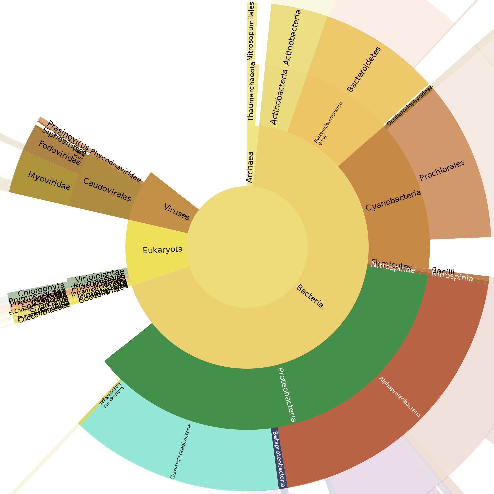

# The Unipept API and command line tools {.chapter data-running-title='3. The Unipept API and CLI'}

The Unipept website is an excellent tool for biodiversity analysis of metaproteomics samples. One disadvantage for large-scale data processing is that all analysis must be run manually on the website. For high-throughput studies, this manual approach is not viable. With this in mind, we developed an API and a set of command line tools to expose the Unipept analysis features for use in automated pipelines and other applications.

In this chapter, we first describe the Unipept API by means of the application note published in Bioinformatics [@Mesuere2016] and then give an overview of the command line tools with two detailed case studies.

## Unipept web services for metaproteomics analysis {#sec:ch3-api data-running-title='Unipept web services for metaproteomics analysis'}

<p class='aside'>This section contains a verbatim copy of the application note by @Mesuere2016 as published in Bioinformatics.</p>

**Abstract** &mdash; Unipept is an open source web application that is designed for metaproteomics analysis with a focus on interactive data-visualization. It is underpinned by a fast index built from UniProtKB and the NCBI taxonomy that enables quick retrieval of all UniProt entries in which a given tryptic peptide occurs. Unipept version 2.4 introduced web services that provide programmatic access to the metaproteomics analysis features. This enables integration of Unipept functionality in custom applications and data processing pipelines. The web services are freely available at [http://&#8203;api&#8203;.unipept&#8203;.ugent&#8203;.be](http://api.unipept.ugent.be) and are open sourced under the MIT license.

### Introduction
Unipept is a web application for biodiversity analysis of complex metaproteomics samples [@Mesuere2012]. The application is powered by a fast index built from UniProtKB [@TheUniProtConsortium2015] and a cleaned up version of the NCBI taxonomy [@Federhen2012]. This index enables quick retrieval of all UniProt entries in which a given tryptic peptide occurs. Using the taxonomic annotations of UniProt entries, Unipept also returns the complete set of organisms in which a given peptide occurs. This set of organisms is then processed using a Lowest Common Ancestor (LCA) algorithm to determine the taxonomic specificity of the peptide. All results are presented in clear overview tables and in an interactive treeview.

Fast computation of LCAs for given lists of peptides also enables interactive biodiversity analysis of metaproteomics data sets. The biodiversity in complex samples can then be inspected using multiple interactive visualizations such as a treeview ([@Fig:ch3fig2]), a sunburst view ([@Fig:ch3fig3]) and a treemap ([@Fig:ch3fig4]). All visualizations on the Unipept website can be saved as publication-grade graphics, and all analysis results can be exported as Microsoft Excel-compatible CSV files.

{#fig:ch3fig2}

To guarantee optimal performance and correctness, the Unipept project pursues excellence regarding best practices for modern web application development. One example of this is automatic correctness testing by over 1000 tests after each code change. The entire application including the web services is open source and licensed under the terms of the MIT license. The source code can be found at [http://&#8203;GitHub&#8203;.com&#8203;/unipept&#8203;/unipept](http://GitHub.com/unipept/unipept).

In this article, we present the latest addition to the Unipept toolbox: a set of web services that expose the Unipept analysis functions for use in other applications and data processing pipelines.

{#fig:ch3fig3}

{#fig:ch3fig4}

### Methods {#sec:ch3-API}
Unipept version 2.4 introduced the Unipept web services. These web services allow access to all Unipept peptide analysis features through a RESTful API. This means that all communication with the web services can be done using simple stateless HTTP requests, to which the server answers in JSON. JSON is an open standard for transmitting data that is both human readable and has wide support in developer tools and programming languages.

In the next sections, we discuss the available API functions by drawing parallels between usage of the Unipept website and the Unipept API. @Fig:ch3fig1 displays a schematic overview of the included functions, along with the expected input and output. The full documentation can be found at [http://&#8203;api&#8203;.unipept&#8203;.ugent&#8203;.be](http://api.unipept.ugent.be). Next to the documentation, the website also offers an interactive API explorer (@Fig:ch3fig5) where API requests can be composed and tested with just a few clicks.

![General outline of the Unipept workflow for taxonomic identification of tryptic peptides. For a given tryptic peptide, all UniProt entries having an exact match of the peptide in the protein sequence are found. Unipept then computes the lowest common ancestor (LCA) of the taxonomic annotations extracted from the matched UniProt entries, based on a cleaned up version of the NCBI Taxonomy. All intermediate results are shown for the sample tryptic peptide <span class='small-caps'>enfvy[il]ak</span> (isoleucine and leucine equated), leading to an LCA in the phylum Streptophyta. Arrows at the bottom show which processing steps are available as functions in the Unipept API.](images/ch3fig1.png){#fig:ch3fig1}

##### pept2prot
The fundamental component in the Tryptic Peptide Analysis feature of Unipept is fast retrieval of all UniProt entries in which a given tryptic peptide occurs. All subsequent calculations are based on this result, and therefore the database indexes are heavily optimized to return the result as fast as possible. When doing a Tryptic Peptide analysis in the web interface, the set of all matching UniProt entries is listed on the Protein Matches tab.

Its web service counterpart, `pept2prot`, takes a single tryptic peptide as input and returns the list of all UniProt entries containing the given tryptic peptide. By default, for each entry, the UniProt accession number, protein name and associated NCBI taxon ID are returned. Optionally, users can also request additional information fields such as the name of the organism associated with the UniProt entry, a list of cross-referenced EC numbers [@Bairoch2000] and a list of cross-referenced GO terms [@Gene2014]. Users can also choose to equate the isobaric amino acids isoleucine (I) and leucine (L) when matching peptides to proteins, a typical option for mass spectrometry-related queries. Batch retrieval of multiple peptides at once is also supported.

##### pept2taxa
After matching the UniProt entries, Unipept uses the cross-referenced NCBI taxon IDs to compile a set of organisms in which the queried peptide occurs. These organisms are then mapped to their taxonomic lineages using a cleaned up version of the NCBI taxonomy database. Using the web interface, the list of organisms along with their lineage can be found in the Lineage Table tab and an interactive visualization is available in the Lineage Tree tab (@Fig:ch3fig2).

<p style="display:none" class='pre-small-image'> </p> ![Screenshot of the API explorer, available on the documentation page of each of the Unipept API functions. By using the form, all of the API features can be easily tested within a web browser. After clicking the "Try it!" button, the resulting query string and response are shown. The figure shows the output for the `pept2lca` method used on the tryptic peptides <span class='small-caps'>aaamsmiptstgaak</span> and <span class='small-caps'>aivaytqtgatvhr</span> with the option to equate isoleucine and leucine when matching peptides to proteins. The LCA for <span class='small-caps'>aaamsmiptstgaak</span> is the superkingdom Bacteria, the LCA for <span class='small-caps'>aivaytqtgatvhr</span> is the species *Bifidobacterium longum*.](images/ch3fig5.png){#fig:ch3fig5}

Similarly, the API function `pept2taxa` takes a tryptic peptide as input and returns the set of organisms associated with the UniProt entries containing the given tryptic peptide. By default, the taxon ID, name, and rank are returned for each of the matched organisms. Optionally, the full lineage of each organism can be requested as a sequence of taxon IDs and/or taxon names. Batch requests and equating isoleucine and leucine are also supported.

##### pept2lca
The matched organisms from the previous section are then used to calculate the taxonomic lowest common ancestor (LCA). Simply put, the LCA is the most specific taxonomic rank that all matched organisms have in common. However, the algorithm used by Unipept has several advancements to better cope with taxonomic noise and misclassifications [@Mesuere2012].<span class="aside">Newer versions of the invalidation script also contain exceptions for viruses.</span> One of these improvements is the invalidation of taxonomic nodes that provide little informational values, such as those containing words like "uncultured", "unspecified" or "undetermined" in their name. Invalidated taxa are ignored during LCA calculation and mapped to their first valid ancestor. These invalidated taxa would otherwise result in a drastic loss of information when used for LCA calculation. Another example is mapping strain-specific taxon IDs to their first valid parent taxon to counter the, now abandoned, practice of creating strain-level taxon IDs [@Federhen2014].

Correspondingly, the `pept2lca` function returns the LCA (taxon ID, name, and rank) for a given tryptic peptide. Optionally, the full lineage (IDs and/or names) can be requested and both equating isoleucine and leucine and batch requests are supported. The LCAs for all tryptic peptides are precalculated and stored in the database. Therefore, the peptide matching steps can be skipped for the pept2lca function, resulting in improved performance.

##### taxa2lca
The Unipept LCA algorithm can also be used outside a proteomics context by using the `taxa2lca` function. This API function takes a list of NCBI taxon IDs and calculates their LCA by using the advanced algorithm as applied by Unipept. The result is returned by listing the taxon ID, name, and rank of the LCA. Additional lineage information is also available upon request. Note that the `pept2lca` function can be mimicked by chaining the `pept2taxa` and `taxa2lca` functions. This is however not recommended, as `pept2lca` makes use of precomputed data and is therefore several orders of magnitude faster.

##### taxonomy
The `taxonomy` function provides access to the cleaned up version of the NCBI taxonomy as used by Unipept. This function can be used, for example, to compute more detailed statistics about taxon hits or implement alternative aggregation strategies next to the LCA computation as used by Unipept. The function takes one or more taxon IDs as input and returns the name and rank for each of the given IDs. Optionally, the full lineage can also be returned.

### Results
The Unipept project consists of two main parts: a collection of scripts to construct the database and the web application. The first part of the database construction, the code to parse UniProt, was recently updated to use Berkeley DB [@Olson1999], a high performance key value store, to store intermediate results. This resulted in an enormous boost in parsing speed: where the old parser took over 30 days to parse UniProt, the new approach using Berkeley DB does the job in under 10 hours. The second part of the database construction is the precalculation of the LCAs of all the peptides in the database. The old Ruby code was rewritten in Java and computation time was reduced from over four weeks to just 15 minutes with the help of some new Java 8 features. The combination of these advancements allows us to consistently offer analysis results based on the latest UniProt release. The second part of Unipept is a Ruby on Rails web application that uses JavaScript for all client side interactions. All data visualizations [@Mesuere2015] are made in-house with the D3.js JavaScript library [@Bostock2011].

The GalaxyP project already takes advantage of the new Unipept web services to integrate Unipept functionality into the Galaxy Framework [@Jagtap2015]. Exact matching of peptides to UniProt entries is also implemented by the Peptide Match application [@Chen2013] of the Protein Information Resource (PIR). Where Unipept is restricted for use with tryptic peptides, Peptide Match has no such limitation. However, the advantage of accepting all peptides comes at the cost of reduced performance. For a test set of 500 tryptic peptides, the Unipept `pept2prot` function returned all matching UniProt entries in 1.5 seconds whereas Peptide Match took over 33 minutes. Since (meta)proteomics experiments almost exclusively use trypsin to digest proteins, resulting in a list of tryptic peptides, this is a reasonable compromise [@Olsen2004]. All functions of the Unipept API are tweaked for optimal performance and usable for high throughput data analysis. The `pept2lca` function (no counterpart in PIR), can process over 10&thinsp;000 peptides per second. For this reason, the information fields that are returned by default are limited to the subset of available fields that can be returned without performance penalty.

## The Unipept command line tools {data-running-title='The Unipept command line tools' #sec:ch3-CLI}

The Unipept API provides a good starting point for integrating Unipept functionality in other applications and pipelines. It is however not a ready-made solution that can be used without additional programming. To counter this, we developed a set of user-friendly command line tools that are essentially wrappers around the API. In this section, we first give an overview of the Unipept command line tools and their advantages over the API and then demonstrate their usage in two detailed case studies.

### The Unipept gem
The Unipept command line tools provide a command line interface to the Unipept web services along with a few utility commands for handling proteins using the command line. All tools support fasta and plain text input, multiple output formats (csv, xml, and json) and parallel web requests for improved performance. Just as with the Unipept web application, we followed the coding best practices and the entire code base is covered with unit and integration tests. All code is open source under the MIT License and available on GitHub in a separate `unipept-cli` repository at https://GitHub.com/unipept/unipept-cli.

##### Installation
The Unipept command line tools are written in Ruby, so to use them, Ruby needs to be installed on your system. We recommend using Ruby 2.2, but all versions since Ruby 1.9.3, as well as JRuby are supported. We made the command line tools available as a Ruby gem. A gem is a packaged version of the code that can be used in combination with the RubyGems package manager. This means it can easily be installed with a single command:

<div class="sourceCode"><pre class="sourceCode zsh"><code class="sourceCode zsh"><b>$</b> <span class="kw">gem</span> install unipept
Fetching: unipept-1.1.0.gem (100%)
Successfully installed unipept-1.1.0
Parsing documentation for unipept-1.1.0
Installing ri documentation for unipept-1.1.0
Done installing documentation for unipept after 0 seconds
1 gem installed</code></pre></div>

After successful installation, the unipept command should be available. To check if the gem was installed correctly, run `unipept --version`. This should print the version number:

<div class="sourceCode"><pre class="sourceCode zsh"><code class="sourceCode zsh"><b>$</b> <span class="kw">unipept</span> --version
1.1.0</code></pre></div>

Updating to the newest version of the command line tools is equally simple using the `gem update unipept` command. Each of the commands also has a built-in help function that can be displayed using the `--help` argument.

<div class="sourceCode"><pre class="sourceCode zsh"><code class="sourceCode zsh"><b>$</b> <span class="kw">unipept</span> --help
<span class='wa'>NAME</span>
<span class="kw">unipept</span> - Command line interface to Unipept web services.

<span class='wa'>USAGE</span>
<span class="kw">unipept</span> subcommand [options]

<span class='wa'>DESCRIPTION</span>
The unipept subcommands are command line wrappers around the Unipept web
services.

Subcommands that start with pept expect a list of tryptic peptides as
input. Subcommands that start with tax expect a list of NCBI Taxonomy
Identifiers as input. Input is passed
- as separate command line arguments
- in a text file that is passed as an argument to the -i option
- to standard input

The command will give priority to the first way the input is passed, in
the order as listed above. Text files and standard input should have one
tryptic peptide or one NCBI Taxonomy Identifier per line.

<span class='wa'>COMMANDS</span>
<span class="kw">config</span>        Set configuration options.
<span class="kw">help</span>          show help
<span class="kw">pept2lca</span>      Fetch taxonomic lowest common ancestor of UniProt entries
              that match tryptic peptides.
<span class="kw">pept2prot</span>     Fetch UniProt entries that match tryptic peptides.
<span class="kw">pept2taxa</span>     Fetch taxa of UniProt entries that match tryptic peptides.
<span class="kw">taxa2lca</span>      Compute taxonomic lowest common ancestor for given list of
              taxa.
<span class="kw">taxonomy</span>      Fetch taxonomic information from Unipept Taxonomy.

<span class='wa'>OPTIONS</span>
<span class="kw">-f --format</span>=&lt;value&gt;        define the output format (available: json,
                           csv, xml) (default: csv)
<span class="kw">-h --help</span>                  show help for this command
   <span class="kw">--host</span>=&lt;value&gt;          specify the server running the Unipept web
                           service
<span class="kw">-i --input</span>=&lt;value&gt;         read input from file
<span class="kw">-o --output</span>=&lt;value&gt;        write output to file
<span class="kw">-q --quiet</span>                 disable service messages
<span class="kw">-v --version</span>               displays the version</code></pre></div>

##### Commands
The Unipept command line tools consist of four main commands: `uniprot`, `prot2pept`, `peptfilter`, and `unipept`.

The `uniprot` command is a utility to easily fetch protein information from UniProt. It takes one or more UniProt accession numbers and returns the corresponding UniProt entry for each of the accession numbers as output. This information is fetched by using the UniProt web services.

<div class="sourceCode"><pre class="sourceCode zsh"><code class="sourceCode zsh"><b>$</b> <span class='kw'>uniprot</span> C6JD41 Q06JG4
MTLVPLGDRVVLKQVEAEETTKSGIVLPGQAQEKPQQAEVVAVGPGGVVDGKEVKMEVAVGDKVIYSKYSGT
  EVKMDGTEYIIVKQNDILAIVK
MFTNSIKNLIIYLMPLMVTLMLLSVSFVDAGKKPSGPNPGGNN</code></pre></div>

`prot2pept` is a utility to perform an *in silico* trypsin digest on protein sequences. The command takes one or more protein sequences as input and returns the digested peptides as output. This command runs entirely locally and doesn't connect to any server.

<div class="sourceCode"><pre class="sourceCode zsh"><code class="sourceCode zsh"><b>$</b> <span class="kw">echo</span> <span class="st">"LGAARPLGAGLAKVIGAGIGIGK"</span> <span class="kw">|</span> <span class="kw">prot2pept</span>
LGAARPLGAGLAK
VIGAGIGIGK</code></pre></div>

The `peptfilter` command also runs entirely client-side and can be used to filter a list of peptides that satisfy a given set of criteria. By default, peptides with length between 5 and 50 are retained, but other criteria can be specified. The length filter can be changed by using the `--minlen` and `--maxlen` parameters. Peptides can also be filtered based on whether or not they lack or contain certain amino acids. This can be done with the `--lacks` and `--contains` parameters.

<div class="sourceCode"><pre class="sourceCode zsh"><code class="sourceCode zsh"><b>$</b> <span class="kw">cat</span> input.txt
AAR
AALTER
<b>$</b> <span class="kw">cat</span> input.txt <span class="kw">|</span> <span class="kw">peptfilter</span>
AALTER</code></pre></div>

The `unipept` command has several subcommands: `pept2lca`, `pept2taxa`, `pept2prot`, `taxa2lca`, and `taxonomy`. Each of them corresponds to the equally named API call and has several options that are equivalent with the corresponding API parameters. A comprehensive description of these calls and parameters can be found in @Sec:ch3-API of this chapter, examples of their usage can be found in the case studies in @Sec:ch3-CS1 and @Sec:ch3-CS2.

##### Input and output formats
One of the benefits of using the command line tools is support for multiple input and output formats. All commands accept input from command line arguments, a file, or *standard input*. Output can be written to *standard output* or to a file. Where the API always uses json as output format, the command line tools offer support for json, xml, and csv. Additionally, the `--select` option allows you to control which fields are returned. A list of fields can be specified by a comma-separated list, or by using multiple `--select` options. The `*`-symbol can be used as a wildcard for field names. For example, `--select peptide,taxon*` will return the `peptide` field and all fields starting with `taxon`.

The commands also support input (from any source) in fasta(-like) format. This format consists of a fasta header (a line starting with a `>`-symbol), followed by one or more lines containing, for example, one peptide each. When this format is detected, the output will automatically include an extra information field in the output containing the corresponding fasta header.

<div class="sourceCode"><pre class="sourceCode zsh"><code class="sourceCode zsh"><b>$</b> <span class="kw">cat</span> input.txt
&gt; header 1
AALTER
MDGTEYIIVK
&gt; header 2
AALTER
<b>$</b> <span class="kw">unipept pept2lca</span> --input input.txt
fasta_header,peptide,taxon_id,taxon_name,taxon_rank
&gt; header 1,AALTER,1,root,no rank
&gt; header 1,MDGTEYIIVK,1263,Ruminococcus,genus
&gt; header 2,AALTER,1,root,no rank</code></pre></div>

##### Request optimizations
Internally, the command line tools query the Unipept API for each of the `unipept` subcommands. Making one http-request at a time for each of the input values would cause a significant overhead and poor performance. This problem was tackled in two ways. A first solution is batching multiple input values per request. The batch size was determined experimentally and lies between 10 and 1000 values per request, depending on the subcommand and the amount of extra information that is requested.

A second solution is doing multiple parallel requests at a time to make optimal use of the multiple CPU cores of the client and server. This fix improves performance significantly, but has an unexpected side effect: because multiple requests are sent at a time, we don't know in what order they will be completed. To make sure that the order of the input and output values are the same, we had to include a non-trivial reordering algorithm to restore the order without consuming lots of memory.

### Case study: analysis of a tryptic peptide {#sec:ch3-CS1}

For a first case study, let's say that we have determined the mass spectrum of a tryptic peptide, that was identified as the peptide <span class="sequence">enfvyiak</span> using database searches (*Mascot* [@Perkins1999], *Sequest* [@Eng1994], *X!Tandem* [@Craig2003]) or de novo identification (*PEAKS* [@Ma2003]). As an example, we show how this tryptic peptide can be taxonomically assigned to the phylum Streptophyta. As a starter, we can use the `unipept pept2prot` command to fetch all UniProt proteins indexed by Unipept that contain the peptide.

##### Matching proteins
The following interactive session shows that UniProt contains 19 proteins that contain the tryptic peptide <span class="sequence">enfvyiak</span>. Note that the first command passes the tryptic peptide as an argument to the `unipept pept2prot` command. In case no tryptic peptide is passed as an argument, the command reads a tryptic peptide from standard input as illustrated by the second command. Throughout this case study we will preferentially pass tryptic peptides as an argument to the `unipept pept2prot` command, but the command works the same way irrespective of how the tryptic peptide is fed to the command.

<div class="sourceCode"><pre class="sourceCode zsh"><code class="sourceCode zsh"><b>$</b> <span class="kw">unipept pept2prot</span> ENFVYIAK
peptide,uniprot_id,protein_name,taxon_id
ENFVYIAK,C6TH93,Casparian <span class="kw">strip</span> membrane protein 4,3847
ENFVYIAK,P42654,14-3-3-like protein B,3906
ENFVYIAK,Q96453,14-3-3-like protein D,3847
<span class="co">...</span>
<b>$</b> <span class="kw">echo</span> <span class="st">"ENFVYIAK"</span> <span class="kw">|</span> <span class="kw">unipept pept2prot</span>
peptide,uniprot_id,protein_name,taxon_id
ENFVYIAK,C6TH93,Casparian strip membrane protein 4,3847
ENFVYIAK,P42654,14-3-3-like protein B,3906
ENFVYIAK,Q96453,14-3-3-like protein D,3847
<span class="co">...</span></code></pre></div>

By default, the output is generated in csv-format (*comma-separated values*). Apart from the query peptide (`peptide`), the output contains two GUIDs (*globally unique identifiers*): i) the UniProt Accession Number (`uniprot_id`) that refers to the protein record in the UniProt database that contains the tryptic peptide and ii) the NCBI Taxonomy Identifier (`taxon_id`) assigned to the UniProt protein record that refers to a record in the NCBI Taxonomy Database [@Acland2014;@Benson2013]. The latter describes a taxon in the hierarchical classification of cellular organisms, being the taxon from which the protein was extracted. The output also contains the name of each protein (`protein_name`).

##### Leucine & isoleucine
In peptide sequencing experiments involving a single step tandem mass acquisition, leucine (`L`) and isoleucine (`I`) are indistinguishable because both are characterized by a 113 Da mass difference from the other peptide fragments in the MS-MS spectrum. In general, there are 2<sup>n</sup> `I=L` variants for each tryptic peptide that contains *n* residues that are either leucine or isoleucine. Therefore, all subcommands of the unipept command that are based on matching given peptides against UniProt proteins support the `-e/--equate` option. Exact matching makes no distinction between `I` and `L` when this option is activated.

<div class="sourceCode"><pre class="sourceCode zsh"><code class="sourceCode zsh"><b>$</b> <span class="kw">unipept pept2prot</span> <b>-e</b> ENFVYIAK
peptide,uniprot_id,protein_name,taxon_id
ENFVYIAK,C6TH93,Casparian strip membrane protein 4,3847
ENFVYIAK,P42654,14-3-3-like protein B,3906
ENFVYIAK,Q96453,14-3-3-like protein D,3847
ENFVYIAK,G7LIR4,Uncharacterized protein,3880
<span class="co">...</span></code></pre></div>

Note that the Unipept database has two separate index structures to match tryptic peptides against UniProt protein records: one that is used to exactly match tryptic peptides against UniProt protein records and one that is used to exactly match all `I=L` variants of a given tryptic peptide. As a result, matching all `I=L` variants of the tryptic peptide <span class="sequence">enfvyiak</span> can be done in a single step, without any performance loss.

##### Metadata
Apart from a fast index that maps tryptic peptides onto the UniProt entries of proteins that contain the peptide, the Unipept database contains minimal information about the proteins that was extracted from the UniProt entries. This includes information about the taxon from which the protein was sequenced (`taxon_id` and `taxon_name`) and a description of the cellular functions the protein is involved in (`ec_references` and `go_references`). Taxonomic information is described using a GUID that refers to a record in the NCBI Taxonomy Database [@Acland2014;@Benson2013]. Functional information is described using GUIDs that refer to records from the Enzyme Commission classification (EC; @Bairoch2000) and the Gene Ontology (GO; @Ashburner2000). The generated output contains this additional information if the `-a/--all` option of the `unipept` command is used. The following example is representative in the sense that the taxonomic information about proteins is generally more accurate and complete than the information about known functions of the proteins.

<div class="sourceCode"><pre class="sourceCode zsh"><code class="sourceCode zsh"><b>$</b> <span class="kw">unipept pept2prot</span> -e <b>-a</b> ENFVYIAK
peptide,uniprot_id,protein_name,taxon_id,taxon_name,ec_references,go_ref
  erences,refseq_ids,refseq_protein_ids,insdc_ids,insdc_protein_ids
ENFVYIAK,C6TH93,Casparian strip membrane protein 4,3847,Glycine max,,GO:
  0016021 GO:0005886 GO:0071555,NM_001255156.1,NP_001242085.1,BT097011,A
  CU21195.1
ENFVYIAK,P42654,14-3-3-like protein B,3906,Vicia faba,,,,,Z48505,CAA8841
  6.1
ENFVYIAK,Q96453,14-3-3-like protein D,3847,Glycine max,,,NM_001250136.1,
  NP_001237065.1,U70536,AAB09583.1
ENFVYIAK,G7LIR4,Uncharacterized protein,3880,Medicago truncatula,,,XM_00
  3629715.1,XP_003629763.1,CM001224 BT141273,AET04239.2 AFK41067.1
<span class="co">...</span></code></pre></div>

Because Unipept uses a separate peptide index in which `I` and `L` are equated, Unipept cannot directly resolve what specific `I=L` variant (or variants) of a tryptic peptide are contained in a protein sequence. However, the Unipept command line tools contain the `uniprot` command that calls the UniProt web services. This can be used, for example, to retrieve all protein sequences for a given list of UniProt Accession Numbers. The following example also illustrates the `-s/--select` option of the `unipept` command, that can be used to include only a selected list of information fields in the generated output. Note that we add a series of additional processing steps to the result of the `uniprot` command, that only put the contained `I=L` variants in capitals (the remaining residues are converted into lower case) and truncate the protein sequences after a fixed number of residues.

<div class="sourceCode"><pre class="sourceCode zsh"><code class="sourceCode zsh"><b>$</b> <span class="kw">unipept pept2prot</span> -e ENFVYIAK <b>-s uniprot_id</b> <span class="kw">|</span> <span class="kw">tail</span> -n+2 <span class="kw">|</span> <span class="kw">\</span>
  <span class="kw">uniprot</span> <span class="kw">|</span> <span class="kw">tr</span> <span class="st">'A-Z'</span> <span class="st">'a-z'</span> <span class="kw">|</span> <span class="kw">sed</span> <span class="st">'s/enfvy[il]ak/\U&amp;\E/'</span> <span class="kw">|</span> <span class="kw">\</span>
  <span class="kw">sed</span> -E <span class="st">'s/(.{60}).*/\1.../'</span>
maaskdrENFVYIAKlaeqaeryeemvesmknvanldveltveerkkgvaildfilrlga...
mastkdrENFVYIAKlaeqaeryeemvdsmknvanldveltieernllsvgyknvigarr...
mtaskdrENFVYIAKlaeqaeryeemvesmknvanldveltveernllsvgyknvigarr...
mastkerENFVYIAKlaeqaeryeemveamknvakldveltveernllsvgyknvvgahr...
mdkdrENFVYIAKlaeqaerydemvdamkkvanldveltveernllsvgyknvigarras...
<span class="co">...</span></code></pre></div>

The `uniprot` command can not only be used to fetch protein sequences from the UniProt database, but also all metadata that is available about the protein in UniProt. This can be done by passing a specific format to the `-f/--format` option of the `uniprot` command: `csv` (default value), `fasta`, `xml`, `text`, `rdf` or `gff`. As an example, the following session fetches the first three proteins from UniProt that contain an `I=L` variant of the tryptic peptide <span class="sequence">enfvyiak</span>. These proteins are returned in FASTA format.

<div class="sourceCode"><pre class="sourceCode zsh"><code class="sourceCode zsh"><b>$</b> <span class="kw">unipept pept2prot</span> -e ENFVYIAK -s uniprot_id <span class="kw">|</span> <span class="kw">tail</span> -n+2 <span class="kw">|</span> <span class="kw">\</span>
  <span class="kw">head</span> -3 <span class="kw">|</span> <span class="kw">uniprot</span> <b>-f fasta</b>
&gt;sp|C6TH93|CASP4_SOYBN Casparian strip membrane protein 4 OS=Glycine max PE=2 SV=1
MAASKDRENFVYIAKLAEQAERYEEMVESMKNVANLDVELTVEERKKGVAILDFILRLGA
ITSALGAAATMATSDETLPFFTQFFQFEASYDSFSTFQFFVIAMAFVGGYLVLSLPFSIV
TIIRPHAAGPRLFLIILDTVFLTLATSSAAAATAIVYLAHNGNQDSNWLAICNQFGDFCQ
EISGAVVASFVAVVLFVLLIVMCAVALRNH
&gt;sp|P42654|1433B_VICFA 14-3-3-like protein B OS=Vicia faba PE=2 SV=1
MASTKDRENFVYIAKLAEQAERYEEMVDSMKNVANLDVELTIEERNLLSVGYKNVIGARR
ASWRILSSIEQKEESKGNDVNAKRIKEYRHKVETELSNICIDVMRVIDEHLIPSAAAGES
TVFYYKMKGDYYRYLAEFKTGNEKKEAGDQSMKAYESATTAAEAELPPTHPIRLGLALNF
SVFYYEILNSPERACHLAKQAFDEAISELDTLNEESYKDSTLIMQLLRDNLTLWTSDIPE
DGEDSQKANGTAKFGGGDDAE
<span class="co">...</span></code></pre></div>

##### Lowest common ancestor
Based on the taxonomic annotations contained in the UniProt entries that match a given tryptic peptide, the tryptic peptide can be assigned taxonomically. To do so, Unipept makes use of an algorithm that computes the *lowest common ancestor* (LCA) of all taxa in which the peptide was found. The implementation of this algorithm in Unipept is robust against taxonomic misarrangements, misidentifications, and inaccuracies. Unipept computes the LCA based on the *Unipept Taxonomy*, a cleaned up version of the NCBI Taxonomy that heuristically invalidates some "unnatural" taxa from the original database based on a set of regular expressions. Not taking into account this identification noise would otherwise result in drastic loss of information.

Apart from the LCA algorithm implemented by Unipept, it is also possible to come up with alternative aggregation scenarios that are implemented client side based on the NCBI Taxonomy Identifiers that are associated with the matched UniProt protein records. Scenarios that are based on the Unipept Taxonomy can be implemented by using the `unipept pept2taxa` command that outputs all taxa associated with the UniProt proteins that contain a given tryptic peptide.

<div class="sourceCode"><pre class="sourceCode zsh"><code class="sourceCode zsh"><b>$</b> <span class="kw">unipept pept2taxa</span> -e ENFVYIAK
peptide,taxon_id,taxon_name,taxon_rank
ENFVYIAK,2711,Citrus sinensis,species
ENFVYIAK,3760,Prunus persica,species
ENFVYIAK,3827,Cicer arietinum,species
ENFVYIAK,3847,Glycine max,species
<span class="co">...</span></code></pre></div>

Using the `-a` option in combination with the `unipept` `pept2taxa` command includes the complete lineages (resulting after the cleanup done by Unipept) of the taxa in the generated output.

<div class="sourceCode"><pre class="sourceCode zsh"><code class="sourceCode zsh"><b>$</b> <span class="kw">unipept pept2taxa</span> -e <b>-a</b> ENFVYIAK
peptide,taxon_id,taxon_name,taxon_rank,superkingdom_id,superkingdom_name,kingdom_id,kingdom_name,subkingdom_id,subkingdom_name,superphylum_id,superphylum_name,phylum_id,phylum_name,subphylum_id,subphylum_name,superclass_id,superclass_name,class_id,class_name,subclass_id,subclass_name,infraclass_id,infraclass_name,superorder_id,superorder_name,order_id,order_name,suborder_id,suborder_name,infraorder_id,infraorder_name,parvorder_id,parvorder_name,superfamily_id,superfamily_name,family_id,family_name,subfamily_id,subfamily_name,tribe_id,tribe_name,subtribe_id,subtribe_name,genus_id,genus_name,subgenus_id,subgenus_name,species_group_id,species_group_name,species_subgroup_id,species_subgroup_name,species_id,species_name,subspecies_id,subspecies_name,varietas_id,varietas_name,forma_id,forma_name
ENFVYIAK,2711,Citrus sinensis,species,2759,Eukaryota,33090,Viridiplantae,,,,,35493,Streptophyta,,,,,,,71275,rosids,,,,,41937,Sapindales,,,,,,,,,23513,Rutaceae,,,,,,,2706,Citrus,,,,,,,2711,Citrus sinensis,,,,,,
ENFVYIAK,3760,Prunus persica,species,2759,Eukaryota,33090,Viridiplantae,,,,,35493,Streptophyta,,,,,,,71275,rosids,,,,,3744,Rosales,,,,,,,,,3745,Rosaceae,171637,Maloideae,,,,,3754,Prunus,,,,,,,3760,Prunus persica,,,,,,
ENFVYIAK,3827,Cicer arietinum,species,2759,Eukaryota,33090,Viridiplantae,,,,,35493,Streptophyta,,,,,,,71275,rosids,,,,,72025,Fabales,,,,,,,,,3803,Fabaceae,3814,Papilionoideae,163722,Cicereae,,,3826,Cicer,,,,,,,3827,Cicer arietinum,,,,,,
ENFVYIAK,3847,Glycine max,species,2759,Eukaryota,33090,Viridiplantae,,,,,35493,Streptophyta,,,,,,,71275,rosids,,,,,72025,Fabales,,,,,,,,,3803,Fabaceae,3814,Papilionoideae,163735,Phaseoleae,,,3846,Glycine,1462606,Soja,,,,,3847,Glycine max,,,,,,
<span class="co">...</span></code></pre></div>

This output corresponds to the tree structure that appears at the left of [@Fig:ch3fig1] or the tree drawn in the Lineage tree tab on the page that shows the results of a Tryptic Peptide Analysis in the Unipept web interface. Note that the tryptic peptide <span class="sequence">enfvyiak</span> was only found in a peach protein (*Prunus persica*), whereas its `I=L` variant was found in proteins of a species of wild banana (*Musa acuminata* subsp. *malaccensis*) and in different members of the flowering plants including chick pea (*Cicer arietinum*), broad bean (*Vicia faba*), soybean (*Glycine max*), common bean (*Phaseolus vulgaris*), barrel medic (*Medicago truncatula*), orange (*Citrus sinensis*), clementine (*Citrus clementina*) and common grape vine (*Vitis vinifera*).

The Unipept implementation of the LCA algorithm can be applied on a given tryptic peptide using the `unipept` `pept2lca` command. Using the `-e` option will again have an influence on the LCA computation for the tryptic peptide <span class="sequence">enfvyiak</span>. After all, the LCA will be computed for all taxa associated with proteins in which the tryptic peptide (or one of its `I=L` variants) was found.

<div class="sourceCode"><pre class="sourceCode zsh"><code class="sourceCode zsh"><b>$</b> <span class="kw">unipept pept2lca</span> ENFVYIAK
peptide,taxon_id,taxon_name,taxon_rank
ENFVYIAK,35493,Streptophyta,phylum
<b>$</b> <span class="kw">unipept pept2lca</span> ENFVYLAK
peptide,taxon_id,taxon_name,taxon_rank
ENFVYLAK,3760,Prunus persica,species
<b>$</b> <span class="kw">unipept pept2lca</span> -e ENFVYLAK
peptide,taxon_id,taxon_name,taxon_rank
ENFVYLAK,35493,Streptophyta,phylum</code></pre></div>

The correctness of the computed LCAs can be checked based on the taxonomic hierarchy shown in [@Fig:ch3fig1].


### Case study: analysis of a metaproteomics data&nbsp;set {#sec:ch3-CS2}

As a demonstration of the Unipept CLI, this second case study shows how it can be used to get insight into the biodiversity within one of the faecal samples from a gut microbiome study [@Verberkmoes2009]. The sample was taken from a female that is part of a healthy monozygotic twin pair born in 1951 that was invited to take part in a larger double-blinded study. Details of this individual with respect to diet, antibiotic usage, and so on are described by @Dicksved2008 (individual 6a in this study, sample 7 in the study of @Verberkmoes2009). The most important thing that we learn from the available information in the questionnaire that this individual has filled up, is that she had gastroenteritis at the time the sample was taken and that her twin sister (individual 6b in the study of @Dicksved2008, sample 7 in the study of @Verberkmoes2009) had taken non-steroidal anti-inflammatory drugs during the past 12 months before the time of sampling. The data can be downloaded from the website of the study and is also available as a demo data set on the Unipept website.

##### Duplicate peptides
Say that we stored the list of tryptic peptides that were extracted from sample 7 in the study of @Verberkmoes2009 in the text file `sample7.dat`. The file contains a list of all tryptic peptides, each on a separate line. The following session shows that this file contains a list of 3&thinsp;983 tryptic peptides (2&thinsp;065 unique peptides) that could be identified in the faecal sample using *shotgun metaproteomics*.

<div class="sourceCode"><pre class="sourceCode zsh"><code class="sourceCode zsh"><b>$</b> <span class="kw">head</span> -n5 sample7.dat
SGIVLPGQAQEKPQQAEVVAVGPGGVVDGK
SGIVLPGQAQEKPQQAEVVAVGPGGVVDGK
SGIVLPGQAQEKPQQAEVVAVGPGGVVDGKEVK
MEVAVGDKVIYSK
MDGTEYIIVK
<b>$</b> <span class="kw">wc</span> -l sample7.dat
3983 sample7.dat
<b>$</b> <span class="kw">sort</span> -u sample7.dat <span class="kw">|</span> <span class="kw">wc</span> -l
2065</code></pre></div>

The first thing that strikes the eye is that a mass spectrometer might pick up multiple copies of the same tryptic peptide from an environmental sample. Depending on the fact whether or not we can draw quantitative conclusion on the number of different identifications of a particular peptide (apart from identification, the quantification of proteins in an environmental sample is an important research theme [@Seifert2013;@Kolmeder2014]), we might decide to deduplicate the peptides before they are analyzed further using the Unipept CLI. This decision has an impact on the analysis results, but deduplication also results in improved performance since it avoids duplicate work.

##### Non-tryptic peptides
What might be less obvious at first sight, is that the peptides on lines 3 and 4 in the text file `sample7.dat` actually aren't tryptic peptides, but the composition of two tryptic peptides. This is a consequence of the fact that cleavage of proteins using trypsin is not always perfect, leading to some proteins that aren't cleaved properly. Such composed tryptic peptides are called *missed cleavages*. The index structure underpinning Unipept only indexes tryptic peptides that result from an *in silico* trypsin digest of the proteins in UniProt, so that missed cleavages cannot be matched directly by Unipept.

To cope with this problem, we can start to check if the peptides resulting from a shotgun metaproteomics experiment need to be cleaved further before making taxonomic identifications using Unipept. Performing an *in silico* trypsin digest can be done using the `prot2pept` command from the Unipept CLI. This command is executed purely client side, and thus is provided as a standalone command and not as a subcommand of the `unipept` command.

<div class="sourceCode"><pre class="sourceCode zsh"><code class="sourceCode zsh"><b>$</b> <span class="kw">sed</span> -ne <span class="st">'4{p;q}'</span> sample7.dat
MEVAVGDKVIYSK
<b>$</b> <span class="kw">sed</span> -ne <span class="st">'4{p;q}'</span> sample7.dat <span class="kw">|</span> <span class="kw">prot2pept</span>
MEVAVGDK
VIYSK</code></pre></div>

##### Lowest common ancestor
Once a peptide is broken into multiple tryptic peptides, the lowest common ancestor can be computed for each tryptic peptide using the `unipept pept2lca` command. Next to accepting tryptic peptides as arguments, the command can also read one ore more tryptic peptides from standard input if no arguments were passed. Each tryptic peptide should be on a separate line when using standard input.

<div class="sourceCode"><pre class="sourceCode zsh"><code class="sourceCode zsh"><b>$</b> <span class="kw">unipept pept2lca</span> -e SGIVLPGQAQEKPQQAEVVAVGPGGVVDGK MDGTEYIIVK
peptide,taxon_id,taxon_name,taxon_rank
SGIVLPGQAQEKPQQAEVVAVGPGGVVDGK,1263,Ruminococcus,genus
MDGTEYIIVK,1263,Ruminococcus,genus
<b>$</b> <span class="kw">sed</span> -ne <span class="st">'3{p;q}'</span> sample7.dat
SGIVLPGQAQEKPQQAEVVAVGPGGVVDGKEVK
<b>$</b> <span class="kw">sed</span> -ne <span class="st">'3{p;q}'</span> sample7.dat <span class="kw">|</span> <span class="kw">unipept pept2lca</span> -e
<b>$</b> <span class="kw">sed</span> -ne <span class="st">'3{p;q}'</span> sample7.dat <span class="kw">|</span> <span class="kw">prot2pept</span>
SGIVLPGQAQEKPQQAEVVAVGPGGVVDGK
EVK
<b>$</b> <span class="kw">sed</span> -ne <span class="st">'3{p;q}'</span> sample7.dat <span class="kw">|</span> <span class="kw">prot2pept</span> <span class="kw">|</span> <span class="kw">unipept pept2lca</span> -e
peptide,taxon_id,taxon_name,taxon_rank
SGIVLPGQAQEKPQQAEVVAVGPGGVVDGK,1263,Ruminococcus,genus</code></pre></div>

Unipept only indexes tryptic peptides extracted from UniProt sequences that have a length between 5 and 50 amino acids (boundaries included). This choice was driven by the detection limits of most common mass spectrometers. As a result, an additional time saver is to search for tryptic peptides that have less than 5 of more than 50 amino acids, because Unipept will never find protein matches for these peptides. The `peptfilter` command from the Unipept CLI can be used to filter out peptides that are too short or too long prior to the taxonomic identification step. By default, it filters out all peptides for which it is known in advance that Unipept will find no matches.

<div class="sourceCode"><pre class="sourceCode zsh"><code class="sourceCode zsh"><b>$</b> <span class="kw">sed</span> -ne <span class="st">'3{p;q}'</span> sample7.dat <span class="kw">|</span> <span class="kw">prot2pept</span> <span class="kw">|</span> <span class="kw">peptfilter</span> <span class="kw">|</span> <span class="kw">\</span>
  <span class="kw">unipept pept2lca</span> -e
peptide,taxon_id,taxon_name,taxon_rank
SGIVLPGQAQEKPQQAEVVAVGPGGVVDGK,1263,Ruminococcus,genus</code></pre></div>

All commands of the Unipept CLI follow the input/output paradigm of the Unix command line, so that they be chained together seamlessly. This way, for example, we can determine the LCAs for the first six peptides of sample 7 by combining the previous processing steps: split missed cleavages, filter out peptides that are too short or too long, equate leucine (residue `L`) and isoleucine (residue `I`), and deduplicate the tryptic peptides.

<div class="sourceCode"><pre class="sourceCode zsh"><code class="sourceCode zsh"><b>$</b> <span class="kw">head</span> -n6 sample7.dat <span class="kw">|</span> <span class="kw">prot2pept</span> <span class="kw">|</span> <span class="kw">peptfilter</span> <span class="kw">|</span> <span class="kw">tr</span> I L <span class="kw">|</span> <span class="kw">sort</span> -u
GLTAALEAADAMTK
MDGTEYLLVK
MEVAVGDK
SGLVLPGQAQEKPQQAEVVAVGPGGVVDGK
VLYSK
<b>$</b> <span class="kw">head</span> -n6 sample7.dat <span class="kw">|</span> <span class="kw">prot2pept</span> <span class="kw">|</span> <span class="kw">peptfilter</span> <span class="kw">|</span> <span class="kw">tr</span> I L <span class="kw">|</span> <span class="kw">sort</span> -u <span class="kw">|</span> <span class="kw">\</span>
  <span class="kw">unipept pept2lca</span> -e
peptide,taxon_id,taxon_name,taxon_rank
GLTAALEAADAMTK,186802,Clostridiales,order
MDGTEYLLVK,1263,Ruminococcus,genus
MEVAVGDK,1263,Ruminococcus,genus
SGLVLPGQAQEKPQQAEVVAVGPGGVVDGK,1263,Ruminococcus,genus
VLYSK,1,root,no rank</code></pre></div>
```zsh
```

##### Website comparison
The biodiversity in sample 7 from the study of @Verberkmoes2009 can be easily computed and visualized using the Metagenomics Analysis feature of the Unipept web site. All it takes is to paste the list of peptides that were identified from an environmental sample in a text area, select the appropriate search options, and to click the Search button to launch the identification process.

In the session that is shown in @Fig:ch3fig6, we have indicated that no distinction should be made between leucine (`L`) and isoleucine (`I`), that the peptides must be deduplicate prior to the actual biodiversity analysis, and that the results must be exported in csv format (comma separated values). Breaking up the missed cleavages happens by default. In addition, the option Advanced missed cleavage handling can be activated to indicate that the results should be aggregated as a post-processing step (not selected in this example).

The same result can be obtained using the following combination of commands from the Unipept CLI. The timing gives an impression of the performance of Unipept to compute the LCAs for all 2005 unique tryptic peptides extracted from sample 7. It indicates that part of the processing is parallelized, and that the majority of the processing time is consumed by exchanging data between the client and the Unipept server and the server-side processing of the data.

<div class="sourceCode"><pre class="sourceCode zsh"><code class="sourceCode zsh"><b>$</b> <span class="kw">prot2pept</span> <span class="kw">&lt;</span> sample7.dat <span class="kw">|</span> <span class="kw">peptfilter</span> <span class="kw">|</span> <span class="kw">tr</span> I L <span class="kw">|</span> <span class="kw">sort</span> -u <span class="kw">|</span> <span class="kw">wc</span> -l
2005
<b>$</b> <span class="kw">time prot2pept</span> <span class="kw">&lt;</span> sample7.dat <span class="kw">|</span> <span class="kw">peptfilter</span> <span class="kw">|</span> <span class="kw">tr</span> I L <span class="kw">|</span> <span class="kw">sort</span> -u <span class="kw">|</span> <span class="kw">\</span>
  <span class="kw">unipept pept2lca</span> -e <span class="kw">&gt;</span> sample7.csv

real    0m0.329s
user    0m0.465s
sys     0m0.038s
<b>$</b> <span class="kw">head</span> -n6 sample7.csv
peptide,taxon_id,taxon_name,taxon_rank
AAALNLVPNSTGAAK,2,Bacteria,superkingdom
AAALNTLAHSTGAAK,1678,Bifidobacterium,genus
AAALNTLPHSTGAAK,1678,Bifidobacterium,genus
AAAMSMLPTSTGAAK,2,Bacteria,superkingdom
AAANESFGYNEDELVSSDLVGMR,186802,Clostridiales,order</code></pre></div>

For those that are not familiar with IO redirection, the `unipept` command also supports the `-i/--input` option to read the peptides from the file that is passed as an argument and the `-o/--output` option to store the results in a file that is passed as an argument.

<div class="sourceCode"><pre class="sourceCode zsh"><code class="sourceCode zsh"><b>$</b> <span class="kw">unipept pept2lca</span> <b>--input</b> sample7.dat <b>--output</b> sample7.csv
<b>$</b> <span class="kw">head</span> -n6 sample7.csv
peptide,taxon_id,taxon_name,taxon_rank
AAALNLVPNSTGAAK,2,Bacteria,superkingdom
AAALNTLAHSTGAAK,1678,Bifidobacterium,genus
AAALNTLPHSTGAAK,1678,Bifidobacterium,genus
AAAMSMLPTSTGAAK,2,Bacteria,superkingdom
AAANESFGYNEDELVSSDLVGMR,186802,Clostridiales,order</code></pre></div>

<p style="display:none" class='pre-small-image'> </p> {#fig:ch3fig6}

If needed, the unipept `pept2lca` command can be used in combination with the `-a` option to fetch the complete lineages for all LCAs according to the Unipept Taxonomy. @Fig:ch3fig7 shows the hierarchical classification of the taxa that could be identified in sample 7. A similar tree view can be found in the *Treeview* tab on the page showing the results of a Metaproteomics analysis in the Unipept web interface.

{#fig:ch3fig7}
