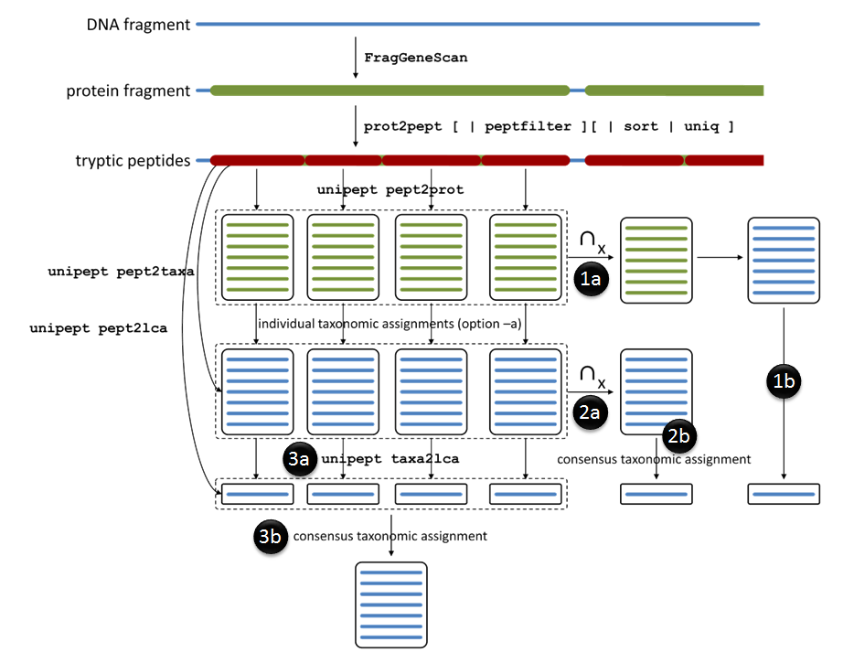
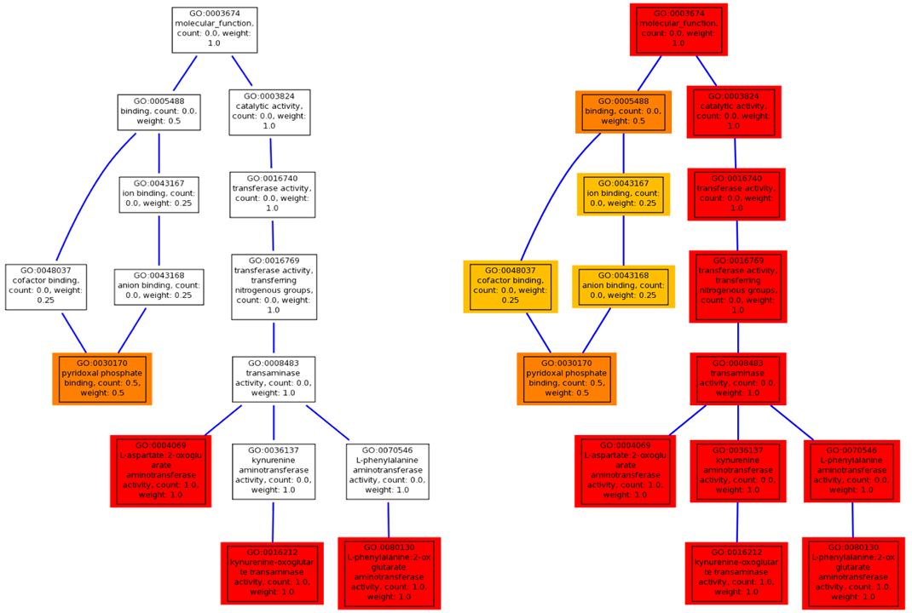
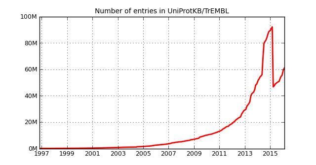

# A short history of Unipept {.chapter data-running-title='6. A short history of Unipept'}

This chapter tells the story of Unipept from a developer's point of view. The first section deals with Unipept before it was a web application. Section two goes into detail about the individual versions of the Unipept web application. The last section handles the Unipept command line tools.

## Before the web application {data-running-title='Before the web application'}

The first attempt at creating a tool for peptide analysis was a stand-alone application written in Java. The data source for this application was the set of complete bacterial RefSeq genomes. First, all files containing the proteomes were downloaded in the GenBank flat file format. These files were then fed through our data processing pipeline. The processing consisted of parsing the files using BioJava [@Prlic2012]and performing an in-silico trypsin digest on the protein sequences. We then only store peptides that have a length between 5 and 50 amino acids (boundaries included). This choice was driven by the detection limits of most common mass spectrometers.

##### Storing the data
Initially, the peptides were stored using a patricia trie. <span class="aside">Unlike in a normal trie, in a patricia trie, parent nodes having only a single child are collapsed into a single node. This reduces the size of the data structure, especially in sparse trees.</span> A trie, or prefix tree, is a data structure where an ordered tree is used to efficiently search for keys (in our case tryptic peptides) and retrieve the associated values (in our case taxon id's). While information retrieval is very fast, this approach has two major problems: the entire dataset must fit into memory to achieve optimal performance and it's not straightforward to both reliably and efficiently store the data structure to disk. This effectively means that all source data must be reprocessed every time the program is run.

Both problems were solved by storing the data in a MySQL database instead of a patricia trie. By default, MySQL uses the hard drive to store data and only uses memory for temporary tables and caches. This not only allowed us to process the source data once and have permanent access afterwards, but also enabled more flexible data access through the use of SQL queries. The downsides are slightly slower data access and fairly slower index construction.

At that time, there were 1190 complete bacterial RefSeq genomes spanning 860 species. Using the MySQL database, it took 21 hours to parse these genomes and create the index. This resulted in a database of 7 GB of which half was used for indexes. The database contained information on 34.4 million distinct peptides that each occurred in 1.57 genomes on average. 90.7% of all peptides only occurred within a single species, 5.8% occurred within two species.

<p style="display:none" class='pre-small-image image-screenshot'> </p> {#fig:ch6fig2}

##### Exploring the data
After creating a fast index mapping peptides on taxonomic nodes, there are two research questions that emerge: in which species does a given peptide occur, and which peptides only occur within a given species. To answer the first question, a Java application with a graphical user interface was created.<span class="aside">This PeptideInfo application later evolved into the Unipept tryptic peptide analysis.</span> As shown in @Fig:ch6fig2, the user could enter a tryptic peptide in the text area, click the search button and a report was generated listing all species in which the peptide was found. The application also listed the number of genomes in which the peptide was found in case multiple genomes of a species were available.

The second question, which peptides can be used to uniquely identify a certain species, was harder to answer. The database was not optimized for this and the queries took too long to wrap everything into a desktop application.<span class="aside">A solution to this question was later provided by the Unipept unique peptide finder.</span> Instead, a collection of scripts and queries was created to explore the potential of the data. @Fig:ch6fig1 shows the promising results of such analysis on the available genomes of *Staphylococcus aureus* subsp. *aureus*, *Clostridium botulinum* and *Campylobacter*. These results show that there is a large number of species-specific peptides and a surprisingly low number of genus-specific peptides. This means that there is a great potential to use tryptic peptides as a way to identify organisms.

Because there was an immediate need for a tool to help analyze the gut microbiota of patients with cystic fibrosis for a joint research project [@debyser2015], we decided to first further develop the PeptideInfo application.

{#fig:ch6fig1}

## The Unipept web application {data-running-title='The Unipept web application'}

After creating a database-backed mapping from peptide sequences to organisms, the use of Java for the client application was reevaluated. The main advantages were familiarity with the programming language, good performance and, at least theoretically, cross-platformness.<span class="aside">Users would also have to set up a local database, still requiring platform-specific solutions.</span> This was offset by drawbacks such as the need for installation of the application, the difficulty to distribute updates and the need to run your own database as a user. Because the target audience of Unipept is non-technical users and we had an agile development style in mind, the disadvantages outweighed the benefits.

### Unipept version 0.1 &ndash; 0.4

##### Unipept version 0.1
<span class="aside">Released on<br>February 3, 2011</span>In the end, we chose to rebuild the client as a web application using the Ruby on Rails framework ([@Fig:ch6fig3]). The main reason to choose for a web application was the low threshold for users to start using the application and the ease with which new versions can be deployed. This client-server architecture also completely shifts the technical burden away from the user. The choice for Ruby on Rails was a bit of a risk since we had no previous experience with it, but the framework looked promising and was becoming popular very fast.

<p style="display:none" class='image-screenshot'> </p> {#fig:ch6fig3}

Unipept version 0.1 was a straightforward reimplementation of the existing PeptideInfo tool. As can be seen in @Fig:ch6fig3 and @Fig:ch6fig4, the user could submit a tryptic peptide in a search form to which the application responded with an overview in which species the peptide was found. The only noteworthy change to the old application was the inclusion of not only the complete RefSeq genomes, but also the draft genomes.

<p style="display:none" class='image-screenshot'> </p> {#fig:ch6fig4}

##### Unipept version 0.2
<span class="aside">Released on<br>May 26, 2011</span>After reaching feature parity with the Java client in version 0.1, work began on adding new features. Where the initial single peptide search only listed the species in which a peptide was found, version 0.2 introduced the concept of the lowest common ancestor (LCA).<span class="aside">The LCA is discussed in more detail in @sec:ch2-SPA.</span> To efficiently calculate the LCA, the complete lineage of every organism is needed. Until then, the hierarchical information of the taxonomy tree was not easily accessible. Each of the records in the taxonomy table represented a single taxonomic node containing, among other things, the taxon id of its parent. To retrieve all ancestors<span class="aside">With ancestor, we mean all parent nodes in the taxonomic tree, not evolutionary ancestors.</span> of a given organism, we needed to recursively query the database for the parent node until we reached the root. A solution to this problem was to calculate the lineage for each organism during database construction,<span class="aside">Unfortunately, it turned out that the unnamed ranks also contain important information, especially in plants.</span> and then store that path to root in a dedicated table. To accommodate for a variable number of ancestors, a fixed structure was used, using only the so-called named ranks. This pre-calculated table containing the 28 possible ancestors for every organism made it possible to efficiently calculate LCAs.

This lineage data was used to improve the single peptide analysis page ([@Fig:ch6fig5]). Instead of simply listing the species in which the peptide was found, it now shows all organisms, the common lineage of these organisms and the lowest common ancestor. The result is also visualized by drawing a simple treeview of the relevant section of the taxonomy tree.

<p style="display:none" class='image-screenshot'> </p> {#fig:ch6fig5}

The next main feature of Unipept became the multi-peptide analysis ([@Fig:ch6fig6]). This feature allowed a user to submit a list of tryptic peptides from a metaproteomics experiment instead of just a single peptide. Listing all occurrences for each tryptic peptide would produce a long and cluttered list of information. Instead, only the LCA of each of the submitted peptides was used. These results were aggregated per taxonomic node into some kind of hierarchical frequency table. Clicking on a node in this table revealed the peptides associated with that taxonomic node. The same information was displayed as in interactive treemap using the JavaScript InfoVis Toolkit (http://philogb.GitHub.io/jit/), a JavaScript visualization framework.

<p style="display:none" class='image-screenshot'> </p> {#fig:ch6fig6}


##### Unipept version 0.3
<span class="aside">Released on<br>July 18, 2011</span>For Unipept version 0.3, we changed our protein data source from the RefSeq genomes to the UniProt Knowledgebase [@Wu2006]. UniProtKB consists of two parts, Swiss-Prot and TrEMBL, containing millions of protein entries, including proteins from complete and reference proteomes. Our Java pipeline iterates over the xml version of UniProt <span class='aside'>We implemented a SAX parser because of its streaming property and the huge size of our data file.</span> to extract the protein entries and additional metadata such as organism information and various cross references. These additional data are stored in an updated database schema. Switching from RefSeq to UniProt not only yielded more protein data, but also richer annotations.

From a user's point of view, there were two small additions in Unipept 0.3. The list of organisms in which the tryptic peptides occurs ([@Fig:ch6fig5]) was replaced by a table. This table not only includes the organism name of the matched UniProt entry, but also the complete lineage of that organism (@Fig:ch6fig8). The second addition was that of a list of all peptides that could not be matched by Unipept on the multi-peptide analysis result page. These peptides are accompanied by a link to immediately start a BLASTp search for them.

<p style="display:none" class='pre-small-image'> </p> {#fig:ch6fig8}

##### Unipept version 0.4
<span class="aside">Released on<br>May 3, 2012</span>Until Unipept 0.4, we always replaced all occurrences of isoleucine (I) by leucine (L) during initial processing. While this makes sense for proteomics data, it makes it impossible to optionally<span class='aside'>Isoleucine and leucine are isobaric amino acids and therefore hard to tell apart in MS experiments.</span> discern between them in a search because that data simply is not present in the database. One could of course store the original sequence in the database and make the substitution at runtime, but this would have a, potentially severe, negative performance impact. When searching for a peptide with $x$ Is or Ls, we would have to combine the result of searching for all possible I/L-combinations, meaning $2^x$ sequences. Instead, we chose to both store the original sequence and the "equated" version. This way, we can offer the user the choice if he wants to differentiate between I and L or not. The only disadvantage is the doubled storage space that is needed to store the sequence and its index in the database.

A second database change in version 0.4 was the caching of the LCA calculation. Individual LCA calculation is quite fast due to the table-based lineage approach, but when performing a multi-peptide search, calculating the LCA for each of the potentially thousands of input peptides can take some time. Since the LCA doesn't change if the rest of the data isn't changed, it makes sense to store the result after it's been calculated the first time.<span class='aside'>Later versions of Unipept pre-compute the LCA for each peptide as part of the parsing step.</span> Because we now give the user the choice of equating isoleucine and leucine and because this influences the outcome of the LCA, a value for both settings must be stored separately. Note that this is the first time that the rails application writes something to the database. Until now, only read access was needed.

Another change to the database in Unipept 0.4 was the need to store the validity of taxa.<span class='aside'>The reasons for and effects of the taxonomy cleanup are discussed in @sec:ch2-SPA.</span> This was done by adding an extra column to the taxa table containing a binary value. While suitable for checking the validity of a single taxon, this solution was not sufficient for an efficient LCA calculation which only uses data from the lineage table. Therefore, the taxon validity data had to be included in the lineage table in a way that invalid taxa could easily be ignored during LCA calculation. Our solution was to multiply the invalid taxon id's by -1 before storing them in the lineage table. Although this solution looks like a kludge, it has many benefits: it's easy to ignore these taxa during LCA calculation by ignoring negative taxon id's, it's possible to discern between invalid taxa and missing values, it has a minimal performance impact and it's possible to retrieve the original taxon id by simply taking its absolute value. The invalidation itself is done during the initial parsing.

<p style="display:none" class='image-screenshot'> </p> {#fig:ch6fig9}

In the competitive field of bioinformatics, it's important to make the threshold to start using your application as low as possible. Being a web application already eliminates a cumbersome installation step and providing easy access to test data further lowers the barrier. We selected three diverse metaproteomics projects and added one-click access to their data to the Unipept home page ([@Fig:ch6fig9]). Other new features introduced in version 0.4 include the addition of a CSV export option and the display of the full organism names in the single peptide analysis results table instead of the taxon id's.

### Unipept version 1.0

<span class="aside">Released on<br>May 29, 2012</span>After the release of Unipept 0.4, everything was prepared to release the first production-ready version. This means that the main focus was on bug fixes, layout tweaks and more documentation. The only new feature was the inclusion of the sunburst graph, a new visualization that had been in development for a while but wasn't ready yet for release with Unipept 0.4.

During the development of version 1.0, Ghent University deployed GitHub Enterprise.<span class="aside">GitHub Enterprise is a self-hosted version of the public GitHub.com website.</span> This allowed all students and researchers to create an unlimited number of (private) repositories to manage their programming projects free of charge. Since the Unipept team was very much in favor of offering GitHub Enterprise as a university-wide repository hosting service, we immediately switched over as a pilot user. This switch resulted in a more professional development approach and the adoption of several best-practices.

##### The flow branching model
The most profound change was the adoption of the flow branching model ([@Fig:ch6fig7]) instead of working on a single branch. Flow uses two core branches: `develop` and `master`. All new development work should happen on `develop`, while `master` always reflects a production-ready state. Once enough work is done on `develop` to justify a new release, the branch is merged into `master`, a version tag is created and the new version can be deployed on the production servers.

Next to these two core branches, two types of temporary, supporting branches are used: feature branches and hotfix branches. As the name implies, feature branches are used to experiment and develop new features without interfering with other development. They always start by branching of `develop` and are merged back into `develop` when the feature is finished. A hotfix branch is used to fix a critical bug in the current production version. When such bug is discovered, a new branch is started from `master`, the bug gets fixed and the hotfix branch gets merged into both `master` and `develop` resulting in a new release.

The flow branching model also suggests using release branches before creating a new release and merging changes into `master`. This release branch can be used for final testing, documentation generation, last-minute bug fixes and other release-oriented tasks without interrupting continuing work on `develop`. Because Unipept development is mostly a one-man operation, this type of branch was not really useful for us.

{#fig:ch6fig7}

##### Issues, pull requests &amp; releases
The flow guidelines note that feature branches typically only exist in developer repos and are only pushed to the main repository when the feature is finished. This is not something we agree with, on the contrary, we encourage pushing feature branches as early as possible to be able to create a pull request. A pull request was originally meant to be a way to submit modifications to an open source project. On GitHub, any branch can be used to create a pull request. This creates some sort of timeline view of the branch, containing all commits and comments chronologically. In the Unipept repository, we use these discussion views to document the development of the feature by commenting with motivations for design choices, benchmark results, screenshots, task lists, etc.<span class='aside'>The pull requests and changelog are what made this reconstruction of the Unipept history possible.</span> Other benefits of using pull requests over simple branches are that they can be labeled, are searchable and can be linked to. Branches also eventually get deleted, pull requests are never deleted, only closed or merged.

Another GitHub feature that helped the management of the project is the extensive use of issues.<span class='aside'>The Unipept repository used over 500 issues for around 3000 commits.</span> Issues is the central bug tracker of GitHub that can be used for bug reports, but also to keep track of ideas for features and other tasks. Each issue gets assigned an incremental numeric identifier after creation. This id can then be used to reference the respective issue in commit messages and throughout the GitHub website. Just like pull requests, issues can also be labeled and assigned to milestones. We always create milestones for the next several Unipept versions and by assigning issues to them, we create a coarse roadmap. This way, the list of all open issues for the next milestone release can serve as a todo list. When all issues for a milestone are closed (or moved to the next milestone), a new Unipept version is released. The list of closed issues for that milestone can then be used to create a changelog. From version 1.0, this changelog is published on both GitHub and the Unipept website.

After a new version is released, it must also be deployed on the Unipept production servers. To automate this process and minimize downtime, we use a tool called Capistrano (http://capistranorb.com/). Capistrano uses our GitHub repository to automatically download the latest version of the code to the server, it updates the dependencies and takes care of asset generation. By default, our Capistrano configuration deploys the `master` branch on production machines and the `develop` branch on our test servers.

##### D3.js
The only new feature in Unipept 1.0 is the inclusion of a new type of visualization: the sunburst graph (@Fig:ch6fig10). The sunburst is an interactive multi-level pie chart where the center represents the root node with several concentric rings around it. These rings are divided into slices representing the nodes in the taxonomy and are aligned according to their hierarchical relation. The size of the slices corresponds to the number of peptides having an LCA equal to that taxonomic node or any of its children.

<p style="display:none" class='image-screenshot'> </p> {#fig:ch6fig10}

<span class="aside">D3 is short for Data-Driven Documents.</span>The sunburst graph was implemented using D3.js [@Bostock2011], a JavaScript framework to create dynamic, interactive data visualizations in web browsers. D3 doesn't come with pre-built charts and visualizations, but requires you to build them yourself. To help with this, it includes several helper methods such as functions to draw axes, map data from a domain to a different range, or calculate complex layouts. The main drawback of D3 is its steep learning curve, but once you've got it figured out, you have ultimate control over the design, animations and interactions of your visualization.

The main idea of D3 is to bind data to the DOM<span class='aside'>DOM stands for Document Object Model, a convention for working with elements in HTML and XML documents.</span> of a web page and then use that data to apply data-driven transformations. For example, you could represent a dataset as a set of circles, where a categorical property of each data point controls the color of the circle, a nominal property controls its radius and another its position. When new data becomes available, the bound data can be updated and the corresponding transformations can adapt the visualization using an animated transition. While D3 is mostly used in combination with SVG graphics, it works with any HTML element.

For the sunburst graph, the input is a hierarchical JSON object generated by the Ruby on Rails middleware.<span class='aside'>The sunburst data format is similar to the treemap format, but is generated separately. Both formats are unified in Unipept 2.5.</span> Each `node` object contains information on a single taxonomic node, such as name, rank and number of associated peptides, and a list of children. These children are its taxonomic descendants and are also `node` objects. This hierarchical data structure is processed by the D3 partition layout algorithm to convert the hierarchical data and the number of peptides to a set of $x$- and $y$-coordinates. These coordinates are then used as angles and radii to draw the diagram using SVG elements.

### Unipept version 1.1 &ndash; 1.5 {#sec:ch6-missed-cleavage}

Unipept 1.0 can be seen as a minimum viable product; it contained all basic features that are needed to be a useful research tool, but not much more. This is also reflected by the fact that the first Unipept article [@Mesuere2012] was based on that version. Its release was followed by a number of smaller updates over the next 6 months. With the exception of support for missed cleavages, no major new features were added. Instead, the focus was on improving the existing application by paying more attention to design, usability and performance.

##### Unipept version 1.1
<span class="aside">Released on<br>June 18, 2012</span>The most visible change of Unipept 1.1 was the reworked design ([@Fig:ch6fig11]). The navigation on the left was dropped in favor of a smaller navigation bar in the header of each page. Since a fixed-width page design was used, this left more space for the actual content, something that was especially beneficial for the visualizations. Another change was the addition of news items to inform users of new features and database updates. A news box was added to the home page in which the latest news item was shown.

From a technical point of view, the biggest change was the update from rails 3.0 to rails 3.2. This update introduced the rails asset pipeline in Unipept. The asset pipeline is a framework to manage CSS and JavaScript resources in a web application. Concretely, this means that when deploying your application to a production environment, your assets are "compiled". During this compilation step, all CSS files of your application are bundled into a single file whilst removing unnecessary white-space. Similarly, all JavaScript files are bundled into one file which is then minified. As the name implies, minification tries to make the input file as small as possible by removing white-space and comments, and by renaming variables and functions to shorter names. The advantage of using the asset pipeline is that as a developer, you can use as many files as you want to organize your code without suffering from the related impact on performance.

<p style="display:none" class='image-screenshot'> </p> {#fig:ch6fig11}

##### Unipept version 1.2
<span class="aside">Released on<br>July 9, 2012</span>Unipept 1.2 contained no visible changes and solely focused on performance improvements. As mentioned in a previous side note, both the treemap and sunburst visualizations use a JSON object as their data source. These two similar JSON objects are first created as a single Ruby root node object that contains all data for the two visualizations. Since the desired output format is slightly different for both, they must be generated separately which involves a few back and forth conversion to the JSON format.<span class='aside'>The initial root object is essentially deep copied by serialization.</span> These conversion steps accounted for a majority of the 2500 ms page load time. Swapping out the default Ruby JSON parser for OJ, a JSON parser optimized for speed, reduced loading time to only 500 ms.

A second set of performance improvements consisted of optimizing all queries for performance and applying eager loading where possible. Eager loading is a Ruby on Rails mechanism where associated records are loaded in as few queries as possible. For example, retrieving all UniProt entries in which a given peptide occurs can be done in a single query. If we afterwards want to fetch information on the associated taxonomy records,<span class='aside'>This is called the N+1 query problem: doing one initial query + one for each of the N associations.</span> we need one query per UniProt entry. If we know in advance that we will need the taxonomy data, we can use eager loading to fetch that data while doing the initial query using only a single extra query.

##### Unipept version 1.3
<span class="aside">Released on<br>August 27, 2012</span>Unipept 1.3 further tweaked the user interface of the website by using Twitter Bootstrap ([@Fig:ch6fig12]). Bootstrap is a popular,<span class="aside">The project is no longer associated with Twitter and is now called Bootstrap.</span> open source front-end framework to create web applications. It contains HTML and CSS templates, for example for typography, icons, forms, etc., and a number of JavaScript powered components such as modal dialogs and tooltips. The main benefit of using Bootstrap is that it speeds up front-end development because of its ready-made components that don't require any additional styling to create an ok-looking, but somewhat generic, web page.

<p style="display:none" class='image-screenshot'> </p> {#fig:ch6fig12}

A second focus area of Unipept 1.3 was to improve the usability of the visualizations by implementing a fullscreen mode and by allowing users to export the visualizations as an image. The Fullscreen API in browsers is a *living standard* which means that it is still in active development and by no means a finalized standard. As a result, it's impossible for browsers to adhere to the standard since there is none. All major browsers do have their own implementation of a fullscreen API, but unfortunately they are not mutually-compatible and incompatible with the latest draft of the spec. To reliably implement fullscreen support, we had to write our own mini API containing the necessary functions as a compatibility layer. This compatibility layer then called different internal functions depending on which browser (version) was used. The downside of this approach is that to maintain compatibility, we had to keep an eye on browsers changing their implementation.

At the time, Unipept contained two types of visualizations: the treeview and treemap are based on the canvas element, while the sunburst uses the svg element. Exporting them as images required a different approach for each. The solution for the canvas visualizations was very simple: the canvas API contains a `toDataURL`-method that returns the contents of the canvas as an image. The svg API has no similar alternative and required a server-side solution. When the user clicks the *save image* button, the content of the svg element gets sent to the server. There,<span class='aside'>ImageMagick is a set of command line utilities for manipulating images.</span> ImageMagick is then called to rasterize the vector graphic and the resulting image gets Base64 encoded and sent back to the client as a data-url. Although these two procedures are very different in nature, they happen invisible to the user.

##### Unipept version 1.4
<span class="aside">Released on<br>October 11, 2012</span>Unipept 1.4 was released as a response to some of the review remarks of the initial Unipept article [@Mesuere2012]. Up until now, our processing pipeline only stored peptides with a length between 8 and 50 amino acids. At the request of one of the reviewers, this was expanded to a length between 5 and 50. Other than an increased database size, this had no implications on the application.

A second request was the addition of missed cleavage handling. When trypsin is added to a protein sample, it hasn't got a 100% success rate. Sometimes it misses a cleavage site, resulting in peptides consisting of two or more tryptic parts. Since Unipept only keeps an index of tryptic peptides, these composite peptides cannot be found using Unipept. A pragmatic solution to this is to do an in-silico tryptic digest after the peptide has been submitted to Unipept and to search for the two or more separate parts. This technique has no negative performance impact and will never produce incorrect results since the matched peptides were genuinely present in the sample. It is however not the most accurate solution, because we don't take into account the fact that the separate parts of the peptide are adjacent in the same protein.

The easiest solution to this would be to not only store tryptic peptides, but also peptides with one or more missed cleavages. The big drawback is that the database size would grow exponentially, depending on how many missed cleavages we wanted to support. Since this is not desirable, we came up with a better solution which we call advanced missed cleavage handling. We still do an in silico digest of the submitted peptide, but instead of returning the various parts as separate peptides, we recombine the results. Since the separate parts occur in the same peptide, we only want UniProt entries where each of the parts occur. The first step in the recombination is thus to take the intersection of the sets of matched UniProt entries for the separate peptide parts. We now have a reduced set of UniProt entries that potentially contain our composite peptide. The second step is to account for the locality since the separate parts occur adjacently. We do this by performing a full text search on the composite peptide in each of the protein sequences of the reduced set of UniProt entries and only retaining those entries with a match. The LCA for the composite peptide is then calculated as normally from the remaining UniProt entries. The biggest downside of this approach is that it takes some time to do the extra calculations, which is why the advanced missed cleavage handling is disabled by default. The big advantage is that it works for any number of missed cleavages.

##### Unipept version 1.5
<span class="aside">Released on<br>March 15, 2013</span>The main feature of Unipept 1.5 was support for loading datasets from PRIDE, a public data repository for proteomics data.<span class='aside'>PRIDE stands for PRoteomics IDEntifications.</span> When a user enters the id of a PRIDE experiment into the Unipept website, the Unipept server fetches the corresponding dataset from PRIDE using BioMart and then sends the peptides back to the user. Data access through BioMart proved very cumbersome and unnecessary difficult. To request data using the BioMart API, one must construct an xml file containing the desired input and output using a special tool. The generated file must then be URL-encoded and added to the request-URL as a parameter. The PRIDE BioMart was retired in November 2014 and replaced by the much more user-friendly PRIDE web services. Support for these web services was added in Unipept 2.4.2.

### Unipept version 2.0 {#sec:ch3-unipept20}
<span class="aside">Released on<br>October 29, 2013</span>Where Unipept 1.0 can be seen as a minimal version of Unipept, Unipept 1.5 is a more complete version. Now that the dust has settled and the code base has stabilized, it was a good time to review some of the implementation choices and refactor the code. From Unipept 2.0 onwards we aimed for bigger releases, every four to six months, containing at least one big new feature. The big feature of Unipept 2.0 was the addition of the unique peptide finder.

##### Spring cleaning
Ruby on Rails is a web application framework using the Model-View-Controller (MVC) principle. MVC is a software pattern for implementing user interfaces that is traditionally used in desktop applications. In this pattern, the application consists of three kinds of components with well-defined interactions between them. A model is used to store data, a controller manipulates the data in the model and a view displays the data of the models. In web applications, the MVC pattern is implemented by letting (a method of) the controller handle incoming requests. The controller can then use models to process the request and prepare data for use in the view. This view consists of a template that gets rendered as a response, for example an HTML page. Models are generally supported by an object-relational mapping (ORM), a system to connect the objects of an application to tables in a relational database. This ORM allows easy access to the properties and relationships of objects in an application that are stored in a database, without writing SQL statements.

In previous versions of Unipept, models were underused and most of the logic was present in the controllers. Additionally, the logic contained lots of SQL queries. To improve the reuse of code, much of the business logic was shifted from the controllers to the models in Unipept 2.0.<span class='aside'>A principle that is know as fat models, thin controllers.</span> The numerous queries were eliminated by making use of the ORM features of Ruby on Rails. These improvements reduce the number of code adjustments that are needed when, for example, the database schema changes.

A database change in Unipept 2.0 is the added support for the storage of additional UniProt cross references. Until then, only NCBI and EMBL cross references were stored. These were expanded with EC numbers [@Bairoch2005] and Gene Ontology annotations [@Ashburner2000] with the purpose of adding a functional analysis component to Unipept. A second change was the addition of information about the completed RefSeq genomes. This was done by adding a single table containing the mapping from BioProject identifiers to the existing UniProt cross references.

##### Unique peptide finder
The unique peptide finder ([@Fig:ch6fig13])<span class="aside">See chapter 4 for more information on the unique proteome.</span> introduced in Unipept 2.0 is the biggest new feature in Unipept history. The associated pull request consists of almost 300 commits spanning a ten-month period. The initial idea for this feature was to replicate something like the microbial core and pan-genome [@Medini2005], but based on the peptide contents of the genomes. Computationally, this comes down to computing unions and intersections for a list of sets, each containing 50&thinsp;000 to 150&thinsp;000 short strings. Performance-wise, doing these calculations server-side makes sense. The data is locally accessible from the database, set operations in Ruby are relatively performant and only the results need to be transmitted over the network to the user. The downside is that when embedded in an interactive web application, we would have to give up some flexibility because adding a new genome to the analysis would mean that all previous calculations need to be redone. This is because keeping track of the state of every user on the server is not feasible.

<p style="display:none" class='image-screenshot'> </p> {#fig:ch6fig13}

Shifting all calculations client-side would allow for a more interactive application but involved some challenges: the complete contents of all selected genomes must be transferred to the user, JavaScript has no built-in Set data type,<span class='aside'>Support for sets was added in ES2015, an updated JavaScript standard finalized in June 2015.</span> and JavaScript is single-threaded meaning that the browser becomes unresponsive during computations. The absence of a real set forced us to think out of the box to efficiently implement the union and intersection operations. We ultimately decided to use arrays instead and to iterate over them to determine the common elements. If both arrays are sorted, this can be done in a single pass in $O(n+m)$ time where $n$ and $m$ are the length of the arrays. This is comparable to the theoretical complexity of the operations if both were sets instead of sorted arrays. The sorting comes at no extra cost because this is how the entries are returned by the database.

This implementation made us realize that the actual peptide contents of each genome is not needed in the browser to calculate the unions and intersections. Something to uniquely identify the peptides is all that is necessary and the primary keys of the `sequences` database table perfectly fit the bill. The switch from using the actual peptides to using their numerical identifiers had several benefits. Because integers take up much less space than strings, the problem of transferring the genomes from the server to the client was mostly solved: the integer representation is only 150 KB in size for a single bacterial genome. This reduced size benefit is also applicable to the memory needed to store the genomes in the user's browser. A third benefit is that comparing integers is more efficient than strings, making the solution even faster.

With the first two challenges solved, the only remaining issue was the single-threadedness of JavaScript. All JavaScript code on a web page executes in a single thread which means that for example, the page can't react to button clicks while another calculation is going on. The JavaScript engine keeps a queue of all work that needs to be done and only starts working on the next item when the previous work is finished. To achieve the perception of a smooth, jank<span class='aside'>Jank is any perceived stutter while using an application and has a negative impact on the user experience.</span> free application, a JavaScript developer must make sure that the workloads added to the queue are sufficiently small. Rendering a fluent animation requires a constant frame rate of 60 frames per second or one frame per 16 ms. This means that while an animation is playing, you must make sure that all scheduled work can be executed in under 16 ms or the next frame will be late, resulting in jank. Another example is the responsiveness of the application when interacting with user interface elements. User experience research shows that users expect a response from direct manipulation within 100 ms [@Miller1968]. This means that any calculations that are needed to respond to the click of a button must be done within that time budget.

Performing all required calculations within the given time budgets would mean setting up an advanced scheduling system to split up the work. Such solution would rapidly become a complex, hard to maintain, and therefore undesirable affair. Modern browsers offer an alternative solution in the form of web workers. Web workers are a mechanism in which JavaScript code can be run in a background thread. Although it might look like it, this is no real multi-threading. The code running in the web worker runs entirely separate from the main JavaScript thread and has no access to the DOM or shared memory access. The only way to communicate between the worker thread and the main thread is by using a simple message passing system. In our case, the time-consuming computations can easily be separated from the rest of the application and communication between both parts is minimal which makes web workers an appropriate solution.

##### Single-page application
Once all back-end problems were solved, the design of the application itself could be finalized. The unique peptide finder was designed as a single-page application. This means that the web page behaves as a traditional desktop application without reloading the page or using any page navigations. The user interface itself consists of three main parts: a collapsible tree view containing all available genomes, a table containing all genomes that were added to the analysis and the pan-core graph itself. All three components use D3 to generate HTML and SVG elements.

The collapsible tree to add genomes to the application is generated from a JSON object that is part of the initial page load. The nested JSON object is converted to a nested unordered list using D3, and CSS is applied to make it look like a Windows explorer-like collapsible tree. The collapsing behavior and the possibility to filter the tree is added by custom JavaScript code. The tree was created as a stand-alone component to make reuse possible; something that was done in Unipept 2.1 where the tree in multi-peptide analysis results page was replaced by this implementation.

The table containing all genomes added to the analysis functions both as view and controller. D3 is used to generate the HTML table and to keep it synchronized with the internal status and order. Genomes can be added to the table<span class='aside'>jQuery UI is a set of user interface interactions, effects and widgets built on top of the jQuery.</span> by dragging them from the tree to the table with the help of jQuery UI. The same library is used to enable the reordering of genomes by drag and drop. The internal state of the application is kept in a single object containing all metadata that's shared with the pan-core graph.

The pan-core graph itself is an SVG element containing D3-generated content. The data shown in the graph is a combination of the metadata from the table and the pan and core data points that are calculated from the web worker. Next to visualizing the data, the graph can also be used to control the visualization. Drag and drop can be used to reorder and remove the genomes, and clicking on a data point shows a dialog containing more information and the option to download the corresponding data.

##### Data flow
When adding a new genome to the analysis, it immediately gets added to the table with a <i>loading</i> status. The web worker then gets notified that a new genome was added and asynchronously requests the corresponding peptide data from the web server. The server answers the web worker with a gzip-compressed list of sorted integers in the JSON format. The web worker converts this list to a JavaScript array, stores it in an internal data object and starts calculating the union and intersection based on the previous state. The size of these two new sets are then sent back to the main JavaScript thread. In the main thread the new data is used to add new data points to the graph and the genome status is set to <i>done</i>. The flow for reordering the genomes is similar, except that no new data needs to be requested from the server.

After all queued genomes are loaded, the graph requests the web worker to load the unique peptide data. The web worker sends the server a list of all core peptides in the analysis, together with the taxon id's of all genomes in the analysis. The server calculates the LCA of these taxon id's and filters the list of peptides for those having the same LCA. The filtered list is then sent back to the web worker, which forwards the size of the received list to the main thread. The main thread then uses this information as new data points in the graph. The server needs the LCA for each of the submitted peptides to be able to filter on this value. Because the typical genome size is between 50&thinsp;000 and 150&thinsp;000 peptides, it's not feasible to calculate all LCAs on the fly. To solve this problem, the LCA for all peptides in the database is precomputed after constructing the database by making use of the LCA caching functionality introduced in Unipept 0.4. Unfortunately, this increases the already long time needed to process a new UniProt version with a few weeks.

### Unipept version 2.1
<span class="aside">Released on<br>December 23, 2013</span>Unipept 2.1 was the smallest release in the Unipept 2 release series. Apart from the redesigned home page ([@Fig:ch6fig14]), it contained few new user-facing features. From a technical point of view, there are only two improvements worth mentioning: an improved file download flow and the refactoring of all unique peptide finder JavaScript code.

<p style="display:none" class='image-screenshot'> </p> {#fig:ch6fig14}

##### Triggering file downloads
Initiating a file download on a web page is harder than it seems, especially if the data is only present locally in the user's browser. Let's say we've got a JavaScript array containing a list of peptides and we want to let the user store these peptides on his computer. There is no straightforward<span class='aside'>Chrome started work on a FileSystem API, but the project was abandoned because of the lack of interest from other browser vendors.</span> way to write this data to a file on the user's file system using JavaScript only. The main reason for this is that in modern browsers JavaScript code gets executed in a sandbox which has no access to the local file system. The only reliable way to trigger a file download that works in all browsers is by doing a server roundtrip. With this strategy, the desired contents of the file is added to a hidden form on the page. After triggering the form submission, the contents get sent to the server which then sends back the exact same data to the user. The server also sets the `disposition` header of the response to `attachment`. When the user's browser detects this header, it will trigger a file download dialog instead of rendering the response.

The downside of this approach is that sending all data to the server and back can take some time. According to @Miller1968, if a computer response takes longer than a second, some kind of confirmation or progress should be displayed to reassure the user. It is easy to display a notification that the file download is being prepared, but much harder to know when said notification can be removed. Because the download is triggered by an HTTP request, it's impossible to get direct status information on that request and thus on the status of the download. Our workaround sends a random number<span class='aside'>A random number that is used for similar purposes is also called a nonce.</span> to the server along with the contents of the file. The server uses this number to set a cookie with a predefined name and the random number as its value. Meanwhile, the client-side JavaScript code keeps checking the list of cookies at a regular interval after the request was sent. Since the cookie only gets set when the server starts responding, we can remove the notification once the cookie with the correct value is detected.

##### JavaScript objects
To support the upcoming peptidome similarity feature, there was a need to refactor the Unipept peptide finder JavaScript code.  The existing unique peptide finder code was located in a huge file that already contained over 1300 lines of code. Adding the peptidome similarity code to that same file was certainly not recommended. Until now, all internal functions were namespaced by wrapping them in a parent function that was executed on page load. Simply using another file would also create a new namespace, thus limiting the possible interactions between the two features. Because the two features share a lot of code, we embraced a more object oriented approach. JavaScript uses a prototypal inheritance model instead of a class-based model and has poor support for information hiding, which is why we designed our own class-like structure ([@Lst:ch6lst1]). This custom structure supports creating new objects with both public and private methods. All existing peptidome similarity code was refactored to adhere to the new structure and was split into separate files for each component. The possibility to create public and private methods allowed for a better design by defining a public API and hiding all internal methods.

```{#lst:ch6lst1 .JavaScript caption="The class-like JavaScript structure used by Unipept."}
/**
 * Some comments about this class
 *
 * @param <String> name This is a string variable
 */
var constructMyClass = function constructMyClass(name) {
    /*************** Private variables ***************/

    // the object to which we will add all public methods
    var that = {};

    // a private variable
    var privateVariable = name;

    // a jquery variable
    var $jqueryVar = $("#someSelector");
    /*************** Private methods ***************/

    /**
     * Initializes method to set up the object.
     * Something constructor-like that gets called
     * at the end of the construct function
     */
    function init() {
        // set up some stuff
        privateMethod();
        that.publicMethod();
    }

    /**
     * This is a private method
     *
     * @param <Integer> i A magic number!
     */
    function privateMethod(i) {
        // Do something
    }

    /*************** Public methods ***************/

    /**
     * This is a public method that gets exported with
     * the created object
     */
    that.publicMethod = function publicMethod() {
        // do something
    };

    // initialize the object
    init();

    // return the object
    return that;
};
```

### Unipept version 2.2

<span class="aside">Released on<br>June 6, 2014</span>Unipept 2.2 introduced the peptidome clustering feature ([@Fig:ch6fig15]) and the possibility to add your own local genomes to the analysis. The user interface of the unique peptide finder was fine-tuned and a new coloring option was added to the sunburst visualization. The previous method selects the colors for the leaves by randomly picking them from a predefined list of colors and recursively<span class='aside'>The colors of the parents are calculated by taking the average of their first two children in de HSL color space.</span> determines matching colors for the parents. This results in a visually pleasing graphic, but the result is somewhat arbitrary. A small change in the dataset can result in a drastically different visual result. This is annoying when trying to compare the sunburst visualization of two datasets. The new coloring option calculates a hash of each of the taxon names in the dataset and uses that to deterministically assign a color to the corresponding leaves. This means that a certain taxonomic node will always have the same color, independent of the dataset.

<p style="display:none" class='image-screenshot'> </p> {#fig:ch6fig15}

##### Peptidome clustering
The peptidome clustering feature uses the peptidome contents of the genomes to calculate pairwise similarities. The similarity between two genomes is the number of peptides they have in common divided by the total number op peptides or, in other words, the size of the intersection divided by the size of the union of the two sets of peptides. These similarities are then used to perform a hierarchical clustering using UPGMA.<span class='aside'>UPGMA stands for Unweighted Pair Group Method with Arithmetic Mean.</span> The output of the clustering algorithm is then used to construct a phylogenetic tree. Both the tree and similarity matrix are rendered using D3 as a single visualization. This means that the branches of the phylogenetic tree are aligned with the squares in the similarity matrix, and that clicking on a fork in the tree swaps both the branches and the corresponding rows and columns in the matrix.

Calculating the similarities is relatively fast (under 50 ms per pair), but because the number of pairs grows quadratically with the number of genomes in the analysis, the similarity calculation can't be done in the main JavaScript thread without interfering with the user experience. All necessary data is already present in the web worker of the unique peptide finder, so it was an obvious choice to add the code for the similarity calculation to the same worker. The similarity metric uses both the union and the intersection of the input sets, but because only the sizes are needed and not the actual contents, the calculation can be optimized. First, the intersection is calculated by iterating over the two sorted arrays containing the id's of the peptides in the input sets and counting the number of common peptides. The size of the union is then derived by taking the sum of the size of the input sets and subtracting the size of the intersection.

##### My genomes
The second new big feature of Unipept 2.2 is the possibility to add genomes that are not (yet) in a public repository ([@Fig:ch6fig16]). This is done by allowing users to add a fasta file from their local hard drive containing all proteins of a genome. Because this is potentially confidential data, we store everything in the user's browser and not on the Unipept servers. A cross-browser method to achieve this is by using localStorage, a JavaScript API for persistent data storage. Unfortunately, storage is limited to 5 MB in most browsers, without a way to increase this. A later version of Unipept worked around this limitation by switching from localStorage to indexedDB if supported by the browser.

Internally, the genomes added by the user and the genomes derived from BioProjects are handled very similarly. The only difference is that instead of fetching the peptide contents from the server, localStorage is accessed. To do so efficiently, the locally stored genomes must be stored in the format as if they were returned from the server, meaning using their peptide id's. The conversion from a fasta file to a list of id's happens when adding the genome. To minimize the impact on the rest of the application, a separate web worker is used.

<p style="display:none" class='pre-small-image image-screenshot'> </p> {#fig:ch6fig16}

### Unipept version 2.3
<span class="aside">Released on<br>August 2, 2014</span>Unipept 2.3 introduced a new data visualization to the multi-peptide analysis. Next to the existing sunburst and treemap, an interactive treeview ([@Fig:ch6fig17]) was added.<span class='aside'>The new treeview is discussed in more detail in @sec:ch2-art2-whats-new.</span> The treeview is written in D3 and is a combination of a classic tree visualization and a Sankey diagram. This means that the size of the nodes and the width of the edges between them correspond to the number of matches for these nodes. Another change is the improved single peptide analysis page. External links to PRIDE and PeptideAtlas and cross references with EC numbers and GO terms were added to the table containing all UniProt matches.

<p style="display:none" class='image-screenshot'> </p> {#fig:ch6fig17}

##### Copy to clipboard
An oft-requested feature was better support for data export out of Unipept. Although some pages already offered file exports, copying something to the clipboard is often more convenient. Because of the structure of the html pages it is not always possible to do this manually. For example, when the data is presented in a tabular form, it's impossible to manually select a single column and copy only that data. In this case, some sort of button to copy the contents of the column to the clipboard would solve the problem. Unfortunately, it's almost impossible to reliably access the clipboard across all browsers without external aid. We chose to use ZeroClipboard (http://zeroclipboard.org/), a library that provides clipboard access using an invisible Adobe Flash movie using a JavaScript interface. This library allows to programmatically copy any contents to the user's clipboard, enabling buttons such as the one in [@Fig:ch6fig18].

<p style="display:none" class='pre-small-image image-screenshot'> </p> {#fig:ch6fig18}

##### My genomes revisited
The initial version of My Genomes introduced in Unipept 2.2 was fully functional, but had some restrictions that limited its usefulness. The main obstacle was the limited storage space of 5 MB that's imposed by the use of localStorage. A solution for this limitation was to switch to IndexedDB, a standard for storing data in the browser using local databases. Because IndexedDB is not supported by all browsers,<span class='aside'>IndexedDB is supported by Chrome, Firefox and Internet Explorer (>=10). Unfortunately, the Safari implementation is riddled with bugs.</span> the old localStorage implementation is used as a fall back. The elimination of the size restrictions allowed us to fix a second problem with the initial implementation: the dependency on a single UniProt version. When parsing UniProt, peptides get assigned an id incrementally. This means that when parsing two versions of UniProt, a certain peptide will almost certainly get different id in the two versions. Because we only stored the sequence id's for the peptides in the user-submitted fasta file, the uploaded genomes became invalid when we updated the underlying UniProt database. To fix this, we now also store the original fasta file using IndexedDB. When the page detects that Unipept uses a newer version of UniProt, all stored genomes get updated.

A consequence of unrestricted storage space is that a user potentially wants to add many custom genomes. Adding them one by one is a cumbersome process, which is why Unipept 2.3 added the option to add many files at once. In this case, the files are processed sequentially by the worker and a progress indicator is shown. The filenames are used as placeholder genome names and can later be edited.

### Unipept version 2.4 {#sec:ch6-api}

<span class="aside">Released on<br>October 7, 2014</span>Unipept 2.4 adds an API with accompanying documentation to Unipept enabling the use of the LCA functionality in other tools and applications. Internally, all code was provided with tests and a rewrite of the UniProt processing pipeline was started with an improved LCA pre-computation step.

Multi-peptide analysis was renamed to metaproteomics analysis and a reset button was added to all visualizations. Single peptide analysis was renamed to tryptic peptide analysis and the results page was restructured. The old treeview was replaced by the one introduced in Unipept 2.3 ([@Fig:ch6fig19]).

<p style="display:none" class='image-screenshot'> </p> {#fig:ch6fig19}

##### API
To<span class='aside'>More information about the API from a functional point of view can be found in chapter 3.</span> allow access to the Unipept peptide analysis features from within other applications, we created a simple RESTful API. The API contains five methods (`pept2prot`, `pept2taxa`, `pept2lca`, `taxa2lca` and `taxonomy`) that can be accessed using HTTP POST or GET requests. The results are always returned in the JSON format. The API was designed with performance in mind, so by default, only a minimal number of fields are returned for each result. More information fields can be retrieved by explicitly asking for them when sending the request.

The API comes with extensive documentation pages where every available method is explained in detailed. All possible input options and output fields are listed, along with several examples per method. Each documentation page also contains an interactive API explorer to compose requests and immediately see the results ([@Fig:ch6fig20]).

<p style="display:none" class='pre-small-image'> </p> {#fig:ch6fig20}

##### Tests
Unipept aims to comply to as many software development best practices as possible. A major shortcoming to this was the lack of automated tests. Unipept 2.4 remedies this problem by adding over 900 tests and achieving a 100% test coverage for the Ruby on Rails part of the application. While this means that every single line of Ruby code is executed during testing, it doesn't imply that every line is actually tested.

Testing support is deeply integrated in Rails by the inclusion of a testing environment. This environment allows to specify separate settings for use during testing, for example a dedicated testing database.<span class='aside'>The included framework is actually called TestUnit, a rails-specific flavor of Minitest.</span> Furthermore, the testing framework Minitest is included since version 1.9. The Minitest framework offers support for different types of tests and a way to actually run the tests.

All models are covered by unit tests, a way to test individual units of code. Because most models interact with the database, a separate test database is used. The data in this database is not actual data, but mock data specifically constructed for the tests. This mock data is specified in separate files called fixtures and is loaded into the database before every test is executed. The purpose of this is to create a known and fixed environment in which the tests can run so that the results are repeatable.

The code in the controllers is not as easily isolated as the code in the models. The controllers depend on many external elements and are therefore harder to test using unit tests. A different approach is to use integration tests. In integration tests, several modules are tested as a group, usually after testing the individual modules using unit tests. When performing an integration test on a controller, a web request is simulated and the output of the controller is compared with the expected output.

A third part of our testing strategy involves running RuboCop. RuboCop is a static code analyzer for Ruby that checks the code for offenses against the Ruby Style Guide. While it may seem that this only affects the appearance of the code, it also prevents errors due to sloppiness.

Having tests is of no use if you never run them, which is why we use Travis, a continuous integration service with GitHub integration. Whenever a commit gets pushed to GitHub, Travis fetches the code, runs all tests and posts the outcome of the tests in the pull request where the code was pushed. This helps guarantee that faulty code never gets deployed in production. The outcome of all tests is publicly available at https://travis-ci.org/unipept/unipept and can be used as a quality label for the code base.

##### Computing the LCAs in Java
The LCAs for all peptides in the database were precomputed by iterating over all peptides and calculating their LCA using the Ruby on Rails middleware. This is done for both the original peptide and the version where isoleucine and leucine were equated. Because the middleware fetched the information for each peptide separately, several database queries were executed per peptide, resulting in terrible performance. The total runtime of the LCA calculation using the middleware was three weeks for each of the two variants.

Unipept 2.4 includes a reimplementation of the LCA calculation code in Java. This code works directly in the generated tsv output files of the processing pipeline and has no interaction with the database. By keeping the lineage of all taxa in memory and making extensive use of the Java 8 Stream API, the new LCA calculation code is several orders of magnitude faster and runs in 30 minutes total for both variants. Profiling the Java code learns that almost all time is spent in reading and parsing the input files. This means that the algorithm can't be optimized any further. Another benefit is that because the code no longer makes use of the middleware and the database, it's much easier to integrate it in the data processing pipeline and to run it on a separate server.

### Unipept version 2.5

<span class="aside">Released on<br>February 25, 2015</span>Unipept 2.5 focused on improving the metaproteomics analysis visualizations. Until now, the sunburst and treeview graphs were created using D3.js and the treemap using the JavaScript InfoVis Toolkit (JIT, http://philogb.GitHub.io/jit/). This meant that the treemap was much more restricted in customizing the visualization and in adding new features. Another drawback is that the two sets of visualizations use a similar but slightly different input format. This means that the source data must be sent to the client twice, once for JIT and once for D3. Unipept 2.5 introduces a treemap replacement that is written using D3.<span class='aside'>By dropping JIT, the JavaScript code base was reduced by 500 KB.</span> This change allowed us to drop the JIT dependency from Unipept, unify the input format and pave the way for new treemap features.

##### A D3 treemap
Although D3 doesn't include ready made visualizations, it does have a few built-in layout algorithms. These algorithms encapsulate the process of converting input data to a set of shapes and/or positions. This output can then be used to create a graph. One of the built-in algorithms can be used to create a treemap from a hierarchical JSON object. When using this layout algorithm, a heuristic tries to recursively lay out rectangles associated with the input nodes. The algorithm used by D3 is superior to the one used by JIT, resulting in a better match between the size of the rectangles and the number of peptides associated with a node.

A second improvement is the addition of breadcrumbs at the top of the visualization ([@Fig:ch6fig22]). When a user zooms in by clicking on a node, these breadcrumbs show the path from the root till where the user zoomed in. This navigational aid allows the user to keep track of their location within the taxonomy tree. Clicking on one of the breadcrumbs results in zooming out to that level immediately, whereas previously, zooming out happened only a level at a time.

<p style="display:none" class='image-screenshot'> </p> {#fig:ch6fig22}

##### Full screen mode
Apart from rewriting the treemap visualization using D3, the other visualizations were also refactored to make use of the JavaScript object style that was introduced in Unipept 2.1. As a consequence, the graphs became more modular and more flexible to work with. A direct result of this increased flexibility is a new full screen mode ([@Fig:ch6fig21]). Previously, full screen mode only showed a single visualization at a time without any other features. The new full screen mode lets users switch between visualizations and gives access to all export and display settings.

<p style="display:none" class='image-screenshot'> </p> {#fig:ch6fig21}

The spaciousness of full screen mode and the treemap breadcrumbs provided the inspiration to also add breadcrumbs to the sunburst ([@Fig:ch6fig23]). A one-dimensional list of links works fine for the treemap, but doesn't fit the bold and circular sunburst. Instead, the circular theme was extended in the breadcrumbs by adding small pie charts showing the fraction of peptides at that level. The colors of the pie charts are the same as the ones used in the corresponding slices of the sunburst, creating an additional contextual link.

<p style="display:none" class='pre-small-image image-screenshot image-half-size'> </p> {#fig:ch6fig23}

### Unipept version 3.0
<span class="aside">Released on<br>July 31, 2015</span>Unipept 3.0 is the biggest Unipept release yet with major rewrites in both the back and front end and many new features. At the back end, the entire UniProt parsing pipeline was rewritten to make it several orders of magnitude faster. The entire website was redesigned based on Google's Material Design guidelines ([http://&#8203;www&#8203;.google&#8203;.com&#8203;/design&#8203;/spec&#8203;/material-design](http://www.google.com/design/spec/material-design)). The unique peptide finder and peptidome clustering page was given a major update and the Unipept command line tools and accompanying documentation were released.

<p style="display:none" class='pre-small-image image-screenshot'> </p> {#fig:ch6fig24}

##### Introducing Material Design
Until now, the Unipept page layout was based on the corporate design of Ghent University. This aging design was already heavily adapted to accommodate the needs of a modern web application. We chose to redesign the entire application based on Google's Material Design guidelines ([@Fig:ch6fig24]). These guidelines define a set of rules and principles to which applications must adhere to, leaving plenty of room for customization. These principles include using cards, depth and padding to group information and using animations as a way to reinforce the user's actions.

The redesign was seized to rethink and improve all pages of the application. Special attention went to the removal of clutter and the simplification of the application. A prime example of this is the tryptic peptide analysis search page ([@Fig:ch6fig25]). The page now focusses on purpose of the page, being the search form, and the long help text was rewritten and split into three clear chunks.

<p style="display:none" class='image-screenshot'> </p> {#fig:ch6fig25}

##### Proteome Analysis 2.0
Both the unique peptide finder and the peptidome similarity feature need a way to define complete genomes and to select all corresponding UniProt entries. In the past, BioProjects were used for this because each BioProject corresponded with a single sequenced genome. More recently however, this relation changed as a single BioProject ID can be used for a multi-species and multi-isolate project [@Tatusova2015]. As suggested by @Tatusova2015, in Unipept 3.0 we started using Assemblies instead. By using the GenBank accession numbers associated with the assembly sequences, we can easily map them to UniProt entries for use in the application.

By using the assemblies, which also include incomplete genomes, the list of available genomes grew considerably to over 7500. This had performance implications on the tree that was used to add genomes to the analysis. The initial rendering time of the selection tree grew to over 10 seconds, which is unacceptable. A new solution was found in using a filterable list, showing only 50 results per page ([@Fig:ch6fig26]). The improved search settings include options to target specific taxonomic ranks, filter on assembly level (e.g. complete or scaffold), filter on complete or partial genomes and to only display type strains.

<p style="display:none" class='pre-small-image'> </p> {#fig:ch6fig26}

The idea of adding more functionality to the full screen mode of the metaproteomics analysis was also applied on the proteome analysis. While in full screen, users can now switch between the unique peptide finder and the peptidome similarity and can even add new proteomes to the analysis. Another improvement to the proteome analysis is the automatic recovery of the analysis state of the previous visit to the page. To eliminate the risk of getting caught in a restoration/crash loop, the same state is only restored once.

##### Modern JavaScript
While rewriting big parts of the peptidome analysis feature, the opportunity was seized to introduce a few new JavaScript features in the Unipept code base. These features are all part of ECMAScript 2015,<span class="aside">ES2015 was previously called ECMAScript 6 or ES6.</span> a new JavaScript language specification that was standardized in June 2015. Because not all browsers support these features yet, Unipept only uses functionality that can be mimicked by using polyfills. A polyfill is a piece of code that can be used to replicate a functionality that the browser doesn't support natively. An example of an ES2015 feature that is used in Unipept 3.0 are the new Map and Set data structures.

A second example of a new ES2015 feature that is used in Unipept are Promises. Traditionally, JavaScript programmers make liberal use of callbacks to handle the results of asynchronous functions. Callbacks are functions that are supplied by the programmer when calling an, often asynchronous, function and are typically executed by that function when the result is available.<span class="aside">This problem is called inversion of control.</span> The problem with this approach is that after calling the initial function, the programmer has lost control over the subsequent program flow. Additionally, callbacks seem to be contagious and have the nature to propagate through the source code, resulting in a phenomenon called *callback hell*. Most of these problems can be solved using Promises, a way to refer to the result of operations that aren't available yet, but will be in the near future.

All JavaScript code in Unipept that used callbacks for asynchronous functions was rewritten to make use of Promises. The peptidome analysis page makes heavy use of JavaScript Workers and therefore callbacks. The switch to Promises drastically reduced the complexity of this code and made the program flow much more transparent.

##### The Unipept command line tools
After an API was added in Unipept 2.4, work began on a Unipept command line interface (CLI) tool to easily integrate Unipept functionality in batch processing scripts. A major part in creating the tool was providing ample documentation about its usage. This documentation was included in Unipept 3.0 and was created in analogy to the API documentation. Each of the included commands have their own documentation page listing all available input and output options and a few examples. Additionally, the documentation includes two detailed case studies: the taxonomic analysis of a tryptic peptide and of a metaproteomics dataset. More information about the command line tool itself can be found in @sec:ch3-CLI.

##### A file-based UniProt parser
In Unipept 2.4, the LCA calculation was reimplemented to use a file-based approach instead of the database. This resulted in such a huge performance improvement that the entire processing pipeline was rewritten using the same ideas. Instead of directly writing the data to the database, the individual parsing steps now generated tab separated value (TSV) files that can easily be imported into the database afterwards. The entire pipeline can be executed by running a single makefile that runs and combines the various processing steps.

For all but one table, this was a straightforward conversion. Because these tables are only written to during processing, it required minimal changes to the code. The `sequences` table is the exception here because we both read from and write to this table in the processing step. More specifically, before a sequence is added to the "database" we first want to check if it was not previously added, and if this is the case, with which identifier. To solve this problem, we used Berkeley DB to store the sequence-identifier mapping during processing. Berkeley DB is a high-performance software library to store key-value pairs. Berkeley DB will keep as much data in memory as possible and will use the hard drive as a fallback option when memory is exhausted.

The performance improvements of this reimplementation are similar to those achieved with the new LCA approach. Parsing the entire UniProt database can now be done in under 12 hours compared to over four weeks with the old approach. This allows us to provide more timely updates to the Unipept database. Another attempt to reduce the number of lookup operations by making use of bloom filters did not result in any significant performance improvements.

##### UniProt redundancy removal {#sec:ch6-uniprot-reduction}
Over the course of 2014, the size of the UniProt database more than doubled from 45 million entries to over 90 million ([@Fig:ch6fig27]). The UniProt team attributes this exponential growth to the high number of redundant bacterial genomes. As an example, they show that UniProt contains 4000 proteomes for *Staphylococcus aureus*, accounting for 10 million UniProt entries. In order to deal with this drastic data growth, they implemented a redundancy removal procedure. The procedure removes redundant UniProt entries by identifying similar bacterial genomes. As a result, the size of the UniProt database decreased from 92 million entries to just 47 million.

<p style="display:none" class='pre-small-image'> </p> {#fig:ch6fig27}

Although this redundancy removal has nothing to do with changes in Unipept 3.0, it was the first Unipept version that was impacted by this reduction in source data. As expected and verified by spot checks, the impact on the Tryptic Peptide Analysis and Metaproteomics Analysis was minimal. Because only redundant entries were removed, there is enough data left to reliably assign peptides to taxa. The Unique Peptide Finder and Peptidome Clustering on the other hand, were seriously affected by the change in UniProt. To properly function, these features rely on the presence of multiple genomes/proteomes per species. The more data is available, the better these features work. The removal of half of the database thus had a severe negative impact on the usefulness of the peptidome analysis. We therefore regret the decision of the UniProt team to throw away half of their data.

### Unipept version 3.1
<span class="aside">Released on<br>December 11, 2015</span>To counter the problems caused by the UniProt redundancy removal, we once again switched our data source for the Peptidome Analysis in Unipept 3.1. Using the assembly data proved increasingly unreliable and caused several incomplete proteomes to show up in our list of proteomes. In our search for an alternative, we reevaluated the use of the proteomes as published on the UniProt website. We considered using these proteomes before, because they are guaranteed to be complete. The reason for not using them earlier was that they only contained few proteomes per species, something essential for the Peptidome Analysis. This issue was remedied in more recent UniProt releases when more proteomes became available. An overview of the number of available proteomes for a few key species can be seen in [@Tbl:ch6tbl1]. Because the previous rewrite was done with flexibility of the underlying data in mind, the change from assemblies to UniProt proteomes required relatively few code changes.

organism        | number of assemblies | number of uniprot proteomes
:-------------- | ----------: | ------------------:
*Acinetobacter baumannii* | 16 | 31
*Escherichia coli* | 61 | 151
*Staphylococcus aureus* | 22 | 20
*Bacillus cereus* | 16 | 107
*Lactococcus lactis* | 13 | 18
**Total** | 7&thinsp;715 | 10&thinsp;638

: Number of proteomes for which Unipept has data for both the old (complete assemblies) and the new (UniProt complete non-redundant proteomes) data source. Both the total number of proteomes and the number of proteomes for five key species are shown. The UniProt numbers are taken from the 2015.11 release. {#tbl:ch6tbl1}

##### Delta encoding
A second focus of Unipept 3.1 was performance improvements of the Peptidome Analysis. One of the things that happen constantly when using this feature is downloading proteomes from the Unipept server.<span class="aside">More information in these id's can be found in [@sec:ch3-unipept20].</span> Although sending peptide id's instead of the full sequences already saves us some space and thus download time, we can do better. When sending the id's to the browser, these integers are actually sent as text (i.e. as separate digits) and not as a number. This means that for example the number 123&thinsp;456 takes up six times more space than the number 3. Sending shorter, lower numbers would thus mean sending less data.

One way to achieve this is by performing a delta encoding on the id's before sending them. With delta encoding, instead of sending the numbers themselves, we send the arithmetic difference between the actual value and the value of the previous element in the list. For example, the list `[101,102,104,105,110,111]` would get sent as `[101,1,2,1,5,1]`, a 40% reduction in characters. Because we don't have any negative id's, this results in lower numbers by definition and because our initial list is sorted, we achieve a maximal reduction in size. The client can easily reconstruct the original list by simply incrementing a temporary variable with the received values.

Applying delta encoding on the sequence id's had a few other unexpected benefits. When data gets sent from a web server to a browser, most of the time the data is compressed using gzip compression. This compression technique works best if there are a lot of repeating values in the data, something that is certainly the case with our delta-encoded id's. Especially when taking into account that because of the way the id's are assigned during database construction, there's a high chance of having sequential id's in a proteome. As can be seen in [@Tbl:ch6tbl2], applying delta encoding reduces the proteome size (and download time) by a factor of three. Consequently, the space needed to store a cached version of our proteomes is also reduced by the same amount, just as the time the browser needs to convert the received (JSON) response to a list of integers.

organism | # peptides | sequence size | id size |  encoded size | compressed size
:-------------| ---------: | ---------: | --------: | ----------: | ------------:
*B. napus* | 1&thinsp;257&thinsp;794 | 20.7 MB | 11.8 MB | 3.00 MB | 835 KB
*H. sapiens* | 722&thinsp;407 | 11.5 MB | 5.8 MB  | 1.60 MB | 395 KB
*E. coli* | 84&thinsp;126 | 1.4 MB | 0.7 MB |  0.21 MB | 63 KB
*A. baumannii* | 69&thinsp;723 | 1.1 MB | 0.6 MB  | 0.19 MB | 68 KB

: The size of a proteome of *Brassica napus* (rapeseed), *Homo sapiens* (human), *Escherichia coli* and *Acinetobacter baumannii* after various encoding and compression steps. *Sequence size* shows the size of the proteome if the actual sequences are used, *id size* if the sequences are represented by their id (in textual form), *encoded id size* if the sequence id's are delta encoded and *compressed size* after applying gzip compression on the delta encoded result. {#tbl:ch6tbl2}
