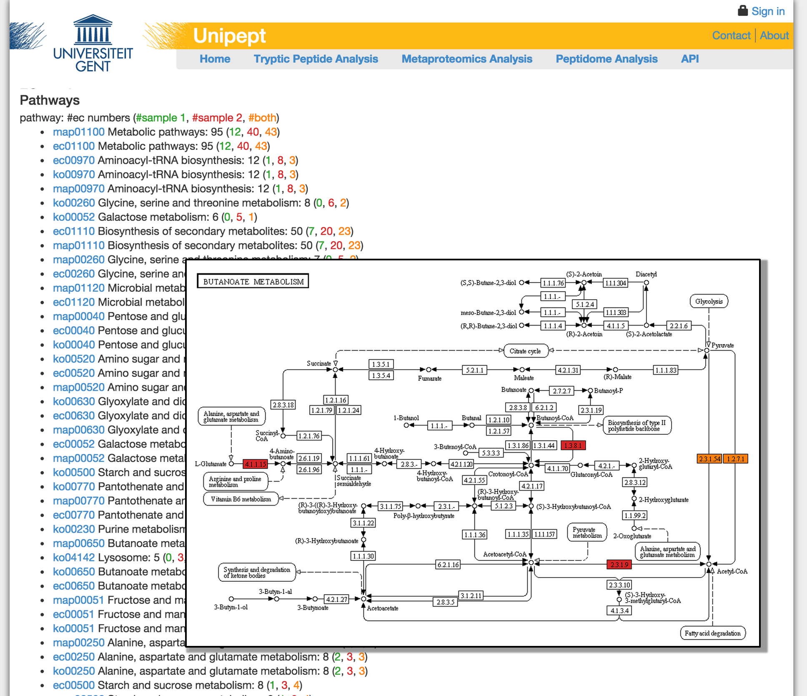

# The future of Unipept {.chapter data-running-title='6. The future of Unipept'}

This chapter explores possible future extensions to the Unipept platform. Four of them are discussed in detail: the possibility to use Unipept for shotgun metagenomics datasets, the addition of a functional analysis next to the current diversity analysis, the addition of a statistically-sound comparative analysis and improved filtering of unique peptides for targeted metaproteomics.

## From metagenomics to metaproteomics (and&nbsp;back&nbsp;again) {data-running-title='From metagenomics to metaproteomics (and back again)' #sec:ch6-metagenomics}

Consider the problem of taxonomically assigning a DNA read resulting from a shotgun metagenomics experiment. The initial step in this process, shared by all current metagenomics analysis tools, is to perform inexact matching (e.g., Blast [@Altschul1990], BLAT [@Kent2002], USearch [@Edgar2010]) of the DNA read against a reference database and to retain only those hits that are considered sufficiently similar. Some tools only consider the best match and assign the DNA read based on the taxonomic annotation of that match in the reference database [@Seshadri2007]. Other tools consider multiple matches (e.g., a fixed number of best matches or all matches that meet certain cutoff criteria) and use an aggregation strategy to reduce the taxonomic annotation of those matches in the reference database into a consensus taxonomic assignment of the DNA read [@Huson2007;@Meyer2008;@Luo2014]. Pep2Pro [@Askenazi2010], for example, only makes a taxonomic assignment if all retained matches share the same taxonomic annotation in the reference database. This is particularly bad since it strongly depends on the sampling bias of the reference database and favors dominant taxa.

A far better approach that is generally recommended in review papers, is to compute the lowest common ancestor (LCA) of all retained matches [@Bazinet2012;@Mande2012]. However, such a strategy should be implemented carefully, as the NCBI Taxonomy for example contains a large number of "false" taxa (strain-level assignments; @Federhen2014) that should be discarded before applying the LCA procedure, and the procedure should also be robust against "false" taxonomic annotations in the reference databases. To avoid "false" reference sequences, databases are often compiled from a list of whole-genome sequences, reducing the taxonomic identification space to only those taxa whose complete genome was sequenced, or from a list of quality controlled 16S rRNA sequences, ignoring the majority of DNA reads that do not contain 16S rRNA fragments and reducing the taxonomic identification space to the prokaryotes [@hunter2014ebi].

##### A shotgun metagenomics pipeline
The Unipept platform could be extended with a shotgun metagenomics analysis pipeline that solves the taxonomic assignment of DNA reads following a radically different approach. Because Unipept was originally designed for shotgun metaproteomics analysis, the metagenomics problem could be translated into a series of metaproteomics problems. These can be solved using existing Unipept functionality and the results can be mapped back into the metagenomics context.

@Fig:ch6fig1 outlines how this approach can be implemented. Instead of directly matching a DNA read against the sequences in a reference database, we start by predicting protein coding genes on the DNA read. This can be done using software packages like FragGeneScan [@Rho2010] or its multi-threaded variant FragGeneScan+ [@Kim2015], which is particularly interesting since it makes use of a hidden Markov model that allows to i) find genes that are only partially covered in the DNA read, ii) correct read errors induced by current NGS technologies and iii) predict the translation table that needs to be used to translate the nucleotide sequence into a protein sequence.

{#fig:ch6fig1}

Assembly of partial peptide fragments into more complete protein sequences using the LCA short peptide assembler [@Yang2013] is an optional post-processing step, which is in contrast with more traditional approaches that start with assembly of DNA reads, followed by gene prediction [@Nielsen2014]. This approach is far more accurate than using nucleotide assembly-based strategies followed by gene prediction. Following this strategy, we essentially transform the metagenomics problem into a metaproteomics problem that can already be solved by Unipept.

The predicted (partial) protein sequences are digested *in silico* into a series of tryptic peptides that are individually identified taxonomically using the Unipept LCA procedure (@Fig:ch3fig1; @Fig:ch6fig1, 3a). Unipept uses exact matching to map peptides to proteins in UniProt, which is not only faster than the inexact matching procedures that are used traditionally but also avoids the need for cutoff criteria: the LCA is computed based on all exact matches.

Although it might seem that the Unipept approach will be less accurate because inexact (DNA) matching is less stringent than exact (protein) matching, @Tanca2013a have shown in a controlled experiment that Unipept has three to five times more correct identifications compared to MEGAN (@Huson2007; which also implements an LCA approach but based on Blast matches), with more than half the number of incorrect identifications. In addition, since Unipept precomputes the LCA for all tryptic peptides extracted from the UniProt database, this step in the identification process is extremely fast.

##### Aggregation
Although the taxonomic identification process could stop at this point by simply pooling all individual peptide-based identifications for all DNA reads in a shotgun metagenomics data set, this approach would ignore an important piece of information: all tryptic peptides derived from the same DNA read come from the same organism. This is where metagenomics has an advantage over metaproteomics, because we can perform an additional aggregation step that bundles the individual peptide-based identifications into a single consensus identification for the DNA read (@Fig:ch6fig1, 3b), which can be more accurate (e.g., less specific identifications are overruled by more specific identifications) and more robust against incorrect identifications (e.g., less supported identifications are pruned). Such an aggregation essentially transforms the metaproteomics identifications back into a consensus metagenomics identification. The individual peptide-based identifications could for example be aggregated by again computing their LCA (note that these LCA computations cannot be precomputed). @Wood2014 propose another aggregation technique based on determining the maximal root-to-leaf (RTL) path of all individual identifications in the taxonomic tree.

Both of the above approaches are based on the idea that aggregation at this step should reduce a series of individual taxonomic assignments into a single taxonomic assignment. However, it is statistically more sensitive to postpone such a crisp reduction until later stages (where the overall biodiversity distribution of the whole sample is analyzed and visualized) and to apply more fuzzy reductions at this stage that represent the aggregated biodiversity as a weighted hierarchical distribution.

One possible approach is illustrated in @Fig:ch6fig2. Instead of reducing the weighted hierarchical distribution formed by the individual taxonomic assignments to a single taxonomic node (for example by taking the lowest node with weight 1 in the LCA approach, or selecting the leaf node with the highest weight in the RTL approach), we may represent the taxonomic assignment of a single DNA read (or protein) as a weighted tree. These weighted trees can then be aggregated for all DNA reads sequenced from the sample by adding the weights of the corresponding nodes in the hierarchy and divide these weights by the number of hierarchies merged (i.e., normalization over all proteins or DNA reads). This essentially computes the root-to-node (RTN) path for every node in the tree (in contrast to computing the path only for the leafs with the RTL approach). As an end result, the biodiversity distribution of a particular sample is represented as a weighted tree instead of a count table (or tree), which is just a generalization that can equally well be analyzed and visualized. A proof-of-concept of this workflow has already been implemented in collaboration with the EBI Metagenomics team, showing very accurate identifications that are not restricted to the prokaryotes as with most of the other metagenomics pipelines. This basic implementation already sequentially processes 12 million reads in under an hour.

Starting from a DNA read that is broken into a series of tryptic peptides, another aggregation approach is to map each peptide onto its matching proteins (@Fig:ch6fig1, 1a) and aggregate the taxonomic annotation only from those proteins that match all or a minimal number of the peptides from the query protein (@Fig:ch6fig1, 1b), e.g., using the Unipept LCA approach. A variant thereof is to map each peptide onto the taxonomic annotations of all its matching proteins (@Fig:ch6fig1, 2a) and only aggregate the taxonomic annotations that were matches for all or a minimal number of the peptides from the query protein or DNA read (@Fig:ch6fig1, 2b), e.g., using the Unipept LCA approach. This will probably lead to more accurate results compared to the previous approaches, but at the cost of a much longer computing time because some universal peptides will be found in large numbers of proteins and/or taxa.

![Weighted hierarchical distribution algorithm: (1) assign (normalized) weights to taxa based on number of individual (peptide) identifications, (2) take into account the hierarchical structure by distributing the weight of a parent node among the identified leaf nodes of its subtree (optional); distribution of parent weights may or may not take into account weights already assigned to leafs, (3) normalize weights across the entire tree (each protein identification is assigned the same weight), (4) take into account the hierarchical structure by computing parent weights as the sum of their child weights (optional).](images/ch6fig2.png){#fig:ch6fig2}

##### k-mer index
Apart from *in silico* splitting a (partial) protein into (non-overlapping) tryptic peptides, the protein may also be split into (overlapping) k-mers. This approach has been introduced in KRAKEN [@Wood2014]. The same aggregation strategies that were discussed for peptide-based identifications can also be applied onto the k-mers. Note however that KRAKEN introduces bias by not correcting for identifications derived from overlapping k-mers, which can be easily remedied by normalizing the identifications per protein residue. It is expected that identification based on overlapping k-mers will increase accuracy compared to peptide-based identification (which is only motivated in a metagenomics context by the fact that Unipept already has fast peptide-based indexes for usage in a metaproteomics context), but at the cost of a higher memory footprint to store the index and a performance penalty because the number of overlapping k-mers is higher than the number of non-overlapping tryptic peptides.

##### Preliminary results
A prototype based on the Unipept command line tools is already available. The prototype takes two fastq files containing paired-end reads as input and tries to map a taxon to each of the reads as output. The pipeline consists of four basic steps.

1. Merge the reads of the two fastq files into a single fasta file. This is done using basic Unix command line tools.
2. Run FragGeneScan+ to convert the reads into protein fragments.
3. Split the protein fragments into tryptic peptides and calculate the LCA for each of the peptides using the Unipept command line tools.
4. Aggregate the results of the individual peptides per read into a single identification for each read using a custom python script.

As a first test, we ran the pipeline on simulated reads from a mix of four organisms (*Escherichia coli*, *Plasmodium falciparum*, *Shigella dysenteriae*, and *Human immunodeficiency virus*). Our prototype was able to process 2 times 9 million 100 base pair (bp) reads in 15 minutes, or 1.2 million 100 bp reads per minute. This is in the same range as Kraken in normal operation, which can process 1.3 million 100 bp reads per minute. Additionally, the prototype managed to identify all of the species that were present in the simulated sample. A small fraction of the reads, however, was misclassified as organisms that are very abundant in UniProt, but of which no close relatives were present in the original sample.

Further investigation showed that many of the short peptides were responsible for the misclassified reads by accidentally mapping to sequences in UniProt. In an effort to filter these erroneous peptides using machine learning, a random forest was trained using peptide length and amino acid composition as main features.

classifier | precision | sensitivity | speed (reads/min)
:--------- | --------: | ----------: | ----------------:
Naïve&nbsp;Bayes&nbsp;Classifier |  97.64% |  97.64% | 7
PhymmBL |  96.11% |  96.11% | 76
PhymmBL (conf. > 0.65) |  99.08% |  95.45% | 76
Megablast&nbsp;w/&nbsp;best&nbsp;hit |  96.93% |  93.67% | 4&thinsp;511
Kraken |  99.90% |  91.25% | 1&thinsp;307&thinsp;161
MiniKraken&nbsp;(Kraken&nbsp;w/&nbsp;4GB&nbsp;DB) |  99.95% |  65.87% | 1&thinsp;441&thinsp;476
MetaPhlAn |     n/a |     n/a | 370&thinsp;770
**Unipept** |  73.69% |  17.66% | ~1&thinsp;200&thinsp;000
**Unipept&nbsp;with&nbsp;filtering** |  96.10% |  17.38% | ~1&thinsp;200&thinsp;000

: Comparison of the performance of the classifiers as tested by @Wood2014 with the prototype of the Unipept metagenomics pipeline (with and without filtering). The filtering, as implemented by the random forest, increases the precision dramatically without reducing sensitivity. The speed and precision of Unipept is comparable to Kraken, but the sensitivity is many times lower. {#tbl:ch7tbl1}

To test the effectiveness of the filter, we ran the benchmark that was used in @Wood2014 to compare Kraken with other tools. As can be seen in @Tbl:ch7tbl1, the filter managed to increase the precision dramatically from 73.69% to 96.10% without further reducing the (admittedly low) sensitivity. The overall speed of the Unipept pipeline is already comparable to Kraken and could even be improved by using a local index instead of relying on the remote web server.

The low sensitivity has a few diverse reasons. The second step in the pipeline is predicting proteins using FragGeneScan. Although FragGeneScan is one of the best tools for the job, only 85% of the input reads gets a prediction. This low prediction level results in an immediate 15% loss in sensitivity. There are two main reasons for this: not all DNA is coding and read errors may prevent a reliable translation. This is a disadvantage of working in the protein space for which there is no easy solution. A second source of sensitivity loss is the depth of identification. The result table (@Tbl:ch7tbl1) only looks at the sensitivity for identifications made at the genus level or better, which is only about half of the reads that are identified by Unipept. Of the other half that was identified at a less specific taxonomic level, only 0.07% was incorrect. A third reason are the read errors in the source data. The reads in the benchmark are 100 bp reads with high sequencing error (2.1% SNP rate, 1.1% indel rate). Because Unipept uses exact matching, a single error can have the effect that Unipept can't identify a single peptide in a read and therefore can't identify the read at all. Switching from tryptic peptides to k-mers will probably have a positive effect on the second and third case and improve sensitivity.

##### Conclusion
The Unipept toolbox can thus be expanded with a metagenomics pipeline for the taxonomic identification of DNA reads from shotgun metagenomics data sets (at least with the existing and novel strategies discussed above), expanding the scope of the platform from metaproteomics to metagenomics. For this, a benchmark study can be performed to compare the speed of execution, storage requirements and accuracy of the different strategies (including the traditional identification approaches implemented in other metagenomics tools), using real and simulated shotgun metagenome data. A reasonable target seems that Unipept should be able to accurately identify at least 1 million 500bp DNA reads per minute, where other packages take hours to perform the same computations. This would enable us, in collaboration with the EBI Metagenomics team, to re-analyze all metagenomics samples from the EBI Metagenomics Archive at regular time interval (e.g., monthly). At present, each data set submitted to this archive is analyzed only once at the time of submission, where reference databases grow at an exponential rate leading to less under-sampled biodiversity.

Current NGS technologies allow metagenomes to be sequenced much deeper than metaproteomes, which can provide a more detailed insight into the complex biodiversity of the samples. Combined metagenomes and metaproteomes of the same sample will also allow to link the functional potential encoded in genomes to expression levels measured in the sample, and to associate differential functional expressions with shifts in the biodiversity. Moreover, to obtain optimal identification of the peptides resulting from metaproteomics experiments, most studies currently match peptides against shotgun metagenomics data sets from the same samples [@Erickson2012;@Kolmeder2014].

## Functional analysis of metaproteomics data {data-running-title='Functional analysis of metaproteomics data' #sec:ch6-functional}
At the heart of Unipept lies an index structure for fast mapping of tryptic peptides onto all UniProt protein sequences having exact substring matches (@Fig:ch3fig1). The taxonomic and functional annotations on matched UniProt entries can be used to infer taxonomic and functional assignments for the individual peptides from metaproteomics experiments using the Tryptic Peptide Analysis feature of Unipept (http://&#8203;unipept&#8203;.ugent&#8203;.be&#8203;/search&#8203;/single). The Shotgun Metaproteomics Analysis Pipeline (http://&#8203;unipept&#8203;.ugent&#8203;.be&#8203;/datasets) of Unipept currently supports streamlined identification, analysis and visualization of all peptides from a metaproteomics experiment, and as described in @sec:ch6-metagenomics this pipeline can be extended for biodiversity analysis of shotgun metagenomics experiments. This diversity analysis could be extended with a statistical data analysis and visualization framework for functional analysis of metagenomics and metaproteomics experiments.

##### Aggregation strategies
The traditional approach for functional analysis of shotgun metagenomics/metaproteomics data sets provided by current tools is to represent functional ontology annotations (e.g., Gene Ontology, GO; @Ashburner2000) as charts that are often zoomable per ontological level, or to map Enzyme Commission (EC; @Bairoch2000) numbers onto metabolic pathways such as those provided by the Kyoto Encyclopedia of Genes and Genomes (KEGG; @Kanehisa2000).

The implementation of this kind of functional and metabolic pathway analysis tools in Unipept will be quite straightforward, as fast peptide-to-protein matching is already part of the Unipept kernel, functional assignments of all UniProt entries are already parsed in the Unipept database, and Unipept already has implemented flexible and interactive visualizations that can be reused for basic functional analysis. However, although many metagenomics and metaproteomics papers base their discussion of the functional complement of environmental samples on GO pie charts and/or metabolic pathway expression levels, we dare to claim that such visualizations usually do not provide deep biological insight. We therefore see an implementation of the basis functional analysis tools only as a stepping stone for the functional analysis framework of Unipept, that can both be made more accurate by taking advantage of aggregation strategies as outlined in @sec:ch6-metagenomics and can lead to in-depth comparative functional analysis (discussed in @sec:ch6-comparative).

The aggregation strategies for taxonomic assignments as discussed in @sec:ch6-metagenomics cannot directly be applied for the aggregation of multiple GO assignments (e.g., taken from all proteins matching a peptide sequence, or taken from all individual peptides in a (partial) protein predicted on a DNA read), as GO is structured as a directed acyclic graph (DAG) rather than a tree (hierarchy). Additionally, a single reference protein may have multiple GO annotations in contrast to a single taxonomic assignment. However, the weighted hierarchical distribution algorithm discussed in @sec:ch6-metagenomics (of which the LCA and maximal RTL algorithms are special cases) can be extended into a weighted DAG distribution algorithm (@Fig:ch6fig3). In this case, top-down redistribution of the weight of a parent node (step 2 in the hierarchical algorithm) might have multiple contributions to the same leaf node as a consequence of multiple parallel node-to-leaf paths. Bottom-up progression of leaf weights (step 4 in the hierarchical algorithm) might have to split a child weight over multiple parent nodes.

{#fig:ch6fig3}

This is a generalization of the aggregation strategy implemented in the commercial software package Blast2GO [@Conesa2005], from which we can use the idea to incorporate Evidence Code weights to promote the assignment of functional annotations with experimental evidence and penalize electronic annotations or low traceability. The latter is important, since it has been predicted that 13-15% of the functional annotations in reference databases contain database propagation errors [@Brenner1999].

Similar to the algorithm described in @sec:ch6-metagenomics, we can avoid using Blast by relying on the Unipept index. As with the LCAs of taxonomic assignments, aggregation of functional assignments of the proteins matching a tryptic peptide can be precomputed for all peptides extracted from UniProt and cached in the Unipept database to increase performance of downstream analysis. One of the challenges will be to come up with fast implementations of functional aggregation strategies for metaproteomics and metagenomics data sets, and to benchmark the performance and accuracy of the different alternatives along the lines of the taxonomic benchmark outlined in @sec:ch6-metagenomics.

##### Applications
This Unipept extension can be applied for the functional and metabolic pathway analysis of the metagenomics and metagenomics data sets, for example data sets generated from the faecal samples of CF patients and their healthy siblings [@debyser2015]. The most pronounced observation in diseases associated with gut dysbiosis (inflammatory bowel disease, colon cancer) is a substantial decrease of "health promoting" species such as *Faecalibacterium prausnitzii*. This was also observed in our cross sectional shotgun metaproteomics analysis of faecal samples from CF patients [@debyser2015].

These organisms are typical producers of butyrate, a key metabolite used as energy source by colonocytes that has anti-inflammatory properties. It therefore seems like a logical conclusion that dysbiosis is associated with a lack of butyrate production. However, systematic analysis has shown recently that more bacteria have butyrate-producing pathways than was previously anticipated, and that these organisms show high abundance (up to 40%) in stool samples of healthy individuals investigated by the HMP consortium [@Vital2014]. Causal inferences between depletion of certain taxa and observed functional shifts should therefore be drawn carefully.

As metaproteomics provides direct abundance measurements of the enzymes involved in metabolic pathways, this gives a better reflection of the potential changes in biochemical pathways. The functional extensions of Unipept could therefore be applied for the analysis of shotgun metaproteomics data sets that were previously generated from the faecal samples of CF patients and their unaffected siblings. This then could answer the question whether dysbiosis indeed results in a loss of enzymes associated with butyrate production. Other interesting questions regarding functional changes due to dysbiosis in CF patients include a potential raise in expression of antibiotic resistance genes, mucin degrading extracellular glycosidases, and increased abundance of proteins involved in inflammatory pathways at level of host proteins.

## Comparative analysis of metaproteomics data {data-running-title='Comparative analysis of metaproteomics data' #sec:ch6-comparative}

Recent review papers about the current state-of-the-art in metaproteomics praise Unipept for the performance and accuracy of its taxonomic identification pipeline, and also for its interactive visualization framework that helps to explore the biodiversity in complex environmental samples [@Seifert2013;@Kolmeder2014]. However, most environmental studies do not merely apply metagenomics and metaproteomics to gain insight in the taxonomic, functional and metabolic composition of individual samples, but rather want to investigate observed compositional shifts between multiple samples.

In general, there are two types of environmental studies. Cross-sectional studies investigate samples collected from distinct environmental niches at one specific point in time or under a time-independence assumption in order to observe causal effects of one or more environmental factors upon sample composition. Longitudinal studies involve repeated observations of the same environmental niche over a period of time to study shifts in sample composition that may be correlated to certain temporal events.

##### A comparative analysis framework
Unipept could be expanded to include a framework for statistical analysis and data visualization of multiple metagenomics or metaproteomics data sets from cross-sectional and longitudinal studies [@Mehlan2013;@Wang2014]. As showcased by Unipept, such a statistical analysis and data visualization toolbox nowadays can be implemented as a highly responsive client application hosted in a web browser using the latest web technologies. In particular, when making use of the latest HTML5 technologies including Web Workers for parallel processing and Local Storage for browser caching, as well as JavaScript libraries including D3.js for interactive data manipulation and visualization.

This framework could allow third-party developers to reuse individual components in their own applications. This will allow the statistical analysis and data visualization framework to be used as a standalone client application that enables users to upload multi-sample contingency tables that were processed by metagenomics or metaproteomics pipelines (e.g., in the Biological Observation Matrix (BIOM) format (@McDonald2012) which is an interoperable format supported by all major pipelines) or to embed the framework in other web applications.

The framework could support basic visualizations such as pie charts, (stacked) bar charts and heat maps, but also more elaborate statistical and visualization approaches for comparative analysis such as Lefse [@Segata2011] for differential taxonomic and functional analysis and UniFrac [@Lozupone2005] to calculate distances between organismal communities using phylogenetic information.

In contrast to the existing MetaSee framework [@Song2012], such framework should be implemented according to the Model-View-Controller (MVC) design pattern. This pattern allows to store the data only once (model), with the possibility of adding interactive operations (controllers) to navigate the data visualizations (views). As such, additional components can be plugged into the framework as independent controllers or viewers. This will require the definition of a standard data representation layer (tabular, tree or (directed acyclic) graph data structures) and a standard data manipulation interface. For example, many metagenomics tools visualize the biodiversity in a sample not as a tree (which may include simply too much information), but sliced at a specific taxonomic rank (e.g., as a pie chart at the phylum level). From the MVC perspective, this slice operation is not implemented as a static conversion from a tree format to a tabular format but as a dynamic view of the tree as a table, which allows more dynamic visualizations that navigate top-down and bottom-up in the tree. Moreover, the same controller can be applied to all sample data sets at once, allowing interactive comparative visualizations.

##### Prototype
An initial prototype of a comparative functional analysis tool has already been implemented and can be seen in @Fig:ch6fig4. In its current implementation, aggregated functional assignments of the tryptic peptides of one or two samples are mapped onto KEGG pathways using the EC numbers that are cross-referenced in UniProt. Here, the pathways are heuristically ranked on interestingness, based on the number of differentially expressed enzymatic reactions.

{#fig:ch6fig4}

The prototype requires a number of extension before it can be added to an official Unipept release. First of all, as discussed in @sec:ch6-functional, the functional assignments could equally well be based on the DNA reads from metagenomics samples. The prototype can also be extended to support cross-sectional studies that want to compare the functional shifts between multiple samples from two distinct environmental niches.

Instead of the current ranking algorithm, a more statistically sound method should be implemented. Examples are the statistical framework for differentially expressed proteins as implemented in MetaStats [@White2009] and its extension MetaPath [@Liu2011], which allows much more granular detection of subpathways that are globally over or under expressed between subpopulations. The current third-party implementation of these tools is quite slow, but it seems that a fast reimplementation might be achievable.

Another goal could be to allow integrated taxonomic and functional analysis. Current metagenomics and metaproteomics tools implement taxonomic and functional analysis merely as separate pipelines, whereas biological comparison between the samples would greatly benefit from statistical tools and visualization aids that intertwine both viewpoints. As taxonomic and functional assignments are made for the individual peptides (metaproteomics) or DNA reads (metagenomics), they establish a complex graph (network) where both pieces of the puzzle come together. However, tools for visualizing metabolic pathways as KEGG or iPath [@Yamada2011] do not provide additional annotations to highlight "who is doing what" in the environment. Having integrated visualizations and graph-based statistical tools would allow to search for functional changes beyond what can be explained by a mere shift in populations, and vice versa, to search for shifts in populations that do not result in functional changes.

## Targeted metaproteomics {data-running-title='Targeted metaproteomics'}

The proteomics field is recently moving into more targeted approaches to address specific biological questions. Typically, this involves Single or Multiple Reaction Monitoring (SRM/MRM; @Pan2012) employing triple quadrupole-like instruments to monitor protein specific tryptic fragments, focusing on a combined set of the precursor ion masses and their MS/MS derived fragments (transitions). Target peptides can be selected according to a wide range of criteria such as their protein-specificity to screen for the presence/absence of certain proteins in proteomics studies. Absolute quantification is achieved by providing complementary isotope labeled peptide standards and the approach is increasingly used in clinical biomarker analysis.

A growing number of human or animal diseases are associated with perturbation of the microbiota naturally residing in the skin or gut of the host. The presence/absence of representatives of specific bacterial genera affects the host condition, and therefore combining host and microbiota biomarkers could be useful in diagnostics in diseases such as Inflammatory Bowel Disease, diabetes or cystic fibrosis, and in microbial contamination detection in food safety. However, selection of suitable peptide markers for these bacteria requires taxon-specificity. With protein profiling providing assays closer to activated functions, metaproteome-wide association studies have the potential to become an important tool in environmental, clinical and food studies [@Juste2014].

The Unique Peptide Finder (http://unipept.ugent.be/peptidefinder; @Mesuere2016a) of Unipept already allows to determine the unique tryptic peptides (the so-called unique peptidomes) of a certain species or pool of species (represented by a selection of available whole-genome sequences). These are the peptides present in all of the selected genome sequences but are found nowhere else outside the species of the selected genomes (actually the LCA of all taxonomic annotations of the selected genomes). These peptides are therefore ideal biomarkers. However, the Unique Peptide Finder typically yields over a thousand unique peptides for a species and not all of them are equally suitable for MRM analysis. Parameters such as, peptide length, presence of amino acids that are prone to chemical modification, and even the cost to produce synthetic peptides for method optimization or stable isotope labeled peptides as internal standards are additional criteria that need to be taken into account. Because the Unique Peptide Finder returns hundreds of potentially useful peptides, we can afford to use strict filters to only retain the most suitable peptide targets.

Several computational tools have however, been built to help select the most suitable peptides. These tools each consider a specific property of the peptide in question: informativeness, presence, ionization, and fragmentation. Informativeness is crucial, because a unique sequence is not a sufficient condition to ensure unambiguous assignment of the detected mass spectrometry signal to a given peptide, and thence a protein and a species. For this, the recorded signal itself must be unique. Two existing tools can already compute these peptide properties: SigPep [@Helsens2012] and SRMCollider [@Rost2012]. SigPep is currently undergoing an extension to take advantage of accurate retention time prediction from ELUDE [@Moruz2012] as well. This can be further optimized using optimal gradient choices [@Bertsch2010]. Presence of a peptide in the sample after digestion is of course affected by presence of the parent protein, but is also strongly affected by the propensity of trypsin (the leading protease in proteomics; @Vandermarliere2013) to cleave this peptide from the protein. Here too, predictors exist, as reviewed in [@Kelchtermans2014], with the optimal predictor so far being CP-DT [@Fannes2013]. Interestingly, CP-DT also provides a good estimate of the probability of ionization for a given peptide. Finally, the fragmentation pattern that will result from a given peptide can now also be predicted with high accuracy, both for CID as well as HCD fragmentation [@Degroeve2015].

The addition of these predictions will help reduce the large number of possible MRM peptide targets obtained from the Unique Peptide Finder, by allowing the user to immediately select the most promising set of peptides. As a result, users will be able to move from query to actual MRM assay much more efficiently.
